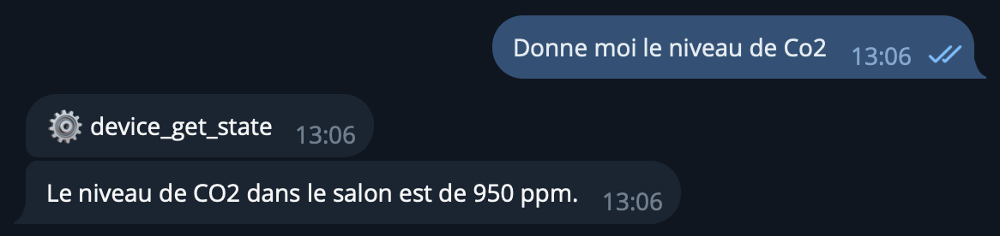
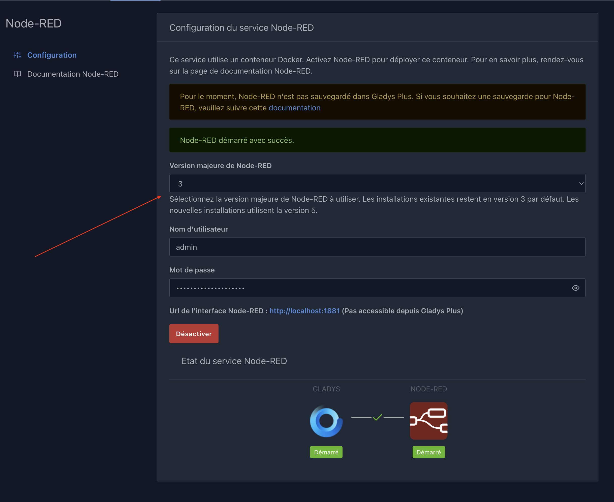

Hey everyone,

Gladys v4.79 is out 🙂, with a smarter AI agent, a better voice assistant, and support for more Matter devices.

{/* truncate */}

## 🤖 Artificial intelligence

This version brings several improvements to the AI agent:

- **Scene creation:** fixed the schema and increased the timeout to fix a scene-creation bug reported by @GBoulvin and @Jluc.
- **Better error handling:** clearer feedback when the AI doesn't respond.
- **Tool calls via Telegram:** you can now see tool calls on Telegram, just like on the web.

- **New tools:**
  - **Web Request:** the agent can query APIs or web pages. It's a personal need I implemented, and it's incredibly handy!
  - **Compare Times:** compares times of day.

These new tools unlock very powerful things, for example, fetching a store's opening hours and telling you whether it's currently open! Super useful in scenes via the "Ask the AI" action. The possibilities are endless.

## 🎙️ Voice assistant

- **Stop button** to interrupt an answer in progress.
- **Microphone detection:** if no sound was recorded, Gladys now shows an error message.

## 🏠 Matter

Extended support for new device types: vacuum cleaners, NO₂ sensors (nitrogen dioxide index), and fans.

## 📡 Zigbee2mqtt

- Updated to Zigbee2mqtt 2.12.0
- Support for the SONOFF SNZB-01M remote (4 buttons)

## 🔧 Node-RED

A version selector lets you move to a major version of Node-RED directly from the Gladys interface.

Handy for moving to v5, which just came out! ⚠️ Make sure the modules you use are compatible with v5.

## 🎬 Scenes

- Wider value field for sensor thresholds
- A Back button to navigate more easily in the scene editor

## ☁️ Gladys Plus

When a remote user is deleted on Gladys Plus, the corresponding local user is automatically deleted on your instance.

---

📋 [Full changelog](https://github.com/GladysAssistant/Gladys/releases/tag/v4.79.0)

As always, the update is automatic within 24 hours if you use Watchtower, or you can do it manually via **Settings → System.** Happy updating! 🎉
