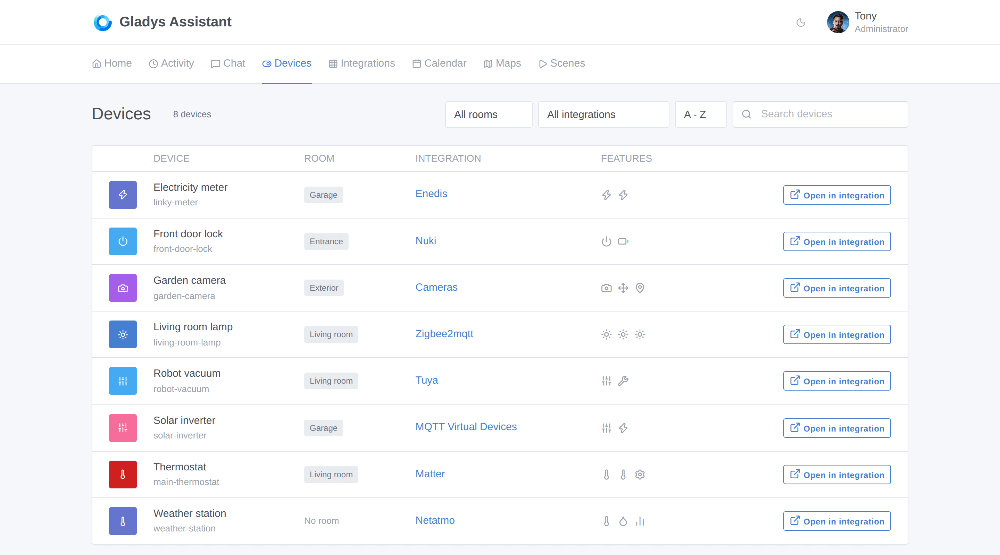
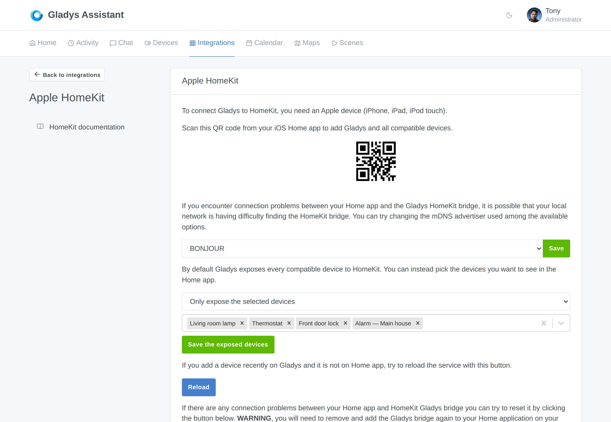
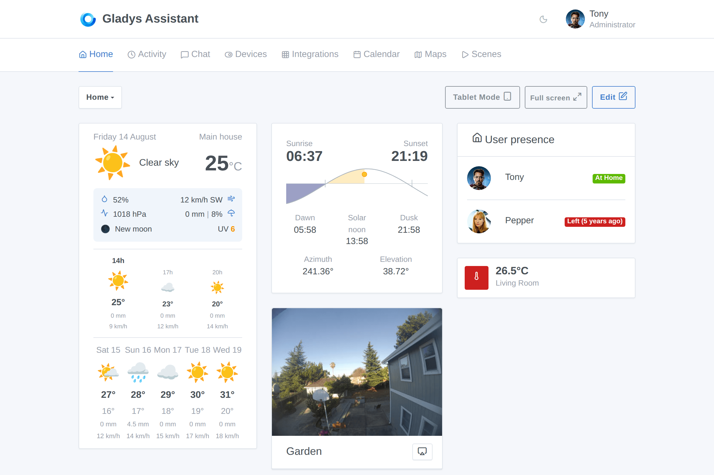
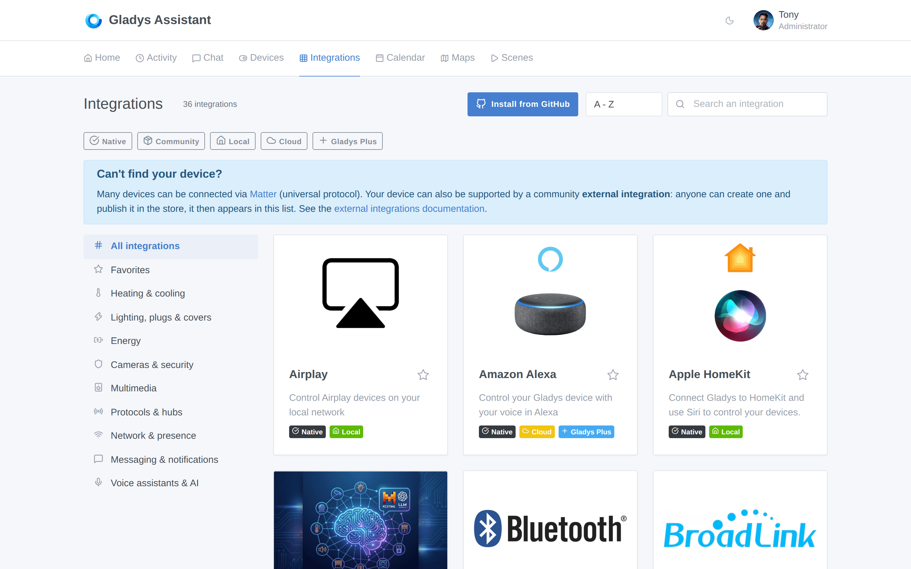
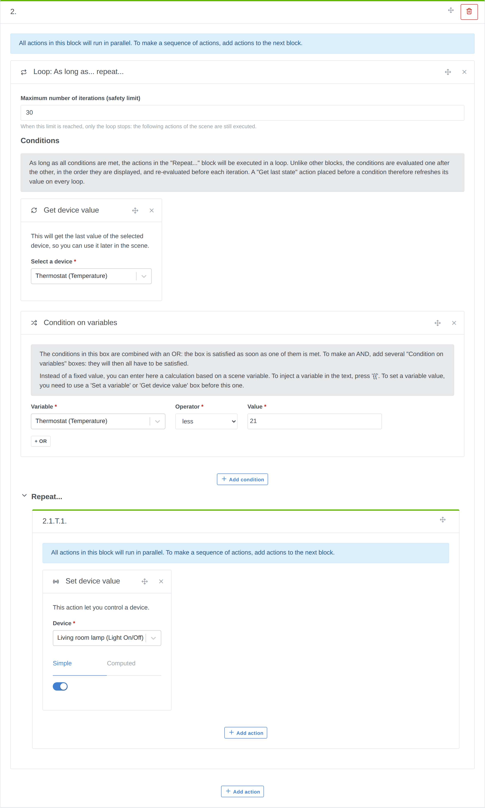
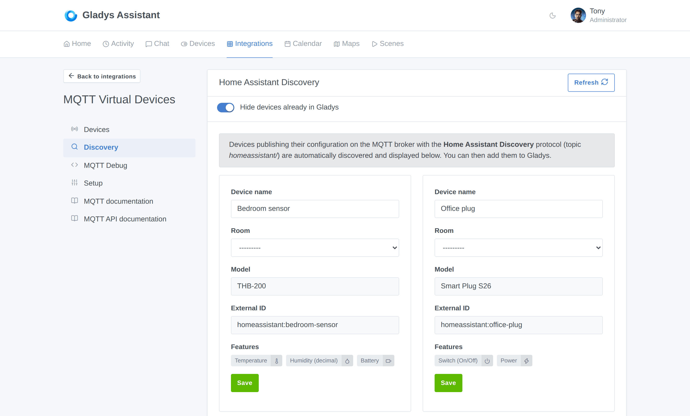

Hey everyone!

Version **4.86.0** is out, and this one is simple to describe: it's the **biggest release in the history of the project**. 🚀

The numbers speak for themselves. In **7 days**, we merged **68 pull requests**, touching more than **1,000 files** and adding around **28,000 lines of code**. For comparison, our biggest releases used to top out at **35 pull requests**, over two weeks. We just did **twice that, in half the time**.

And this isn't a one-off spike. Every single week, we blow up the productivity of this project a bit more, and the reason is no secret: **AI**. Out of the 68 pull requests in this release, **62 were co-authored with Claude**. Specs, implementation, tests, code review, even the CI that fixes its own failures: AI is now everywhere in the Gladys development loop, and the result is a pace this project has simply never seen before.

👉 **You can follow that pace live, day by day, on the [development activity page](/dev/)**. Commits, contributors, streaks: everything is there, updated automatically.

Now, let's look at what actually landed in your home.

{/* truncate */}

## 📱 A new Devices page

Until now, seeing every device in your Gladys meant walking through each integration one by one. That's over.

Gladys now has a **Devices** page, in the main menu, listing **all the devices of your instance** in one place:

- **Search** by name
- **Filter** by room and by integration
- **Sort** them A-Z, Z-A, or by room
- See at a glance the **features** of each device
- Jump straight to the device in its integration with **Open in integration**

It sounds simple, and that's exactly the point: when you have 60 devices spread across 8 integrations, this page becomes the one you keep open.

## 🍏 HomeKit becomes a first-class citizen

This is probably the biggest chunk of work in this release. The HomeKit bridge went from "lights and sensors" to **almost everything Gladys knows how to control**.

Newly exposed to the Home app on your iPhone:

- **Thermostats** (with modes and operating state)
- **Locks**
- **Fans**
- **Buttons**
- **Smoke sensors**
- **Presence sensors**, exposed as HomeKit *Occupancy Sensors*
- **Device batteries**, so iOS warns you before a sensor dies
- **Your house alarm**, exposed as a HomeKit *Security System*: you can arm and disarm Gladys straight from the Home app, or with Siri

And because exposing everything isn't always what you want, you can now **choose exactly which devices are visible in HomeKit**:

The bridge restarts automatically when you save, and **your pairing is kept**: no need to remove and re-add Gladys in the Home app.

Two long-standing bugs were also fixed along the way: thermostat modes are now mapped correctly, and HomeKit services are looked up by feature instead of by device type (which used to break devices that mix several categories).

## 🌤️ A brand new weather widget, and a sun widget

The weather widget has been **fully redesigned**, and it now shows a lot more than the current temperature:

- **Hourly forecast** and **daily forecast**
- **Rain** (amount and probability), **wind** and its direction
- **UV index**, **pressure**, **humidity**, **moon phase**
- **Weather alerts**
- And a **display mode selector**: you pick the blocks you want, the widget shows only those

Next to it, a brand new **Sun widget** shows the position of the sun over your day: sunrise, sunset, dawn, solar noon, dusk, plus the current azimuth and elevation, drawn as a horizon curve.

Small but satisfying detail on dashboards: **chart tooltips now follow your cursor** instead of covering the curve you're trying to read.

## 🧩 An integrations catalog you can finally browse

With native integrations plus **45 community external integrations** already published, the catalog needed a real structure. It now has one:

- **Browse by category**: heating & cooling, lighting, energy, cameras & security, multimedia, protocols & hubs, network & presence, messaging, voice assistants & AI…
- **Facet filters**: Native, Community, Local, Cloud, Gladys Plus
- **Sort by newest first**, to see what the community shipped this week
- **New** and **Soon deprecated** badges
- **Accent-insensitive search** (typing "camera" finds "caméra")
- Your filters and sort order are **kept when you navigate back** from an integration page

And when a search returns nothing, Gladys now points you to the **external integrations**: the recommended way to add a new device compatibility, that you can [build yourself in an afternoon](/docs/dev/external-integrations/).

## 🎬 Scenes: loops, variables and calendars

Scenes got their biggest upgrade in a long time.

- **Loops.** A new **"As long as… repeat…"** block repeats a group of actions while its conditions hold. Conditions are re-evaluated before every iteration, so a "Get last state" action placed before a condition refreshes its value on every loop. A **maximum number of iterations** acts as a safety limit.
- **Set a variable.** A new action defines a variable (fixed text or a computation), reusable in every following action of the scene.
- **Get calendar events.** A new action fetches the events of the day, of tomorrow, or of the next X hours from your shared calendars, and hands the next actions a ready-to-use sentence, the number of events and the event list — perfect for a morning announcement on your speaker.
- **Multi-select in the device state trigger.** One trigger can now watch **several features of the same type**: the scene starts as soon as one of them matches.
- **Choose the channel** of the "Send a message" action, instead of always broadcasting to every configured messaging service.
- **Send text to a device** directly from the "Control a device" action.
- Value lists in the editor now show **readable labels** instead of raw numbers.

## 📡 MQTT: Home Assistant Discovery

Big one for MQTT users: Gladys now understands the **Home Assistant Discovery** protocol.

Any device publishing its configuration on the `homeassistant/` topic of your broker is **discovered automatically** and shown in a new **Discovery** tab. You name it, pick a room, and add it to Gladys in one click.

In practice, that's a huge number of ESPHome, Tasmota, Zigbee2MQTT and DIY devices that now show up in Gladys with **zero manual configuration**.

## 🎥 Cameras: PTZ control

Motorized cameras can now be **moved from Gladys**. A camera device can expose:

- A **movement** feature (pan left/right, tilt up/down, zoom in/out, stop)
- **Presets** you define yourself (name + value sent to the camera), to recall a framing like "Entrance" or "Garden"
- Pan, tilt and zoom **position** features

A directional pad and a preset selector appear on the live view of the camera widget, and in the room widget. You choose which movements your camera actually supports, so only the working buttons are displayed.

Also fixed: cameras now keep their **true colors in fullscreen in dark mode**.

## ⚡ Energy: solar production and grid flows

Gladys now models a full home energy flow, with new device feature categories:

- **Production sensor**: production power (your solar panels)
- **Grid sensor**: import power, export power, signed grid power (import +, export −), and import/export indexes
- **Home output sensor**: home output power and index, including off-grid output

On top of that, Gladys can now **compute a production index from meter readings**, the same way it already did for consumption — so you get proper production history even from devices that only report a raw index.

## 🧠 New device feature types

Several new building blocks landed for integrations and for MQTT virtual devices:

- **Text** and **Selection** feature types. "Selection" lets you define your own list of choices (scenes, modes, sources…) with a readable label and the value published to your device.
- A **Maintenance** category, to track the remaining life of consumables (vacuum brush, filter…).
- **NO2, O3 and SO2** sensors, alongside the existing air quality categories.
- A **per-feature setpoint step**, driven by the device: your thermostat can now step by 0.5 °C when it supports it, instead of a hard-coded 1.

## 🤖 The AI keeps learning

Gladys' AI assistant can now **answer weather questions** in the chat: "What will the weather be like tomorrow?" is answered from your configured weather provider, like temperature or humidity questions already were.

Also fixed: when you ask a question about the whole house instead of a specific room, the AI no longer gets confused about what you're targeting.

## 🏠 House: find your address by typing it

Setting the location of your house no longer requires hunting on a map: **type your address, and Gladys finds it**. The search is powered by OpenStreetMap (Nominatim), and Gladys tells you clearly that the address you type is sent to that third-party service.

## 🔌 Integrations and external integrations

- **External integrations** can now be installed and updated **from a locally built Docker image** — no registry needed, which makes developing one much faster.
- A new **Wake-on-LAN permission**: an integration can ask to send magic packets through Gladys on your local network, and you approve it explicitly.
- Docker images left behind by external integrations are now **cleaned up**.
- A new **account link** configuration field, for providers that don't use OAuth2.
- **Zigbee2MQTT**: support for HS1SA-E features, the container restart policy is reconciled on startup, and the scene action now makes it clear that the topic must include the `zigbee2mqtt/` prefix.
- **Z-Wave JS UI**: the built-in integration is now flagged as **deprecated** in the catalog, and every one of its devices gets a **Migrate** button to move it — with its history — to another integration.
- Published MQTT and Zigbee2MQTT payloads are now **logged**, with a warning on invalid JSON. Debugging an automation just got a lot easier.

## 🛠️ Under the hood

This is where the AI-driven pace really shows. In one week:

- **Gladys now runs on Node.js 24.**
- **Server tests run in parallel**, one worker per core, with a snapshot-based database reset and per-file sandboxes. The test suite went from a bottleneck to a non-issue.
- The **Cypress CI job** was slimmed down and cached.
- **Security**: all high and critical dependency advisories were patched.
- Sequelize was upgraded to 6.29.
- Scene condition formulas now **fail closed**, with a pinned operator surface.
- And the CI now runs a **daily automated fix pass**: review-bot feedback fires Claude Code cloud sessions that open the fix themselves.

Plus a long tail of interface fixes: the water heater boost control no longer overflows narrow dashboard cards, drag & drop works with a mouse on touchscreen PCs, motion sensors stop showing their last state report as their last motion, binary buttons are labeled with the action they apply, and the integrations badge is aligned in the mobile menu.

## 🚀 Why this pace matters

I want to be clear about what's happening here, because it's the most important part of this release.

A release of this size used to be a **multi-month** effort. This one took **one week** — and not by cutting corners: the specs are written, the tests are there, the code is reviewed, and the test suite actually got *faster* along the way. AI removed the part of the work that was pure friction: boilerplate, tests, refactors, review passes, CI plumbing.

What that means for you is simple: **the features you ask for on the forum now ship in days, not quarters**. Several items in this release came straight from a forum thread this week.

👉 **[Follow the project's pace on the development activity page](/dev/)** — it's updated automatically, and honestly, it's become my favorite page of the website.

## ❤️ Thank you

Huge thanks to everyone who contributed to this release: [@Dreamthy](https://github.com/Dreamthy), [@William-De71](https://github.com/William-De71), [@callemand](https://github.com/callemand), [@cicoub13](https://github.com/cicoub13), [@bertrandda](https://github.com/bertrandda), [@prohand](https://github.com/prohand), [@Terdious](https://github.com/Terdious), Stéphane Escandell and Anupam Mediratta.

And thanks to everyone publishing **external integrations**: the catalog went from 20 to **45 community integrations** in two weeks. If your device isn't supported yet, [you can now build it yourself](/docs/dev/external-integrations/).

As always, Gladys updates automatically within 24 hours if you use Watchtower, otherwise you can do it in one click from the settings.

Remember to set up Telegram to get an alert on your phone when Gladys updates!

[See the full release notes on GitHub](https://github.com/GladysAssistant/Gladys/releases/tag/v4.86.0)
