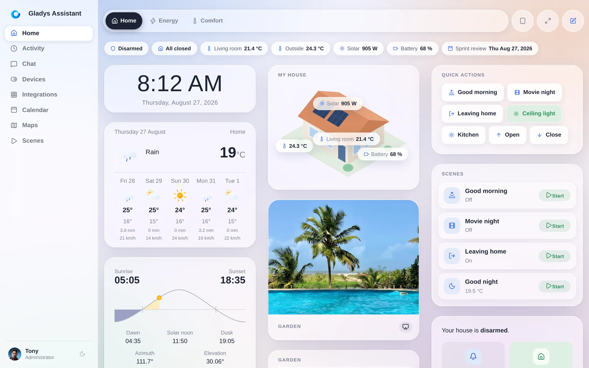
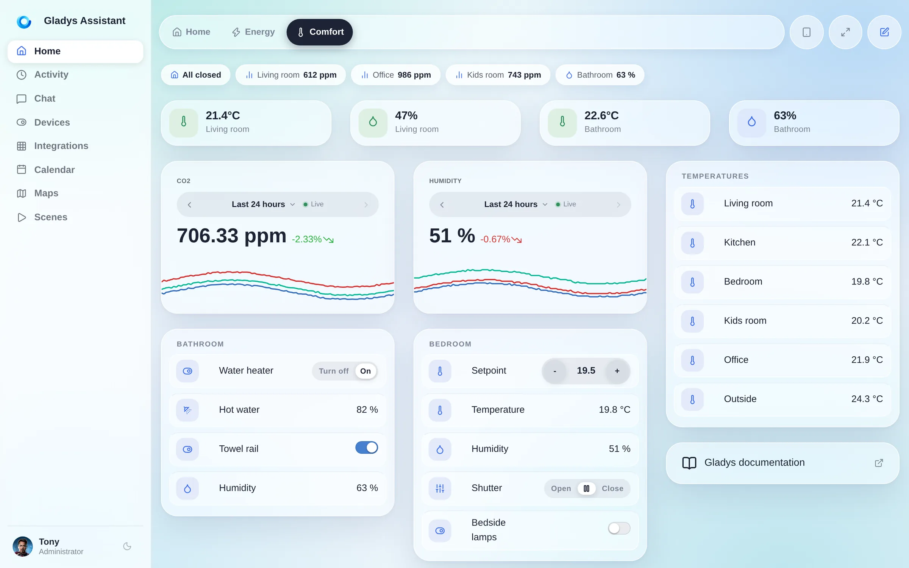
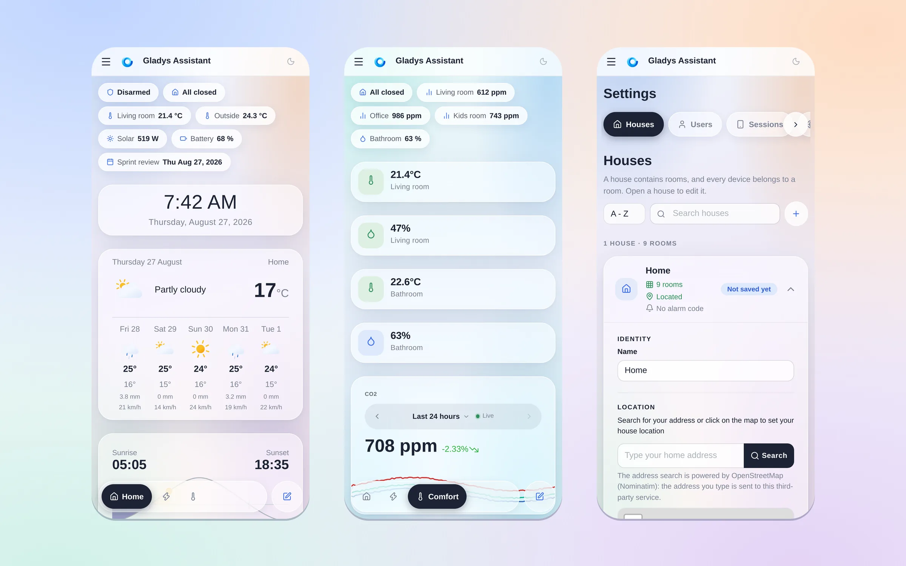
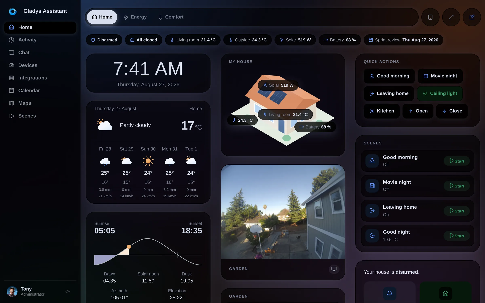
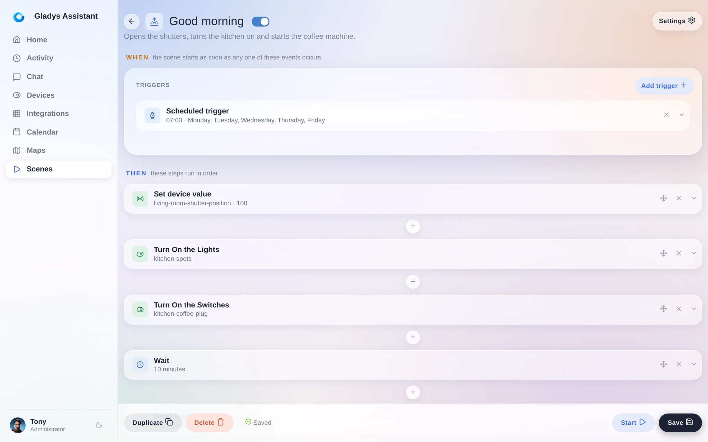
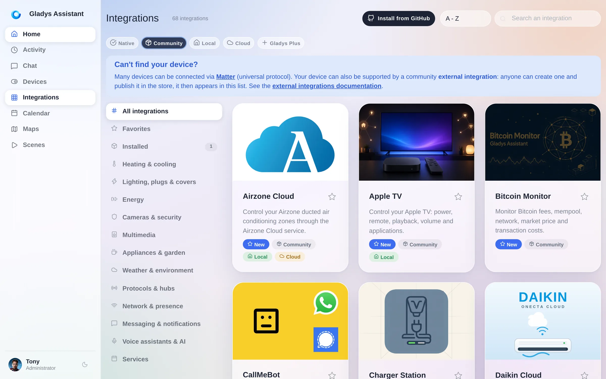
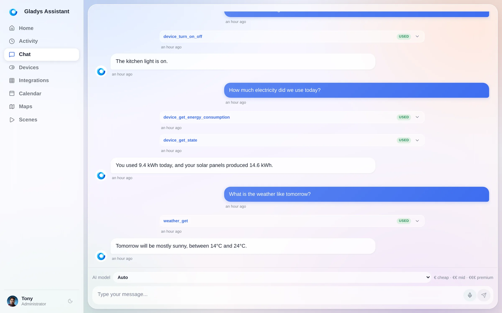
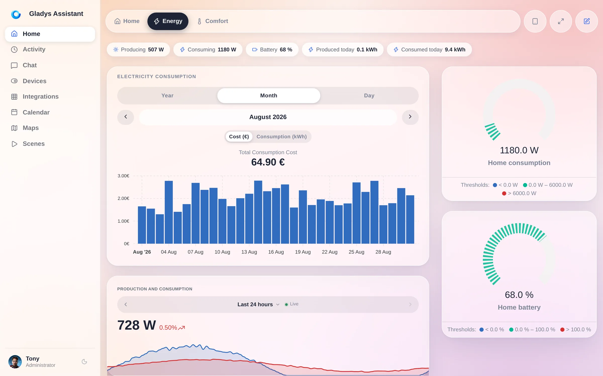
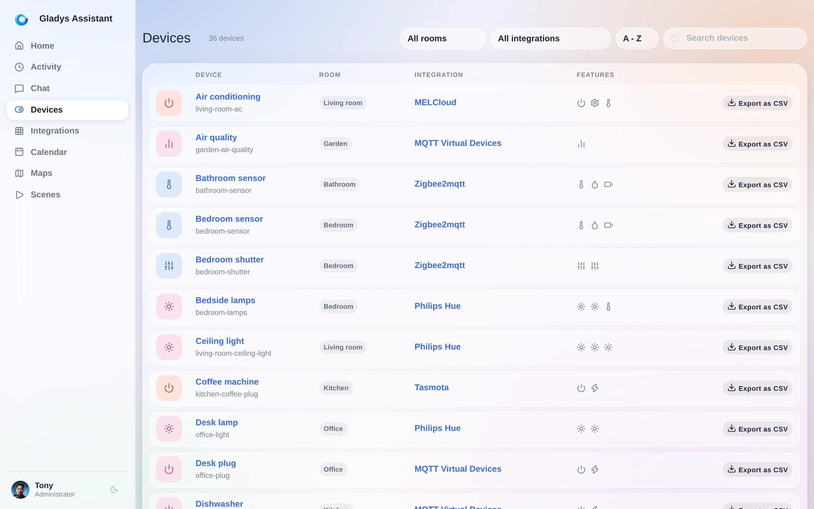

Hey everyone!

**Gladys Assistant 5 is out.** 🎉

This is the first major version of Gladys in almost six years, and it is the one I have wanted to ship for a very long time: a complete redesign of the interface, from the dashboard to the last settings page.

{/* truncate */}

## A short history

Gladys has been in the open **since 2013**. It started as a personal project on a Raspberry Pi, in a bedroom, with a very simple idea: your home should be run by a machine **you own**, in **your house**, that keeps working when the internet goes down and when a startup gets acquired.

Thirteen years later, that idea has not moved, and it has aged well.

- **2013**: first lines of code, Gladys v1, on a Raspberry Pi.
- **2015**: Gladys v2, and a community forms around it.
- **2016**: Gladys v3.
- **3 November 2020**: **Gladys 4**, a full rewrite, Docker-based, with the interface most of you use today.
- **27 August 2026**: **Gladys Assistant 5**.

Between v4 and today, we shipped **86 minor versions**. The engine got very good: Zigbee, Z-Wave, Matter, MQTT, cameras, energy, scenes, an AI assistant, a plugin system. But the interface stayed the one designed in 2020, for a laptop screen, at a time when I did not really expect people to mount tablets on their walls and drive their house from their phone in bed.

You did exactly that. So version 5 is for the screen you actually use.

## ☀️ Horizon, the new design

The new design is called **Horizon**. It is a soft, luminous glass theme: frosted surfaces floating over a living gradient, generous radii, real depth, and a type scale that finally lets the numbers breathe.

It is not a re-skin of two screens. **Every page of Gladys moved onto it**: the dashboard, Devices, Integrations and each of their sub-pages, Discussion, Activity, Calendar, Plans, Scenes, Settings, the profile, even the login screen.

Look at the controls in that screenshot. The old Bootstrap button groups became **iOS-style segmented controls**: a soft track, a single white active segment. Setpoints became **capsules** with a minus and a plus. Switches became real toggles. None of this changes what Gladys does. All of it changes how it feels to use twenty times a day.

## 📱 Built for the phone in your pocket

This is the part I care most about, and the part that is hardest to show in a screenshot, so let me be specific.

**The dashboard switcher moved to the bottom.** On a phone, the reachable edge is the bottom one, not the top. So below the desktop breakpoint the tab bar detaches from the header and becomes a floating dock within thumb reach. It respects `safe-area-inset-bottom`, so it clears the home indicator on an iPhone, and it tracks the **visual viewport**: iOS Safari animates its own bottom toolbar while you scroll, and without that correction the dock would keep hiding underneath it. Now it does not.

**Only the active tab keeps its name.** The others shrink to icon dots. On a 390 pixel screen that is the difference between seeing two dashboards and seeing five.

**You can swipe between dashboards, and it feels native.** Not a page reload: the neighbouring dashboard **slides in under your finger as a skeleton**, at the exact layout the real one will have, and swaps to live data when it lands. The gesture locks to an axis after 12 pixels of travel, commits at 15% of the screen width or on a flick, and rubber-bands when there is no dashboard on that side. Widgets that own their own horizontal gesture (a map, a slider, a scrollable device table) keep it: the pager detects those by geometry, not by a hardcoded list, so a new scrollable widget is covered by construction.

**Touch targets grow only for fingers.** Every control in a widget reaches the ~44 pixel Apple HIG floor, but under `@media (pointer: coarse)` only, so a laptop with a touchscreen keeps the compact mouse sizing instead of turning into a kiosk. Same idea for tapping a device row: on touch, the whole row is the target; with a mouse, it is not, because a stray click on a device name must never be a live write to your lights.

**Segmented controls are the exception to the 44 pixel rule**, on purpose: inside a segmented track the *whole track* is the touch zone, so its segments stay at the iOS segmented height instead of stacking into a tower of fat buttons.

**Popups are portalled.** Date pickers, period selectors, dropdown menus: they used to be clipped by the card that contained them, or painted under the next step of a scene. They now render at the top of the document, so they are never cut off on a small screen.

**The settings menu scrolls sideways** with overflow arrows instead of wrapping into six lines. Columns that no longer fit **wrap** instead of being crushed. The scene name stops being truncated. The integrations disclaimer collapses.

Twenty small decisions. Together they are the difference between an interface that *works* on a phone and one that was *made* for it.

## 🌙 Light or dark, your call

Horizon ships in both. The dark theme is not an inverted filter, it is authored: the same glass, the same depth, warmer at the edges.

## 🧱 A dashboard you can actually lay out

The old dashboard was N equal columns, full stop. If you wanted a big house view on the left and a stack of small tiles on the right, you could not have it.

Now a dashboard is made of **sections**, and each section has its own columns:

- **Weighted column widths.** A column is *normal* or *wide*. A `wide | normal` section puts a large panel on the left and a tile stack on the right. Two clicks, two values, no pixel fiddling.
- **A chips bar.** Compact status pills at the top of a dashboard: alarm state, "all closed", a temperature, solar production, the next calendar event. They reflow on a phone instead of overflowing.
- **Quick actions and scenes with live state.** A scene button now tells you what the scene did: `Leave home · On`.
- **A house view widget**: an illustration of your home with live values pinned on it.
- **The editor previews the real thing.** The edit canvas and the viewer now share one column layout, with the same percentage shares, so what you arrange is what you get.
- **A searchable widget picker** with an icon and a name per type, instead of a raw dropdown.

Dashboards also now **require an icon** when you create one, and existing dashboards whose name started with an emoji get that emoji promoted to their icon automatically.

## 🎬 The scene editor, rewritten

Scenes were the most powerful and the most intimidating part of Gladys. The editor is now a **vertical flow**: a **WHEN** block for the triggers, a **THEN** block for the steps, each step collapsible, each action picked from a **categorized picker** instead of a flat list.

Also new in scenes:

- **See and stop running scenes**, at last.
- A **"Get the current date and time"** action.
- An **"any state change"** mode on the device state trigger.
- The message channel selector only lists the messaging services you actually configured.
- You can delete the first action block of a scene.
- Calendar events come back as a readable list in scene variables.

## 🧩 67 community integrations, and counting

Two versions ago we opened **external integrations**: anyone can package a device compatibility as a small Docker image, publish it, and it appears in the catalog of every Gladys instance on the planet.

The catalog went from 20 to **67 integrations** in about a month, and **22 of those landed in the last two weeks alone**. Airzone, Apple TV, Daikin, De Dietrich, charging stations, CallMeBot, Docker, solar inverters: almost all of it written by the community, not by me.

This release polishes that whole loop: an **Installed** view showing what actually runs on your instance, version numbers **linked to their changelog**, the new version shown in the "update available" banner, **per-feature history retention** on external devices, and **automatic energy tracking** for the features that report power.

If your device is not supported yet, [you can build the integration yourself in an afternoon](/docs/dev/external-integrations/).

## 🤖 An assistant that actually uses your house

The AI assistant now shows **which tools it used** to answer you. Ask what you consumed today and you see it call `device_get_energy_consumption`, then `device_get_state`, then answer in plain language. No black box.

New in this release: a **microphone button** to dictate your message instead of typing it, and a **battery tool** so the assistant can answer "which sensors need new batteries?".

## ⚡ Energy

The energy widgets got the Horizon treatment and a few real upgrades: a **billing period that can start on any day of the month** (so it matches your actual bill, not the calendar), a redesigned month and year view, and a period picker that no longer gets clipped inside its card.

Enedis users: the new **DataConnect 2026** consent callback is supported, and a sync now only recalculates the costs of the devices it actually touched, instead of the whole history.

## 🔌 Devices, protocols, system

- **Export a device's history as CSV**, straight from the devices list.
- **Matter**: water leak detectors, contact and rain sensors, and **door locks**.
- **Zigbee2MQTT 2.13**, support for **network coordinators** (SMLIGHT SLZB-06/07 and friends), outdoor solar sirens, and the Heiman HS2WD-E.
- **MQTT**: wildcard state topics in Home Assistant discovery.
- **Google Home**: temperature and humidity sensors are exposed.
- **Cameras**: disable a camera without deleting it, a real private mode.
- **Reboot or shut down the host** from the System settings, and it now works on standard Docker installs too.
- **Gladys announces itself on your local network over mDNS**, so finding your instance stops being an IP hunt.
- **Two-factor recovery codes** for Gladys Plus, and Gladys now recommends mainstream 2FA apps.
- Weather icons were redrawn and the pivot conditions extended.

Plus the long tail: rooms sorted alphabetically, integration names shown on the devices list, the houses tab turned into a readable list, the DuckDB migration card hiding itself once there is nothing left to migrate, and a pile of fixes.

**92 pull requests, 720 files, about 52,000 lines added, in 12 days.**

## 🏡 Coming from Home Assistant?

I will be honest about the trade: Home Assistant has more integrations than Gladys, and it will for a while. Here is what you get in exchange.

- **An interface you do not have to build.** No YAML, no dashboard DSL, no card catalog to learn. You install Gladys and it already looks like the screenshots in this post, on your phone, in dark mode, without a single config file.
- **Your existing devices probably already work.** Gladys speaks **Home Assistant Discovery over MQTT**: your ESPHome, Tasmota and Zigbee2MQTT devices are found automatically, with zero manual configuration. It also speaks Zigbee2MQTT natively, Matter, Z-Wave, and it can talk to HomeKit and Google Home.
- **One update button.** Gladys is a Docker image. It updates itself, in one click, or automatically with Watchtower.
- **An AI assistant that is actually built in**, that can see your devices and act on them, and that tells you which tools it used.
- **The same promise since 2013**: local first, open source, no cloud required, no account required, your data on your hardware.

The fastest way to judge is not to read me. It is to click the next link.

## 👉 Try it right now

**[Open the live demo](https://demo.gladysassistant.com/dashboard)**. It is a full Gladys Assistant 5 running entirely in your browser, with a real house, real dashboards, real scenes. Nothing to install, nothing to sign up for.

Then, when you are convinced: **[install Gladys](/docs/)**. On a Raspberry Pi, a NAS, an old laptop, anything that runs Docker. It takes a few minutes.

## ❤️ Thank you

Version 5 exists because of the people who reported, argued, tested on their own wall tablets and sent me screenshots of things that were broken on iOS.

Huge thanks to [@Dreamthy](https://github.com/Dreamthy), [@William-De71](https://github.com/William-De71), [@callemand](https://github.com/callemand), [@cicoub13](https://github.com/cicoub13), [@vincentBesseau](https://github.com/vincentBesseau), Stéphane Escandell and Valentin Hutter for the code in this release, and to everyone publishing external integrations: you are the reason the catalog tripled in a month.

As always, Gladys updates automatically within 24 hours if you use Watchtower, otherwise you can do it in one click from the settings.

Remember to set up Telegram to get an alert on your phone when Gladys updates!

[See the full release notes on GitHub](https://github.com/GladysAssistant/Gladys/releases/tag/v5.0.0)
