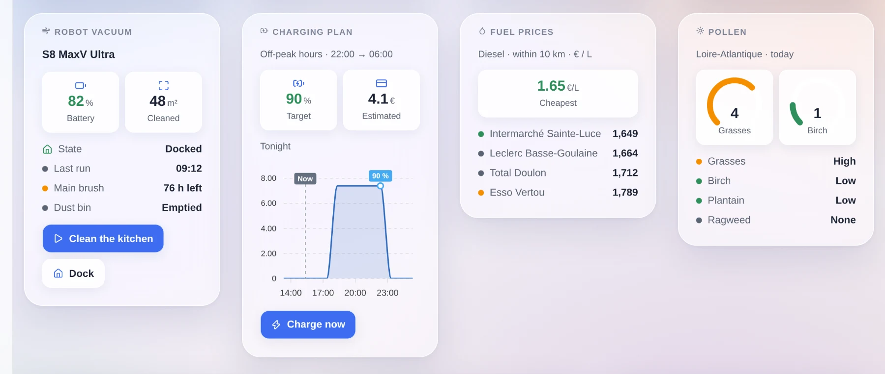
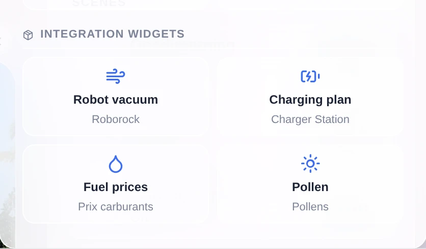
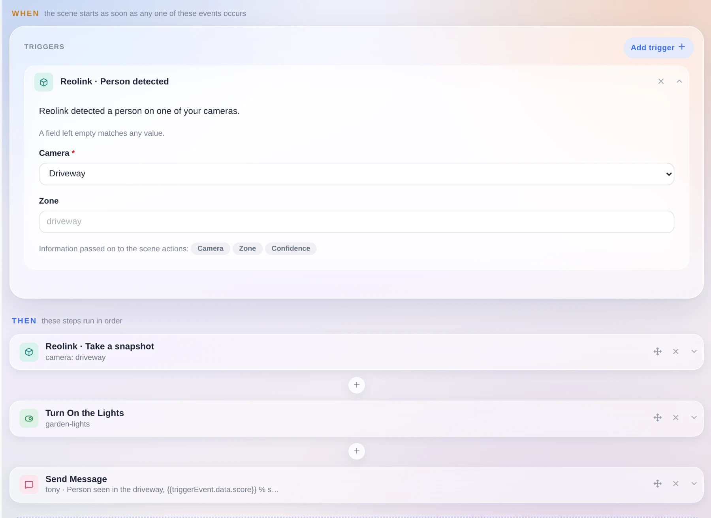
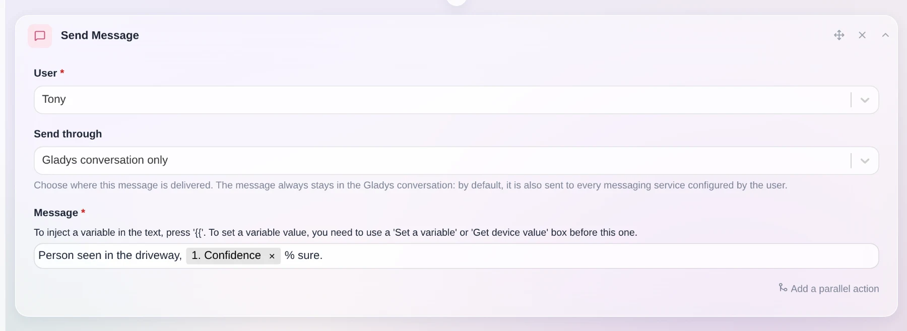
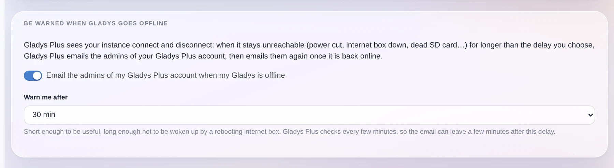
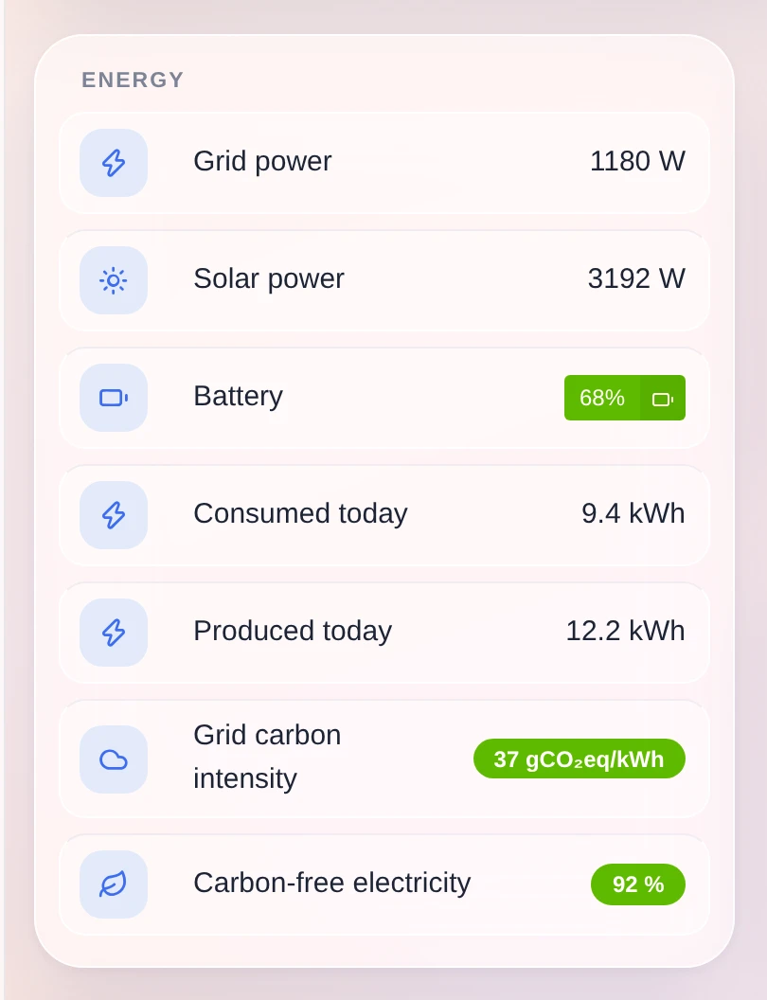
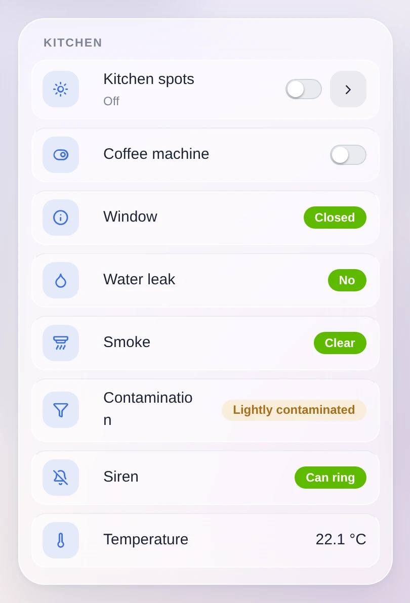

Hey everyone!

New version of Gladys today, 5.1 🎉

Version 5 was a big interface redesign. This one is mostly for integrations. Until now, a community integration could do exactly one thing: publish devices. It can now put its own widgets on your dashboard, and add its own triggers and actions to your scenes.

{/* truncate */}

## Dashboard widgets published by integrations

Quick reminder: since 4.84, anyone can package an integration into a small Docker image, publish it on GitHub, and it shows up in the catalog of every Gladys instance. We are at 81 today, written almost entirely by the community.

The problem is that a lot of useful things are not devices. A solar production forecast, a vacuum's cleaning map, the cheapest diesel around you, today's pollen risk, the plan your car will follow tonight: none of that fits into "a temperature and a switch", and all of it is exactly what you want on a dashboard.

So an integration can now declare its own widgets, and they land in the dashboard editor next to the built-in ones:

They show up in the widget picker of the dashboard editor, in their own section, with the name of the integration that provides them. You add one like any other widget. And if it has settings (which vacuum, which region, which period), you fill them in right there, in a form described by the integration and generated by Gladys.

### The integration says what to show, Gladys decides how

This is the important part of the feature, and it was a deliberate choice rather than something we ended up with.

No third-party integration injects HTML into your Gladys. No iframe, no script, no CSS, no custom colors or sizes. The integration sends a description of its content in a small vocabulary: a title, value tiles, a gauge, a list of states, a chart, an image grid, buttons. Gladys does the rendering.

So every widget, even one written by someone you have never heard of, automatically gets the Horizon theme, dark mode, the mobile layout, your language and your timezone. And it keeps working when the interface changes. It is the iOS and Android widget model.

There is also a content budget, to avoid overloaded cards: 8 components maximum, a single main component (a chart or a list or an image, not two), 6 value tiles maximum, 4 buttons maximum, bounded lists and short texts. And Gladys decides the display order: header, tiles, main component, states, buttons. Two widgets showing a value, a curve and two buttons therefore come out looking the same.

A few technical details:

- The content is computed on the fly, not frozen in the manifest. A vacuum that is cleaning can return a different layout than a vacuum on its dock.
- Nothing is treated as trustworthy. Every payload is checked and bounded before it reaches the interface: known components only, size-limited texts and lists, finite numbers, valid dates, https links, and images served by your Gladys rather than fetched from a third party by your browser.
- A button can act: call the integration, or write a value on one of its device features. The result is shown in the card.
- A widget can plot a curve from your Gladys history, or from data Gladys does not have (a forecast, a charging plan, tomorrow's prices) by sending the points directly, with annotations and a "now" marker.
- An integration with no devices at all, like a fuel price index or a cinema release feed, finally has a place thanks to the new `provider` type.

One note about the screenshots above: they are examples of what the vocabulary can do. The mechanism ships today, the integrations that use it still have to be written.

## Scene triggers and actions published by integrations

It is exactly the same problem on the scenes side. Until now, every trigger and every action in the scene editor was hardcoded in Gladys. An external integration had no way to add one, and the two generic surfaces it did have were not enough:

- A device feature is a state. A temperature, a switch, a presence: that works very well with the "state change" trigger. But a licence plate recognized in the driveway, a doorbell with a snapshot, an NFC tag scanned or a voice command understood are one-off events with data attached. Turning them into a feature loses the data, gets mixed up when two events come in a row, and pollutes your history.
- Writing a value is not running an operation. "Take a snapshot and give me the image", "clean these three rooms", "announce this on that speaker": there are parameters and a result.

So an integration can now declare its triggers and its actions in its manifest, and they show up in the scene editor like everything else.

The card is generated by Gladys from the declaration. The fields become a form, a field left empty matches any value, and the data carried by the event becomes scene variables you can reuse in the following steps. The confidence score in the screenshot comes straight from the trigger.

On the design side, it is Gladys that does the matching: the integration sends a typed event with its data, and Gladys compares it against the triggers you configured. The integration never learns which scenes exist, so there is nothing to leak and nothing to resynchronize when it reconnects, and your configuration stays in Gladys. An action is sent once, and a timeout fails that action only.

One nice side effect: a scene can now mix an event from one integration, an action from another, and the usual Gladys steps in between.

## "Gladys conversation only"

A lot of you asked for this one. When a scene sends you a message, it goes by default to every messaging service you configured (Telegram, SMS...).

You can now choose. With "Gladys conversation only", the message stays in Gladys and nowhere else. That is handy if you install Telegram later and do not want your old scenes to start notifying your phone. The option works even if you have no messaging channel configured at all, and it also exists on the "Ask the AI" action.

Still in scenes: scenes created by the AI are now tagged "AI", which makes them easy to find again. And filtering by tag now matches the tag exactly, instead of keeping anything that contains the word.

## Gladys speaks Spanish

Gladys is now translated into Spanish, the fourth language after English, French and German. The whole interface went through: dashboard, devices, scene editor, settings, integration pages, and even the icon search keywords.

Big thanks to Nestor Alonso Torres for this contribution. If you want Gladys in your language, the translation files are plain JSON in the repository, go for it.

## Get warned when your Gladys goes down

Gladys Plus sees your instance connect and disconnect. It can now email you when it has been unreachable for longer than a delay you choose, from 10 minutes to a day, then email you again when it comes back.

Power cut, internet box down, dead SD card, a Docker update that went wrong: you find out the same day, instead of discovering it in the evening when you get home.

The setting belongs to your Gladys Plus account, so you change it from Gladys Plus, and Gladys gives you a direct link to the right page.

## A new device category: grid carbon

Gladys gains a "grid carbon sensor" category, with three values: the carbon intensity of your electricity grid in gCO₂eq/kWh, the share of carbon-free electricity and the share of renewables. Each one has its unit, its history and its charts.

More importantly, a scene can read them. "Start the washing machine when the grid is clean" becomes possible, and the integrations that publish those numbers for your country finally have somewhere to put them.

## Smoke detectors report more information

Zigbee smoke detectors send a lot more than the alarm itself, and Gladys can now read it: how contaminated the sensing chamber is (a contaminated detector no longer detects anything, so it tells you when to clean or replace it), whether the detector has muted itself, and a command to hush the alarm for as long as the device allows.

That last one deliberately stays out of the switch category. Silencing a fire alarm must not be possible through a "turn everything off" in a scene or a voice assistant.

## Devices, protocols, system

- **Matter**: matter.js is upgraded to 0.17.9, which fixes the `Node ID X is already commissioned` errors that blocked some pairings.
- **HomeKit**: air conditioners are exposed as a HeaterCooler. Asking Siri to turn one on now keeps the mode it was in.
- **Zigbee2MQTT**: the ZLinky_TIC three-phase labels are handled (`SINSTS1`, `SMAXSN*`, `IINST1`, `IMAX1`), `probe_temperature` gets its own temperature type instead of overwriting the main one, and the container now runs in your instance's timezone. Its logs and schedules are no longer off by a couple of hours.
- **Dashboard**: the slider and the number input respect the step declared by the device feature. A setpoint that moves by 0.5 no longer jumps by 1.
- **Sonos**: the built-in integration now has a "deprecated" badge and a migrate button to the community integration, which does more. The migration modal warns about what changes for play notifications.
- **Calendar**: fixed a regression where loading the dayjs timezone plugin broke the calendar.
- **Gladys Plus**: the payment lock some accounts were stuck in because of the Lite plan 402 bug is now cleared automatically. And every release is published to Gladys Plus straight from the release workflow.
- **Security**: fixed a password reset flaw where an attacker-chosen origin could poison the link sent by email.

On the documentation side, the API routes that were missing from the generated apidoc are published, and the external integrations specification is split into one file per topic.

## And everything 5.0.x already fixed

Between 5.0 and today, four patch releases went out (5.0.1 to 5.0.4) with around fifty fixes, almost all of them from your feedback on the new interface: portrait tablets, long device names, the mobile dock, weather icons, the ConBee III, scene variable renumbering, dropdown menus falling off the bottom of the screen, dashboard scroll lag.

That makes almost 70 pull requests since version 5.0, 23 of them in this release.

## Thanks to the contributors

Thanks to [@cicoub13](https://github.com/cicoub13), [@William-De71](https://github.com/William-De71), [@vincentBesseau](https://github.com/vincentBesseau) and Nestor Alonso Torres for the code in this release, and to everyone publishing external integrations. The catalog is at 81 and it keeps growing.

If you want to write your own, [the developer guide is here](/docs/dev/external-integrations/). It does not cover widgets and scene declarations yet, in the meantime everything is detailed in [the external integrations specification](https://github.com/GladysAssistant/Gladys/tree/master/docs/specs/external-integrations/capabilities).

See you on [the forum](https://community.gladysassistant.com/) if you want to talk about this release :)

## How to update?

As always, Gladys updates automatically within 24 hours if you use Watchtower, otherwise you can do it in one click from the settings.

Remember to set up Telegram to get an alert on your phone when Gladys updates!

The full CHANGELOG is available [here](https://github.com/GladysAssistant/Gladys/releases/tag/v5.1.0).
