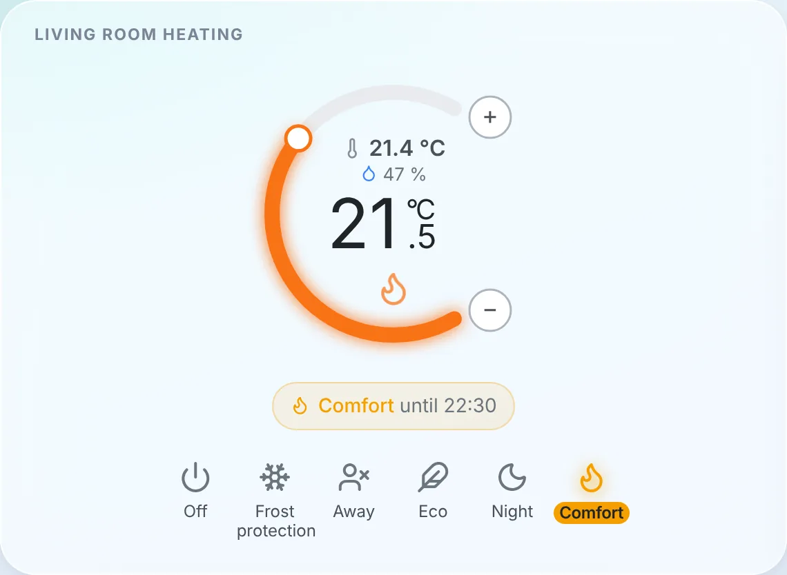
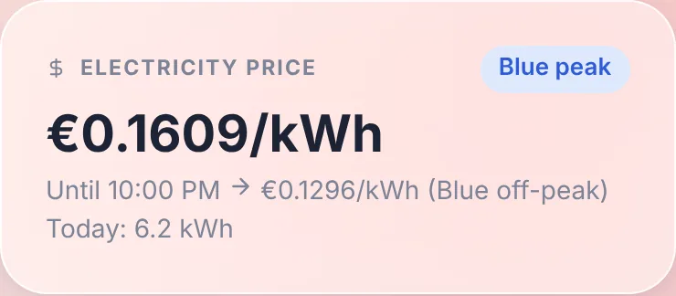
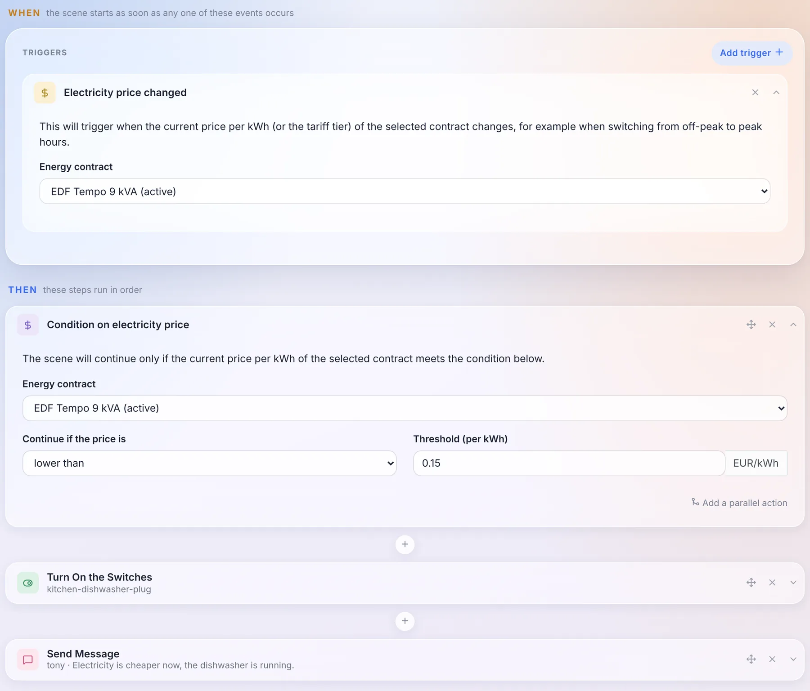
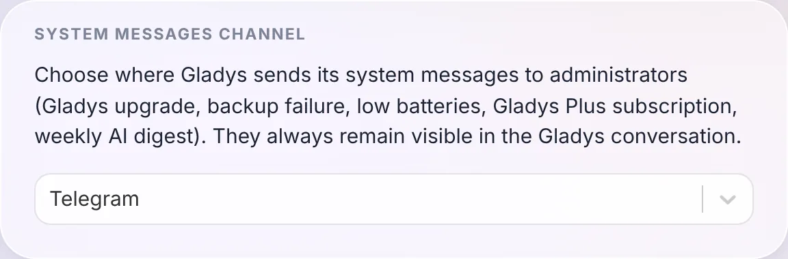
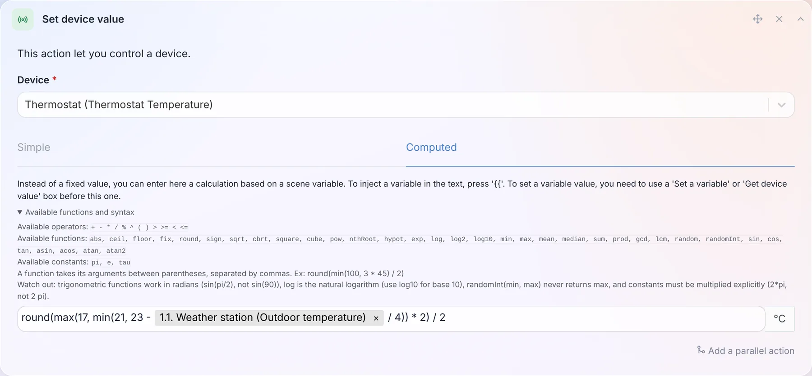
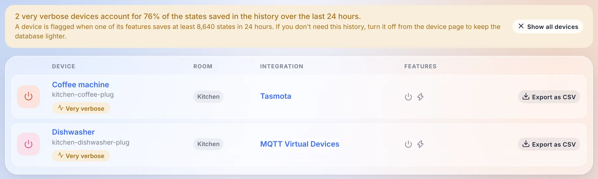

Hey everyone!

New version of Gladys today, 5.2 🎉

Two big pieces in this one, and both are about your home rather than about the interface. Gladys can now **be your thermostat**, or programme the one you already have, with weekly schedules. And **energy tracking opens up to every electricity contract**: not just the three French ones Gladys knew until now, but time-of-use rates, seasons, tiers, spot prices, from almost any country.

{/* truncate */}

## Gladys becomes a thermostat

It was one of the oldest requests on the forum, and probably the most common setup in France: an electric heater driven by a relay or a smart plug, a temperature sensor somewhere in the room, and no branded thermostat anywhere. Until now, the answer in Gladys was a scene per temperature threshold. No schedule, no hysteresis, and a heater that flickered on and off around 21 °C.

There is now a native **Thermostat** integration, and it handles two cases.

**Gladys is the thermostat.** You pick a temperature sensor and a switch (a relay, a plug, a boiler contact), and Gladys regulates: it reads the temperature every minute and turns the heater on and off to reach the setpoint. You choose between a hysteresis (heat below 20.5 °C, stop above 21.5 °C) and TPI regulation, which heats for a share of a fixed cycle proportional to the gap. The latter is gentler on heaters with a lot of inertia. A window sensor cuts the heating the second the window opens.

**Gladys programmes your existing thermostat.** A Netatmo, a Zigbee radiator valve, a Matter or MQTT thermostat already regulates itself very well. What it lacked was a schedule living in Gladys, next to the rest of the house, rather than in the vendor app. Gladys now writes its setpoint according to the schedule, switches its mode to Off when needed, and shows whether it's heating.

A detail I'm quite happy with: if someone turns the dial of the real thermostat, or changes the temperature from the vendor app, Gladys sees it and treats it as a manual change. It doesn't overwrite it a minute later, which is the classic bug of thermostats driven by two masters.

### Weekly schedules, per house

The schedules belong to a house. With two houses, each has its own "Week", and a thermostat can only follow a schedule of its own house.

Under the hood, a schedule is a list of **transition points**, the way Netatmo and Tado do it: "from Monday 06:30, Comfort, until the next point". It sounds like a detail, but it removes a whole family of bugs:

- a night from 22:30 to 06:30 is a single slot, not two halves glued together at midnight;
- there are no gaps and no overlaps: adding a slot shortens the ones it covers, deleting a slot extends the previous one;
- a day without its own slot keeps the last preset of the day before. An office schedule with no weekend slot keeps its Friday evening preset all weekend, and the week view shows exactly that.

"Copy to..." copies a day onto the others: you write Monday, you copy it to the whole week, done.

### The widget, and everything else

The new dashboard widget shows the room temperature and humidity, the setpoint in large, and an orange glow when the heater is running. The banner tells you what the thermostat is doing ("Comfort until 22:30"), and the bar at the bottom gives you the presets: Off, Frost protection, Away, Eco, Night, Comfort.

Picking a preset or turning the dial is a manual change, which by default lasts **until the next slot of the schedule**, as on Tado or Netatmo. You can also set a fixed duration instead. And without a schedule, a manual change stays, like on a classic thermostat.

The part that matters the most to me is not visible on screen: the preset, the mode and the setpoint are **standard device features**. A scene can therefore set the house to "Away" when everyone leaves, and the AI, MQTT, Gladys Plus and the voice assistants see a thermostat like any other, with its preset and its heating state.

Huge thanks to [@William-De71](https://github.com/William-De71), who wrote the bulk of this integration: 84 commits, and a lot of patience through the review!

The [thermostat documentation is here](/docs/integrations/thermostat).

## Energy contracts, for every country

Energy tracking in Gladys knew three contracts: base, peak / off-peak and EDF Tempo. Anything else meant a pull request on Gladys and a new release. A weekend off-peak rate, a summer / winter tariff in the United States, Hydro-Québec tiers, an hourly spot price in Norway: impossible.

In 5.2, a contract is no longer a list of prices but a **set of rules**, interpreted by a pricing engine that knows no supplier by name. A rule can depend on the time, the day of the week, the season, a date range, a tariff calendar (Tempo colour, public holidays, critical peak days), consumption tiers per day, per month or per billing period, or the peak power. On top of that come fixed fees, taxes as a percentage, demand charges per kW and spot prices with a multiplier and a margin.

The engine is tested against real contracts from **12 countries**: France, Belgium, the United Kingdom, Germany, Finland, Norway, the United States, Canada, Australia, Japan, South Korea and India.

### A wizard, and a preview on your own consumption

Creating a contract happens in four steps: the meter, the contract template (filtered by country, with a search), its parameters, and a **preview**.

The preview prices your real consumption of the last 7 days with the contract, without saving anything: the total, the detail per component, and a sample of intervals with the price applied to each of them. If it doesn't match your bill, you know before you save.

Your existing prices are **converted automatically** into contracts on the first start, without touching the cost history. Gladys checks the conversion itself by comparing the old and new calculation over the last 7 days, and flags a contract that differs.

### The price on the dashboard, and in your scenes

A new **Electricity price** widget shows the current price, the current tier, until when it applies and the next price, as well as today's consumption.

And because the price is now known by Gladys at every moment, scenes can use it: an **"Electricity price changed"** trigger, and a **"Condition on electricity price"** action. Starting the dishwasher when electricity gets cheaper takes three blocks:

### A contract can come from anywhere

The templates come from three places: the [community catalogue](https://github.com/GladysAssistant/energy-contracts), downloaded by Gladys without needing an update, the internal Gladys services (EDF Tempo), and **external integrations**. An integration can now declare contract templates, publish tariff calendars (day colours, half-hourly or quarter-hourly spot prices, public holidays) and, for the contracts that rules can't express, compute the cost itself.

Concretely: an Octopus Agile, Tibber or Nord Pool integration can be published by anyone, without touching Gladys. And if your contract is missing, you can also write it yourself in JSON in the wizard, then export it as a template to share it.

The [energy monitoring documentation](/docs/integrations/energy-monitoring) is up to date.

## Choose where system messages go

Gladys sends messages to administrators on its own: an update, a failed backup, low batteries, the Gladys Plus subscription, the weekly AI digest. Until now, they went to every messaging channel you had configured.

You now choose the channel in `Settings / System`: all of them, Telegram only, or the Gladys conversation only. They always stay visible in the Gladys conversation anyway.

Thanks to [@cicoub13](https://github.com/cicoub13) for this one!

## 35 math functions in scene formulas

The calculated values of scenes (wait, set a device value, set a variable, conditions, speaker volume) only knew `+ - * / % ^` and five functions. There are now 35 of them, plus 3 constants: `min`, `max`, `mean`, `median`, `sum`, `sqrt`, `pow`, `log10`, `exp`, the trigonometric functions, `pi`... And a "Available functions and syntax" link opens the full list right under the field.

So a setpoint that follows the outdoor temperature while staying between 17 and 21 °C, rounded to the half degree, fits in one line, like in the screenshot above: `round(max(17, min(21, 23 - outside / 4)) * 2) / 2`, where `outside` is the temperature read in the previous step of the scene.

Another change: a formula that can't be computed now **stops the scene**, instead of letting it continue with the previous value.

[The full list is in the documentation](/docs/scenes/math-functions).

## Find the devices that fill your database

Some devices send a value every few seconds. A smart plug reporting its power ten times a minute, kept forever in the history, ends up weighing more than the rest of the house combined.

The devices page now flags them: a banner tells you which share of the history they represent over the last 24 hours, a filter shows only them, and each device page displays the size of the history of each feature. If you don't need that history, disable it from the device page, and your database will thank you.

## For integration developers

- **Calendars**: a new `calendar` integration type lets an integration sync calendars and their events into Gladys: a CalDAV or Nextcloud server, iCloud, a public ICS feed (school timetable, waste collection, sports fixtures)... They show up in the calendar view and work with the calendar scene triggers, exactly like the calendars of the CalDAV integration, and each user links their own account from the integration page. Google Calendar and Outlook, which need a per-user OAuth login, will come in a second step.
- **Energy contracts**: the new `energy_contracts` capability, described above.
- **Widgets**: a widget button can now open a short form (4 fields maximum) before sending its action, for example the price of a pellet delivery typed from the wall tablet.
- **Houses**: a field can offer the list of the houses of Gladys with `source: "houses"`, in the configuration, the widgets and the scenes.

Everything is in [the developer guide](/docs/dev/external-integrations/).

## Fixes, and everything 5.1.x already brought

Four patch releases went out since 5.1 (5.1.1 to 5.1.4). Here is what they and this release fix:

- **Updates**: when Gladys can't download its new image, the update now shows the real Docker error (internet connection, disk space, timeout) instead of a generic message.
- **CalDAV**: events with parameters on their properties and `GMT+hhmm` timezones are synced correctly, and an event that can't be formatted no longer blocks the others.
- **Zigbee2MQTT**: the bundled container is upgraded to 2.14.2.
- **Broadlink**: the toggle of smart plugs stays in sync with the real state of the plug.
- **Vacuum cleaners**: the cleaning mode and run mode controls only offer the options the device supports.
- **Camera widget**: only the text states of the image feature are displayed.
- **Integrations**: secret fields of actions can be typed in, default values of action fields are applied, number fields accept decimals, and widget buttons keep their colours in dark mode.
- **Login**: after a local login, Gladys takes you back to the page you were trying to open.
- **Database**: the daily purge keeps the 1,000 most recent messages per user and the 2,000 most recent background jobs, so these tables no longer grow forever.
- **Security**: the location and presence routes of a user are now restricted to that user and to administrators, and several dependencies are upgraded to clear npm advisories.
- **Gladys Plus**: the version check is only sent by the official release images, and the pricing page now shows the offline email alert introduced in 5.1.

That makes 38 pull requests since version 5.1, 19 of them in this release.

## Thanks to the contributors

Thanks to [@William-De71](https://github.com/William-De71) for the thermostat, to [@cicoub13](https://github.com/cicoub13) for the system messages channel and the camera widget fix, and to [@bertrandda](https://github.com/bertrandda) for the CalDAV fix. And thanks to everyone who reported bugs on the forum!

See you on [the forum](https://community.gladysassistant.com/) if you want to talk about this release :)

## How to update?

As always, Gladys updates automatically within 24 hours if you use Watchtower, otherwise you can do it in one click from the settings.

Remember to set up Telegram to get an alert on your phone when Gladys updates, and since this release, you can choose exactly where these messages go!

The [full CHANGELOG of 5.2.0](https://github.com/GladysAssistant/Gladys/releases/tag/v5.2.0) is on GitHub.
