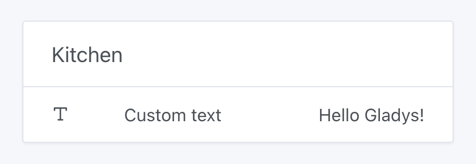

If you have configured a MQTT Broker with your Gladys installation, you will have access to the Gladys MQTT API.

Here are all the MQTT topics available, each one with an example message to send:

### Push a decimal device state

Say you have a temperature sensor sending data to Gladys, you'll have to send it's temperature values to:

```
Topic: gladys/master/device/:device_external_id/feature/:device_feature_external_id/state
Body: 22.2
```

### Push a text device state

If you want, you can send text to Gladys to display it on the dashboard!



You need to create a "Text" device in the MQTT integration, then publish a message on this topic:

```
Topic: gladys/master/device/:device_external_id/feature/:device_feature_external_id/text
Body: Hello Gladys!
```

### Push a state to a device

Say you have a MQTT light, and you want it to be controlled in Gladys.

The light will need to subscribe to this topic:

```
gladys/device/:device_external_id/feature/:device_feature_external_id/state
```

Where it will receive values such as:

```
1
```

Meaning "The light needs to be turned on".

Or

```
0
```

Meaning "The light needs to be turned off".

### Launch a scene with MQTT

You can now launch a scene using MQTT by posting a message on the topic:

```
gladys/master/scene/SCENE_SELECTOR/start
```

By replacing `SCENE_SELECTOR` with the scene selector, which can be found in the scene edition URL.

For example, for the scene `http://192.168.1.10/dashboard/scene/cinema`, you'll need to send a message to the topic:

```
gladys/master/scene/cinema/start
```
