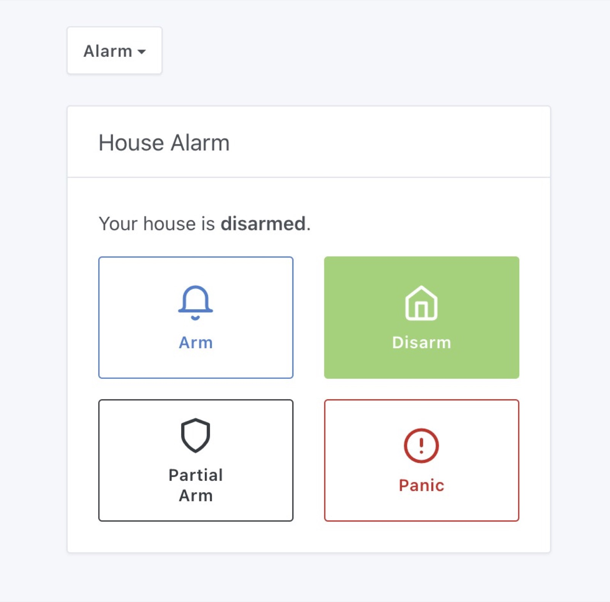
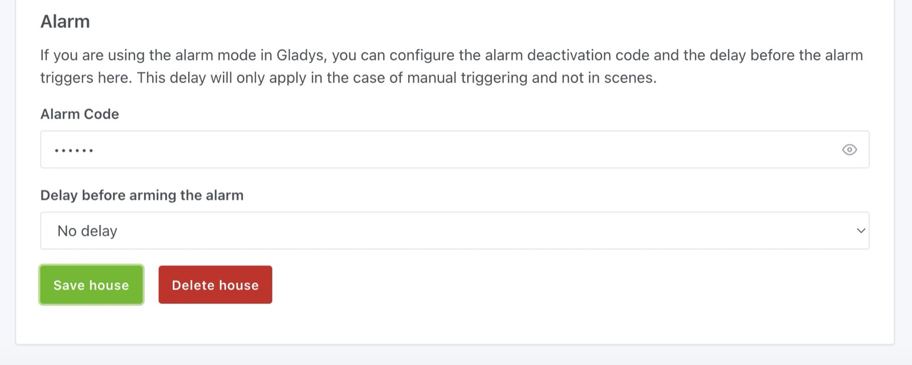
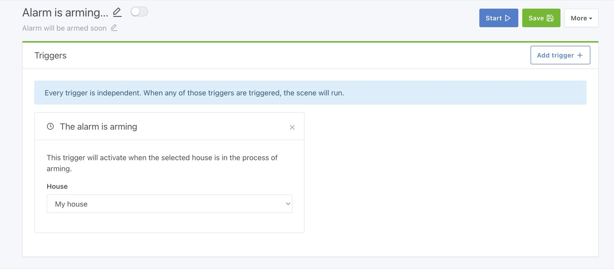
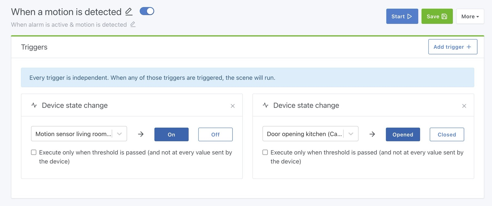
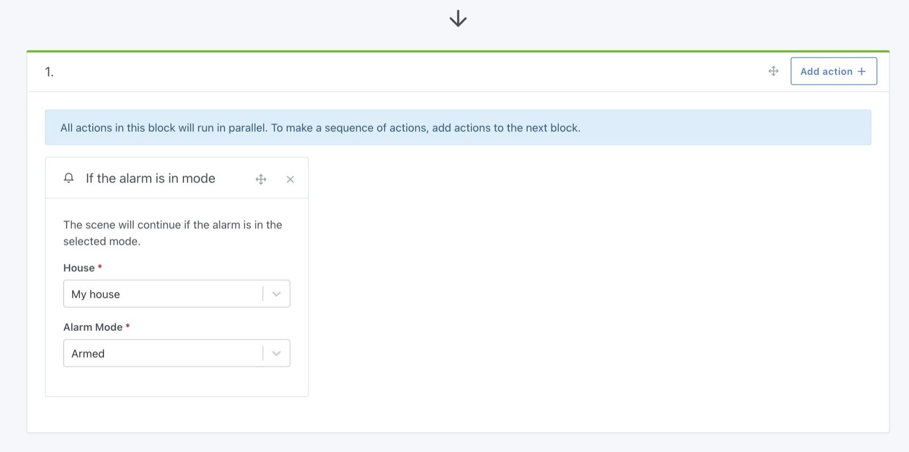
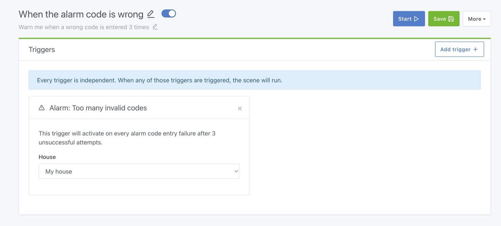
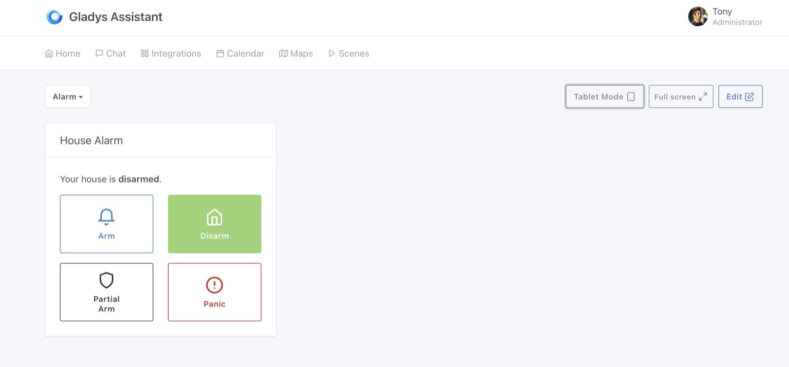
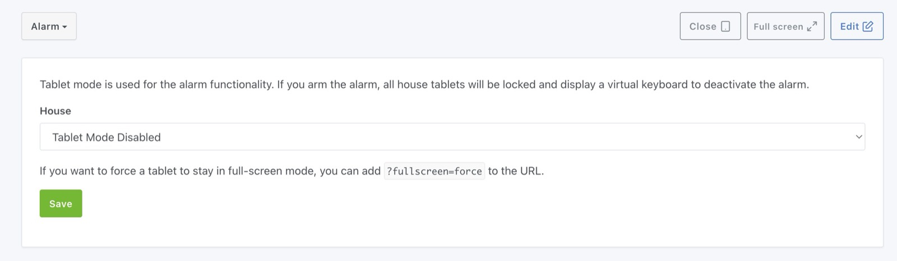
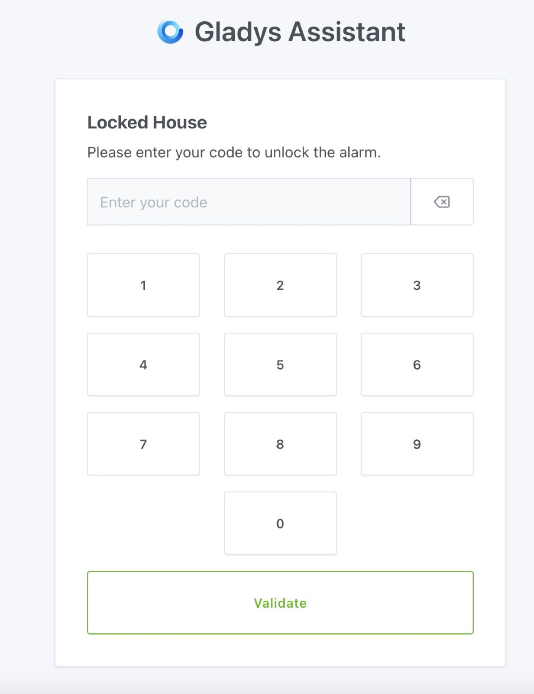

In Gladys, you can configure a real alarm system.

## Configure dashboard

On the dashboard, you can add an "Alarm" widget:

The alarm in Gladys has 4 modes:

- **Armed**: The house is armed. Useful when you're away from home.
- **Disarmed**: The house is disarmed, the alarm is not active.
- **Partial arming**: This mode is useful for "night mode" or "nap mode". You're at home and want to monitor only the outside of the house, but not the inside, so you can continue moving around.
- **Panic mode**: An intruder is in the house and you want to trigger the alarm, perhaps sending an automatic message to a loved one?

Now that you've understood the different modes, it's time to set up scenes to implement your alarm strategy.

## Set arming delay and alarm code

There are 2 parameters to set in the house parameters ("Parameters" -> "Houses")

- **Alarm code**: If you use "tablet mode", Gladys will display a numeric keypad on these tablets when the alarm is armed. The code defined here will be used to deactivate the alarm. We'll talk about this tablet mode later in this tutorial.
- **Delay before arming**: If you want to leave a delay before the alarm is armed (between 5 seconds and 1 minute), you can set it here. This allows you to leave the house before the alarm is activated.

## Setting up scenes

Now we need to tell Gladys what the alarm mode will do.

The first scene to create is one that will be triggered when the alarm is armed.

For example, you can send yourself a Telegram message when the alarm is arming, or make a sound signal in the house, make the lights flash - anything is possible!

Next, the most important scenario: what to do in the event of an intrusion?

You can create a scene with several triggers:

- "When motion is detected in the living room"
- "When motion is detected in the kitchen".
- "When the front door is opened".

Then add a condition "AND that the alarm is in armed mode" :

If this condition is met, the scene will continue and you can then send yourself a Telegram message, send yourself a camera image via Telegram, trigger an audible alarm in the house, etc...

If someone breaks into your home, they may try to unlock Gladys via your wall-mounted tablets.

They will be able to test 3 codes before the keypad locks for 5 minutes, and after 3 failed codes, this scene trigger will be called:

You can create a scene on this trigger that will warn you by message.

## Tablet mode

If you have a tablet on the wall at home, you can declare it to Gladys via the "Tablet mode" button:

When you click on this button, you'll see a form prompting you to enter the house in which this tablet is located.

Gladys needs this information to know when to "lock" the tablet:

If you want your tablet to be full-screen (and the rest), you can add a parameter to the URL: `?fullscreen=force`.

This "forced fullscreen" has nothing to do with the tablet mode; both are entirely independent.

When the alarm is armed, Gladys will automatically fetch all the tablets in the house, and lock them.

These tablets will display a numeric keypad that will enable you to unlock the alarm:

This keyboard is an alternative to physical keyboards, but you can also use a real physical Zigbee keyboard and create a scene that disarms the alarm when this keyboard is used.

You can also dispense with these keypads altogether and disarm the alarm via your phone's "Alarm" widget.
