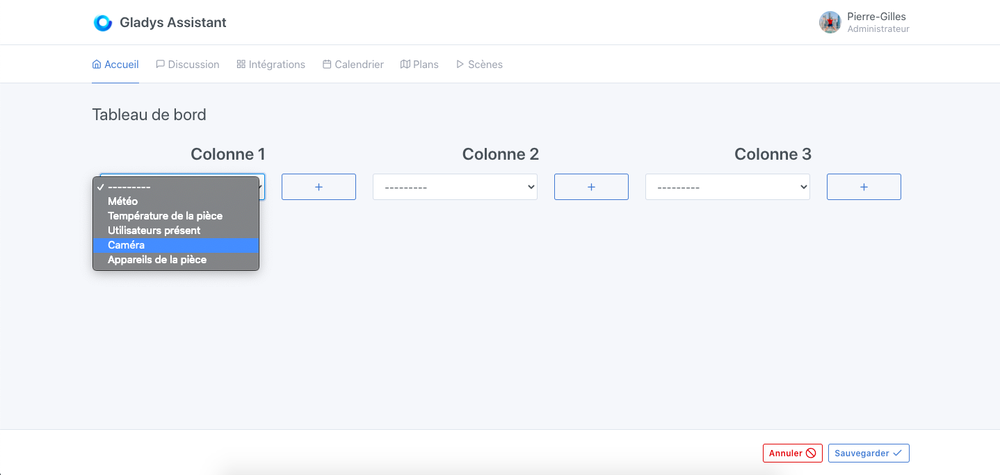
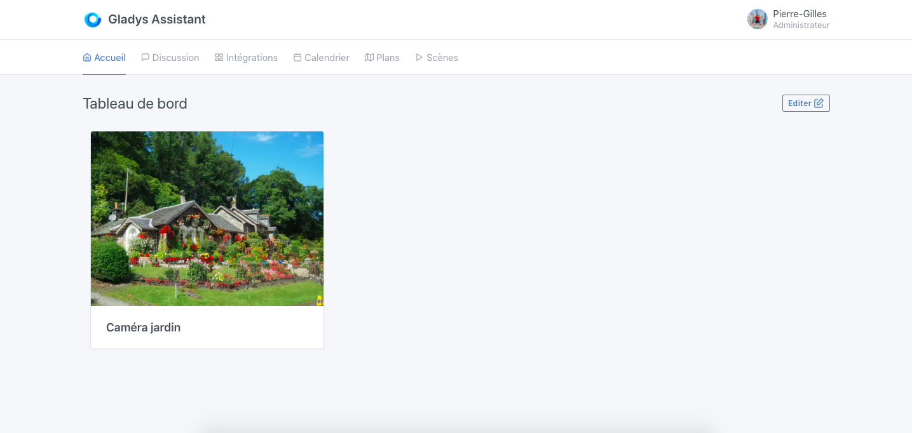

In Gladys Assistant, you can display images from your cameras, straight on the dashboard.

These images are refreshed at regular intervals. You can specify the interval in your camera configuration.

## Prerequisites

- You must have configured a camera, see [documentation](/docs/integrations/camera/) for camera integration.

## Configuration

Go to the Gladys Assistant dashboard, then click on the "Edit" button.

Select the "Camera" widget, and click on the + button.

Select the camera you want to view.

Give this widget a name, This will be the caption displayed on the dashboard, under the camera image.

Click on "Save".

You should see the image from your camera.

This image will refresh automatically, according to the frequency that you have defined in the camera integration.
