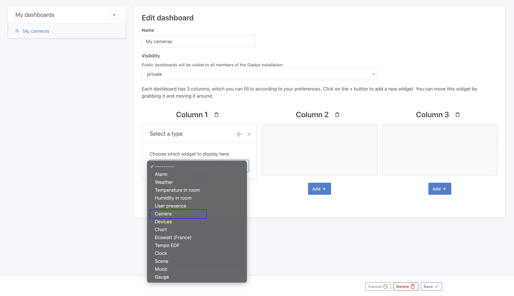
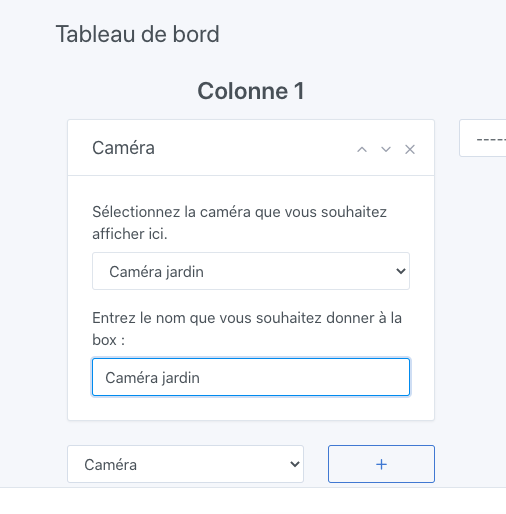

You can display a camera image on the dashboard, and watch the live video stream from the camera.

## Prerequisites

You must have configured a camera, see [the documentation](/docs/integrations/camera/) for the camera integration.

## Configuration

Go to the Gladys Assistant dashboard, then click on the "Edit" button.

Select the "Camera" widget:

Next, select the camera you want to display.

Give this widget a name; this text will be displayed on the dashboard below the camera image.

Click "Save".

That's it! You should see your camera image.

This image will refresh automatically according to the frequency you defined in the camera integration.
