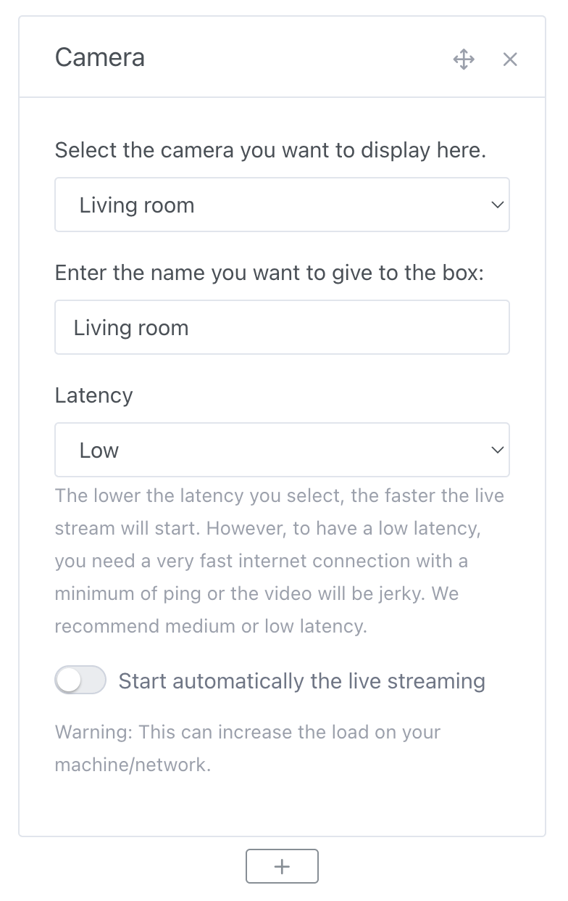

In Gladys Assistant, it is possible to display images from your cameras on the dashboard.

These images are refreshed at regular intervals, according to the interval you specified in your camera configuration.

## Prerequisites

You must have configured a camera, see [documentation](/docs/integrations/camera/) for camera integration.

## Configuration

Go to the Gladys Assistant dashboard, then click on the "Edit" button.

Select the "Camera" box, and click on the + button.

Then select the camera you want to view.

Give this box a name, it is this text that will be displayed on the dashboard under the camera image.

Click on "Save".

You should see the image from your camera.

This image will refresh automatically, according to the frequency that you have defined in the camera integration.
