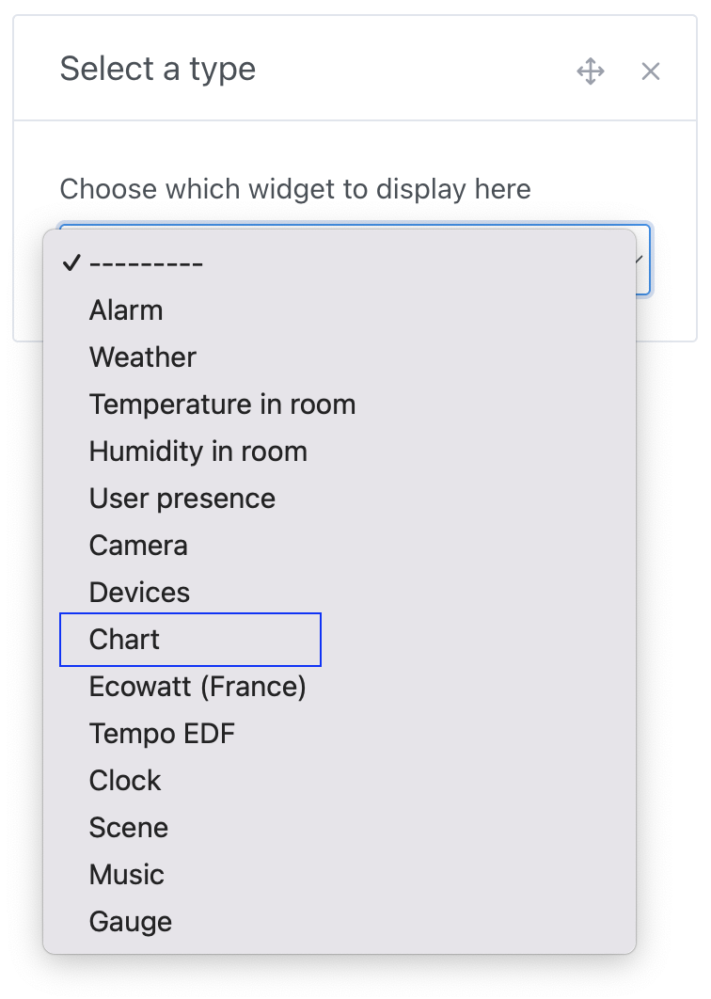
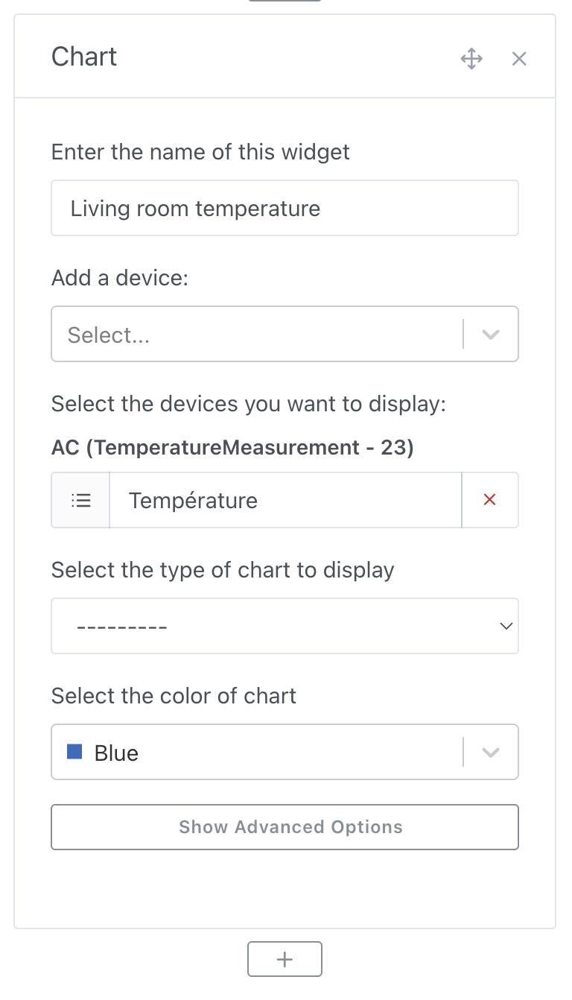
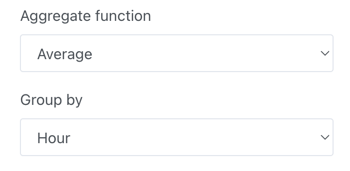
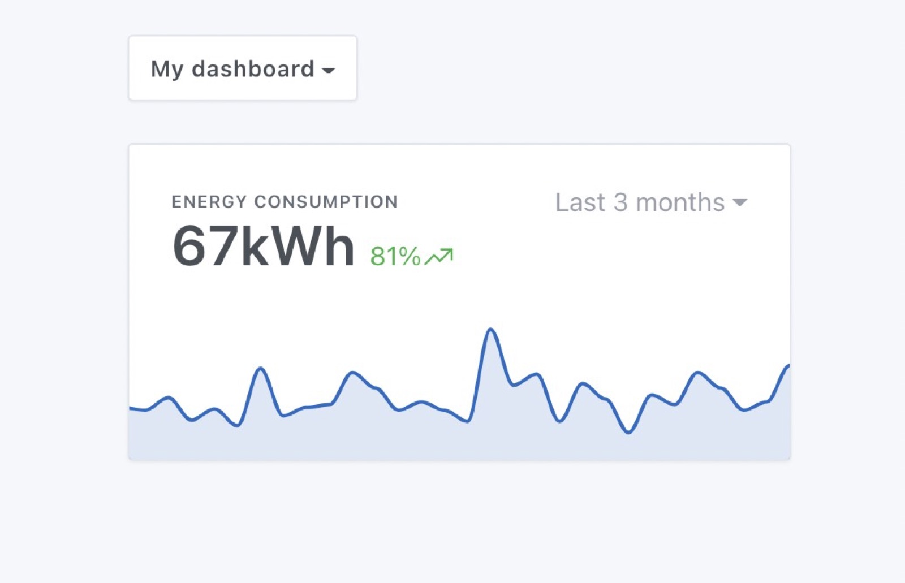
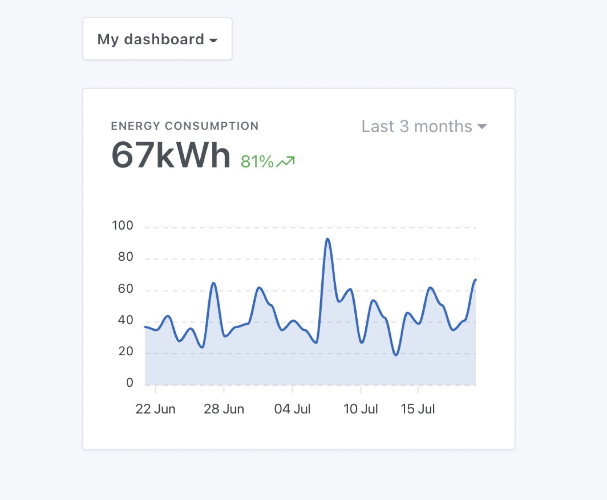

## Prerequisites

You must have configured at least one sensor sending data to Gladys.

## Configuration

Go to the Gladys dashboard and click on the "Edit" button.

Add a "Chart" widget:

Select the devices you want to display, then configure the rest of the widget:

- **Name**: Will be displayed at the top of the widget on the dashboard
- **Chart type**: It's possible to display several types of charts in Gladys (Line, Bar, Area, Straight line, Binary)
- **Display axes**: We offer two types of display, a more design-oriented display without axes and one with axes
- **Display variation**: If selected, the chart will display the relative variation between the first and last value over the selected interval

If you want to group data by time interval, you can modify this option in the advanced settings:

## Chart examples

Let's say you want to display the energy consumption of one of your devices, the "bar" chart is particularly suitable for this:

You can also display this data as an "area" curve, without axes for a more design-oriented display:

Or with axes for better readability:

The possibilities are endless!
