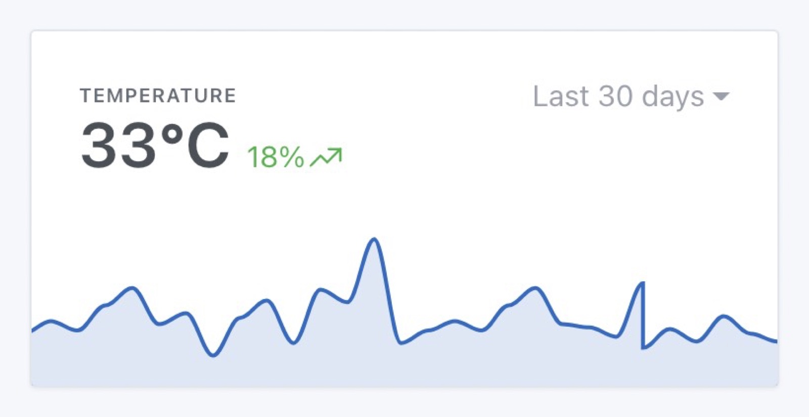

Since Gladys Assistant v4.6, you can display a sensor chart on Gladys dashboard.

## Prerequisites

You need to be in Gladys Assistant >= v4.6, and have at least once sensor configured sending data.

## Configuration

Go to Gladys Dashboard, and click "edit" on the dashboard you want to add a chart to.

Add a new "chart" box:

Select the device you want to display here, and configure your chart:

- Name: It'll be display on top of the chart
- Chart type: You can display different type of chart in Gladys (line, area, bar, step line)
- Axes: If you want a more design display without axes, or if you prefer to see the x/y axis
- Display variation: If selected, the chart will display the relative variation between the first & last value in the selected interval.

Save, and you're done!
