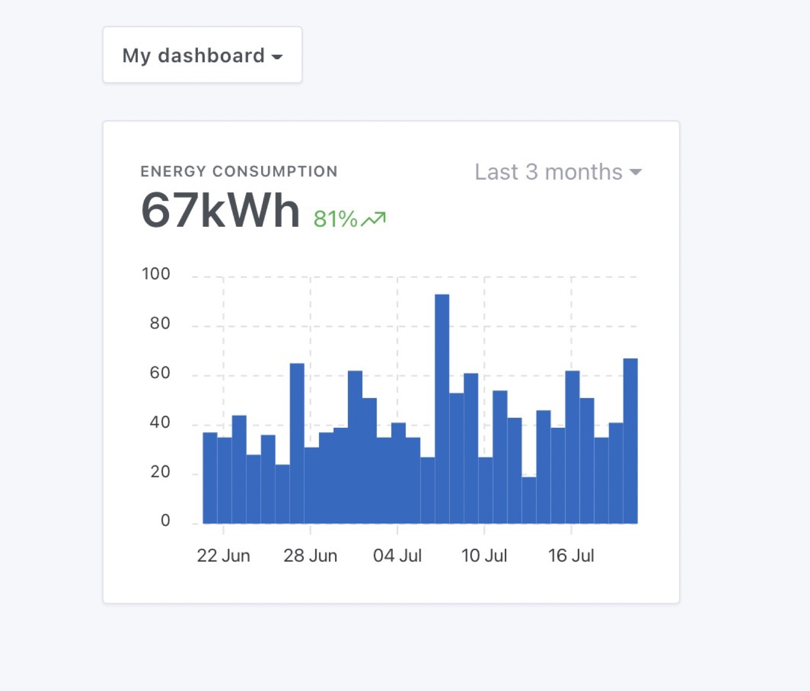

Since Gladys Assistant v4.6, you can display a sensor chart on Gladys dashboard.

## Prerequisites

- You need to be in Gladys Assistant v4.6 (or above)
- Have at least one  sensor configured and sending data.

## Configuration

Go to Gladys Dashboard, and click "edit" on the dashboard you want to add a chart to.

Add a new "chart" box:

Select the device you want to display here, and configure your chart:

- Name: It'll be display on top of the chart
- Chart type: You can display different types of chart in Gladys (line, area, bar, step line)
- Axes: If you want a display without axes, or if you prefer to see the x/y axis
- Display variation: If selected, the chart will display the relative variation between the first & last value in the selected interval.

Save, and you're done!

## A few examples

A simple example of a device sending its energy consumption, displayed as "bar" chart, with axes and with the variation displayed:

The same device can be displayed with a "area" chart, without axes for a more stylish view:

Or same "area" chart, with axes, less design-oriented but easier to read:

### Verify that the backgroung aggregation is working

To be able to display charts quickly, Gladys is running some aggregation tasks every hour to pre-process sensors data.

For example, if you want to display the last 6 months of a temperature sensor that sends data to Gladys every 30 seconds:

- It means the sensor send 2 x 60 x 24 = 2 880 values per day
- that's 2 880 x 30 = 86 400 values per month
- that's 86 400 x 6 = 518k values for 6 months

In the UI, Gladys will only need 100 values to display the chart, so we need to downsample the 518k values to 100 values.

As we want the Gladys UI to be snappy, we can't process all that information live. We need to pre-process sensors data in the background so it's super fast to query the dataset.

Our goal is less than 100ms for any request.

Gladys is processing 3 types of aggregation:

- hourly data
- daily data
- monthly data

If you want to check that the background tasks are working properly, you can check in "Settings" => "Background tasks":

