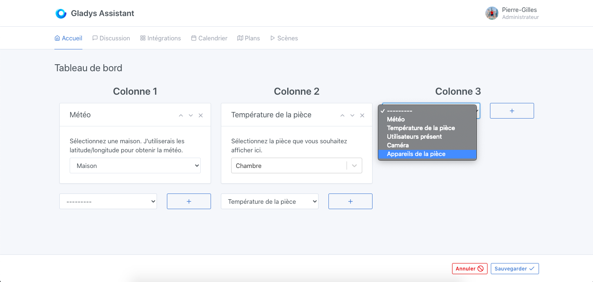
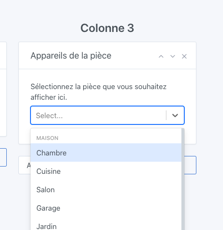

In Gladys Assistant, you can control your devices directly from the dashboard, and display the values ​​of your sensors in the interface.

## Prerequisites

You must have added at least a few devices to Gladys, otherwise it is of little interest 😄

## Configuration

Go to the Gladys dashboard, and click on "Edit".

Select the "Room devices" box, and click on the + button.

Then select the room you want to display.

Click on "Save".

You should see all the devices in that room.

## Note

This box only displays what it is capable of handling.

If you have a particular feature on one of your devices, it is possible that this feature is not yet managed by the dashboard, and therefore does not appear here.

Do not hesitate to contact us on the forum if you want to propose the addition of a feature to this box.
