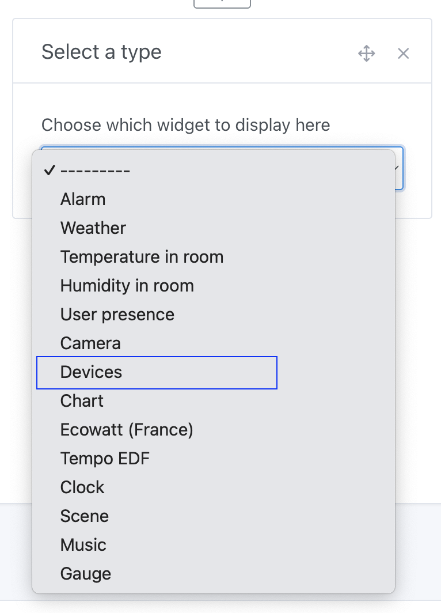
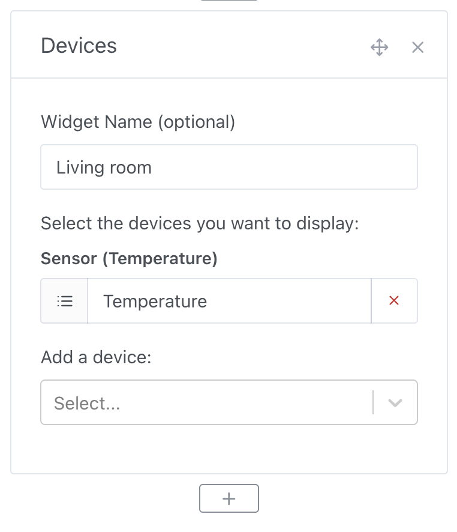
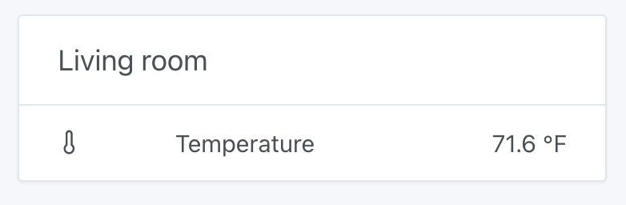
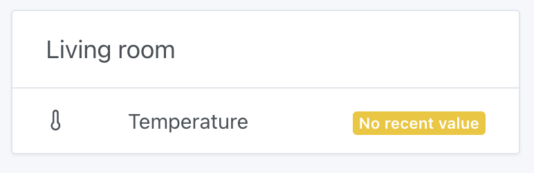
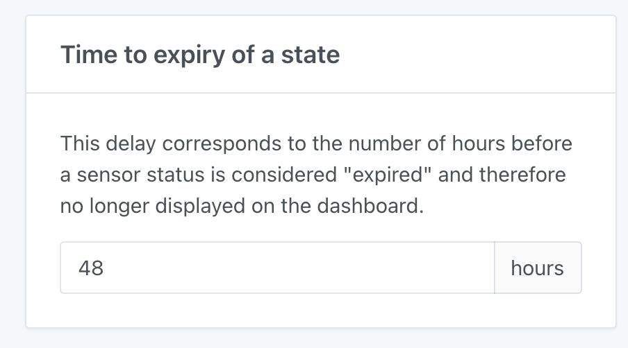

In Gladys Assistant, you can control your devices directly from the dashboard and display the values of your sensors in the interface.

## Prerequisites

You must have added at least a few devices to Gladys (it's much less exciting without them 😄).

## Configuration

Go to the Gladys dashboard and click on "Edit".

Select the "Devices" widget:

Select the devices you want to display and pick a name for your widget (optional).

Click on "Save".

## Usage

You can now see your devices on the dashboard, view their last values if they're sensors, or control them directly.

## If no value is displayed

If your devices display "no recent value", it means the device hasn't sent any values recently.

The default threshold is 48 hours without any values, but you can change this in `Settings` -> `System` -> `Time to expiry of a state`:

