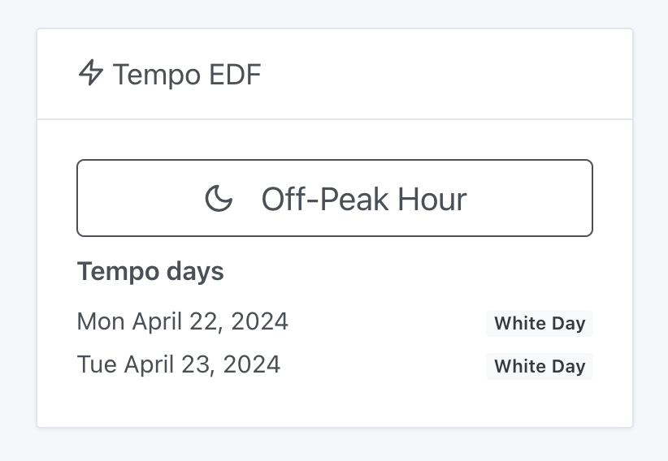
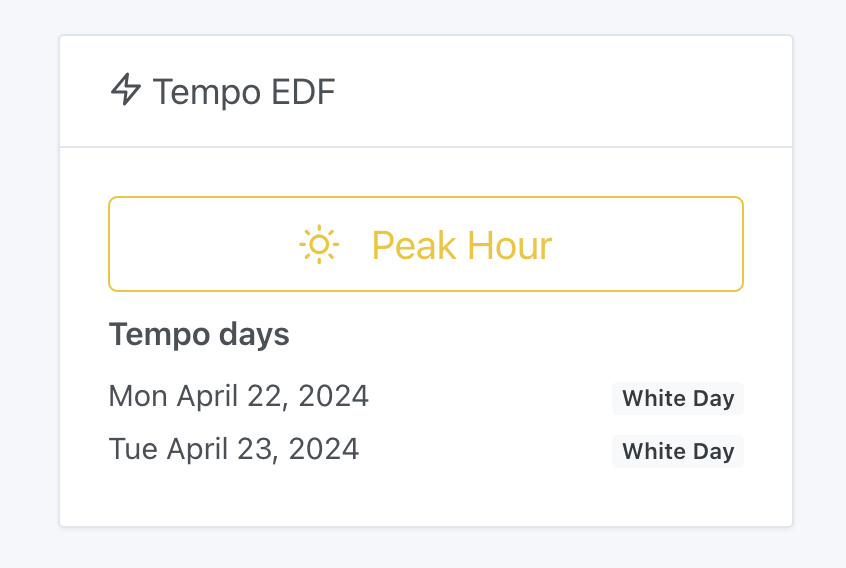

In France, EDF provides a service [EDF Tempo](https://particulier.edf.fr/fr/accueil/gestion-contrat/options/tempo.html) where the cost of electricity is generally cheaper all year round, except on certain "white" and "red" days when the price of electricity is much higher.
In 2024, there are 301 blue days, 43 white days and 22 red days.
This type of contract is practical for users who can easily shift their usage.

### EDF Tempo and home automation

In Gladys, you can view the current status of the Tempo option on your dashboard: full hour / off-peak hour and the color of the current day / next day.

Off-peak time :

Peak time :

