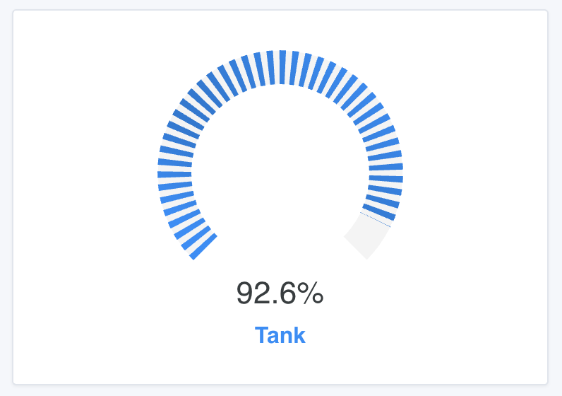
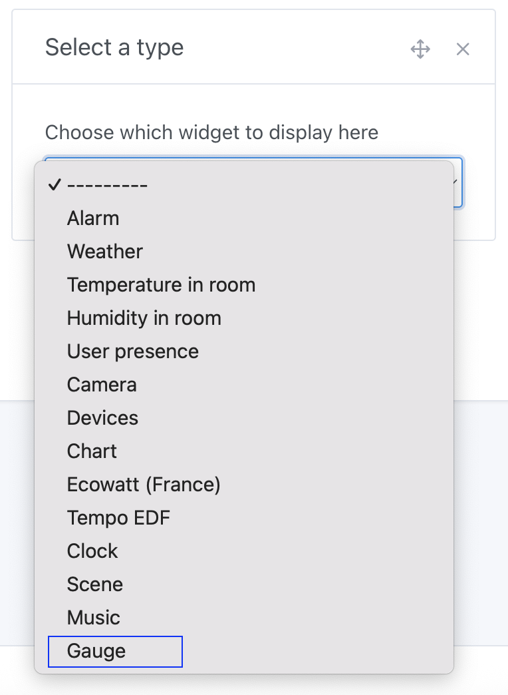
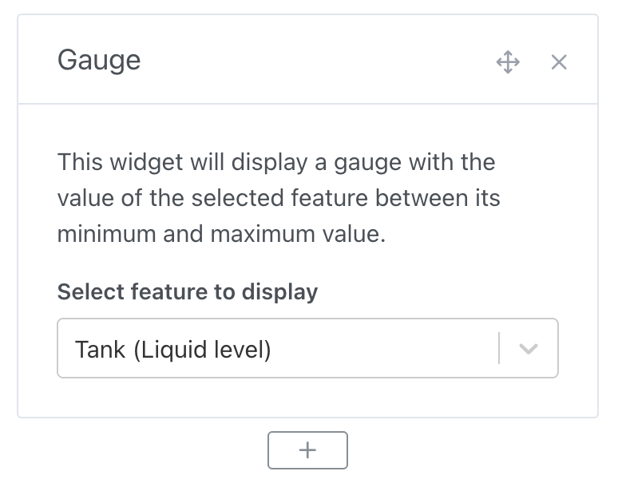

You can display a gauge on the dashboard.

This gauge displays the current value of the sensor, between the minimum and maximum defined at the sensor level.

:::note
If you created the sensor yourself in the MQTT integration, you can modify the minimum and maximum values yourself.

Otherwise, it is the responsibility of the integration to correctly define the minimum and maximum values.

If the minimum and maximum values are not correctly defined, feel free to come to the forum to discuss it!
:::

## Prerequisites

You must have configured at least one sensor sending data to Gladys.

## Configuration

Go to the dashboard, and click "Edit".

Add a "Gauge" widget:

Then, select the sensor you want to display:

Click "Save", and you're all set!
