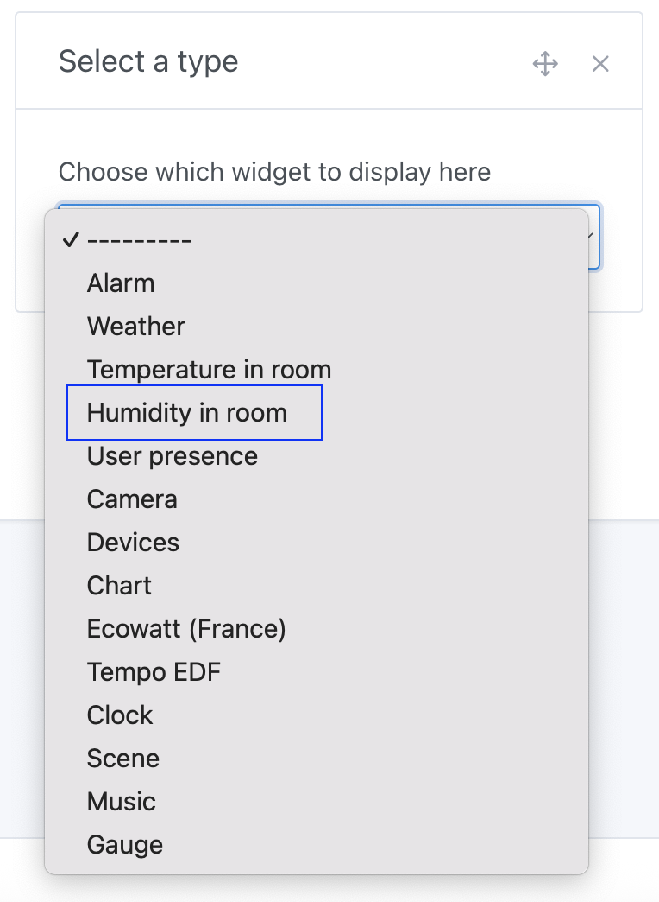
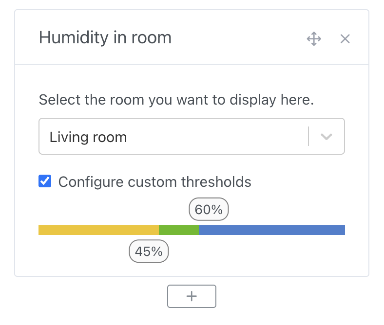
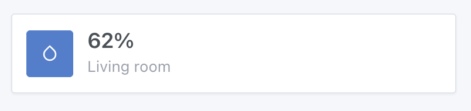
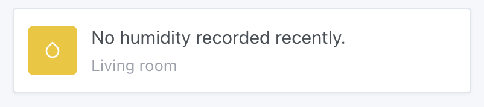

In Gladys Assistant, you can display the average humidity of a room on your dashboard.

This widget will fetch the humidity from all humidity sensors present in the room and display an average on the dashboard.

## Prerequisites

You must first have configured at least one humidity sensor.

This can be a sensor of any protocol (Zigbee, Matter, MQTT, whatever), and have assigned this sensor to a room.

## Configuration

Go to the dashboard, and click "Edit".

Select the "Room humidity" widget, and click the + button.

Next, select the room you want to display.

You can configure custom thresholds where the widget color will change based on humidity.

Click "Save".

If you have no sensors in the room, or if these sensors have not sent any values in the last hour, you will see:

