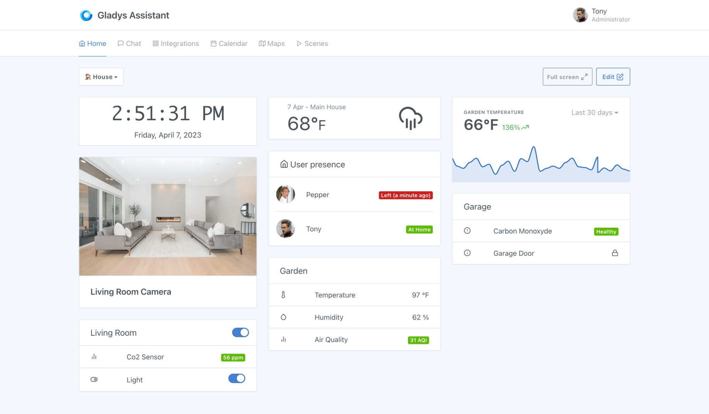
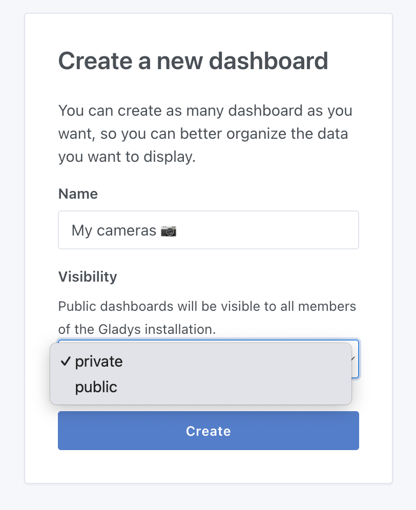

In Gladys Assistant, the dashboard is the main page of Gladys.

You can create multiple dashboards and share these dashboards with your family members.



Display camera images? Monitor sensor values? Control your lights?

Everything is possible!

## Dashboard Visibility

When you create a dashboard, it can be "private" or "public":

- A "private" dashboard is visible only to yourself.
- A "public" dashboard is visible to all users of the Gladys instance.



### Tablet Mode

If you use Gladys on a touchscreen tablet somewhere in your home, you will likely want to display the Gladys dashboard in full screen, without the ability to navigate away from this screen.

It is possible to force a full-screen mode by adding a parameter to the URL:

```
?fullscreen=force
```

### Feedback?

If you have needs that are not covered by the current Gladys dashboard, do not hesitate to contact us on [the forum](https://community.gladysassistant.com/) to see if we can develop a specific widget.
