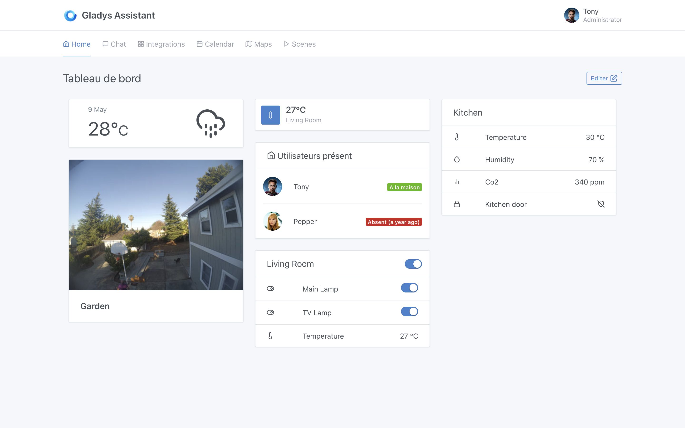

The dashboard is the main page of Gladys Assistant.

This page is fully configurable and you can tweak it to meet your needs.

Are you looking to display camera images? Monitor sensor values? Control his lights?
You can do so on your dashboard.

In this section, we go through all types of widgets, and how each one works.

If you have any requirements that are not covered by the current Gladys dashboard, do not hesitate to contact us on [the forum](https://community.gladysassistant.com/). We can explore the possibility of developing specific widgets.
