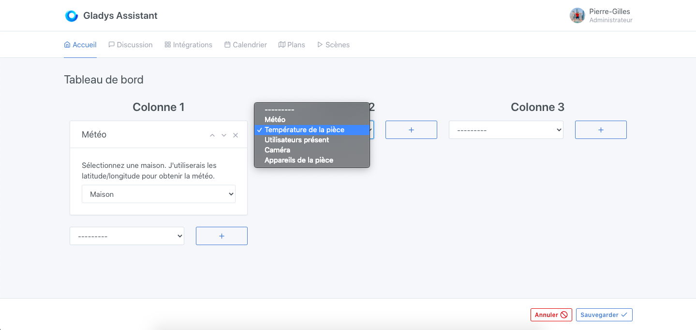
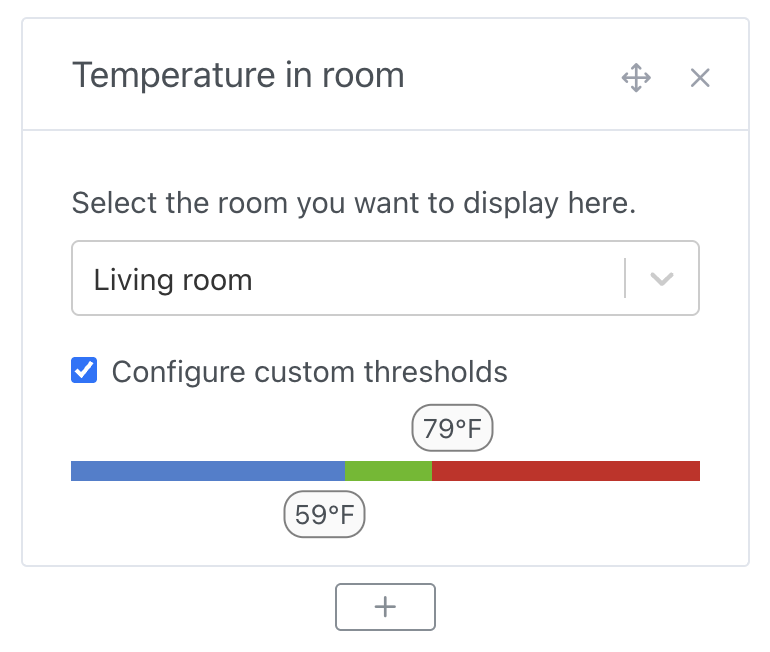

In Gladys Assistant, you can display the average temperature of a room, right on your dashboard.

This widget will look for the temperature of all the temperature sensors present in the room, and displays an average on the dashboard.

## Prerequisites

You must first have configured at least one temperature sensor. It could be a sensor from any protocol (Z-Wave, MQTT, etc.), and have that sensor assigned to a room.

## Configuration

Go to the dashboard, and click on "Edit".

Select the "room temperature" widget, and click on the + button.

Select the room you want to display.

Click on "Save".

You should see the average temperature of this room!
