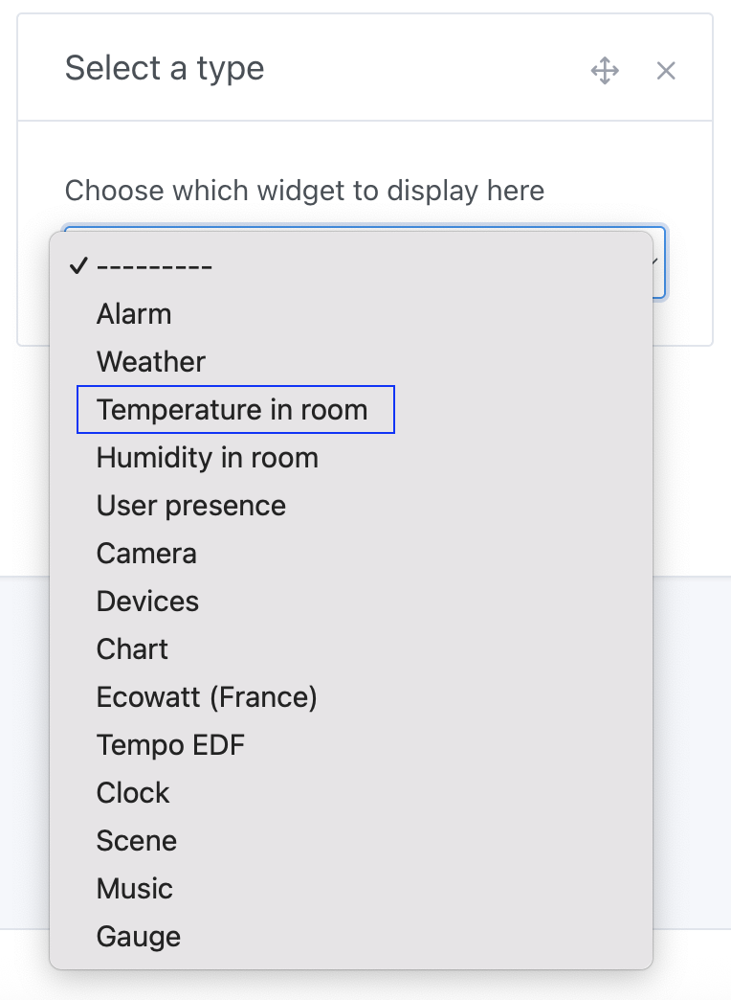

In Gladys Assistant, you can display the average temperature of a room on your dashboard.

This widget fetches the temperature from all temperature sensors present in the room and displays an average on the dashboard.

## Prerequisites

You must have at least one temperature sensor configured beforehand.

This can be a sensor of any protocol (Zigbee, Matter, MQTT, it doesn't matter), and this sensor must be assigned to a room.

:::note
Some sensors report a "Device Temperature", for example, a computer might report its CPU temperature. Gladys does not count these values as temperature values for this widget.
:::

## Configuration

Go to the dashboard, and click "Edit".

Select the "Room Temperature" widget, and click the + button.

Next, select the room you want to display.

You can configure custom thresholds where the widget color will change based on the temperature.

Click "Save".

If you don't have any sensors in the room, or if these sensors haven't sent any values in the last hour, you will see:

