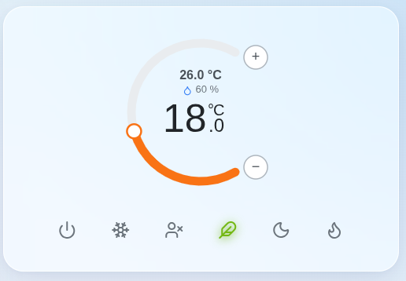
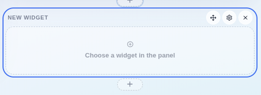
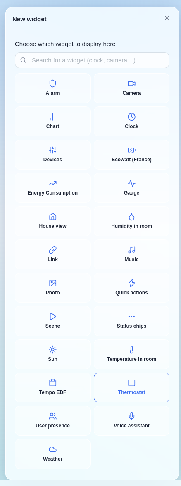
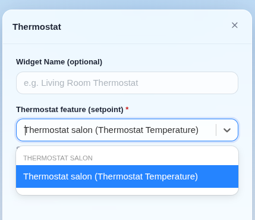
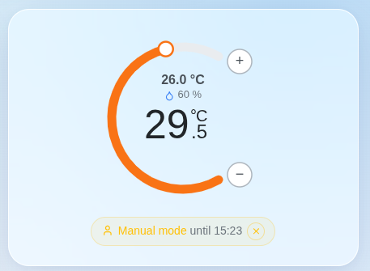
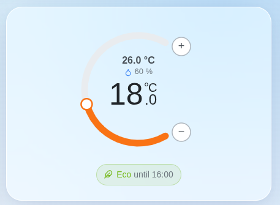
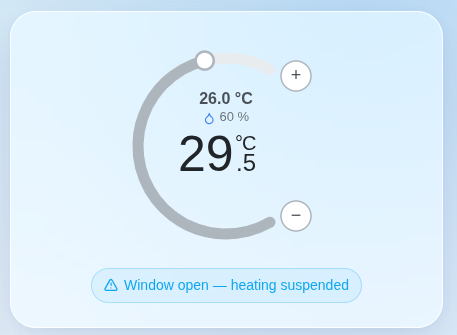

The thermostat widget displays and controls a thermostat directly from your dashboard: current temperature, setpoint, preset in use, and the schedule that is running.

It is designed for the thermostats created by the [Thermostat integration](../integrations/thermostat.md). Any other thermostat in Gladys exposing a target temperature (Netatmo, Zigbee, Z-Wave, Matter…) can be selected too, and you'll be able to change its setpoint from the dial — but the schedule, the presets and the open-window handling only exist on the virtual thermostats.

## Add the widget

Edit your dashboard, click "Add a box" and choose "Thermostat".

Then pick the thermostat feature (the setpoint) you want to control, and optionally give the widget a name.

## Read the widget

The dial shows the **setpoint**, the big number in the middle. Around it you'll find the measured temperature, and the humidity if a humidity sensor is configured on the thermostat.

The ring around the dial is orange in heating mode, blue in cooling mode, and grey when the thermostat is off or suspended.

Under the dial, the six presets — Off, Frost, Away, Eco, Night, Comfort — let you switch target temperature in one click.

## Change the temperature

Drag the dial, or use the + and − buttons, to change the setpoint.

Doing so puts the thermostat in **manual mode**: your temperature takes priority over the schedule, for the duration configured on the thermostat (30 minutes by default). A banner shows how long the hold lasts, along with a button to cancel it and hand the thermostat back to its schedule right away.

On a thermostat that follows no schedule, a manual setpoint holds indefinitely, like on a physical thermostat.

## Follow the schedule

When the thermostat follows a weekly schedule, the widget shows the preset currently running and until when.

:::note
The current slot is resolved in the timezone configured in Gladys, not in your browser's — so a dashboard consulted from another country still shows the slot that is actually heating your house.
:::

## Suspended states

Two situations suspend the regulation, and the widget says so explicitly:

- **Window open**: an opening sensor configured on the thermostat is reading "open", so the heating is cut until the window is closed.
- **Off preset**: the thermostat is stopped, and no temperature is targeted.

