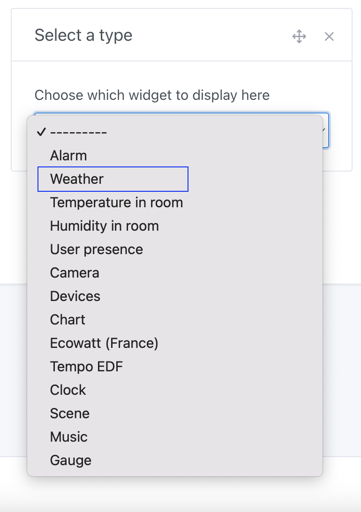
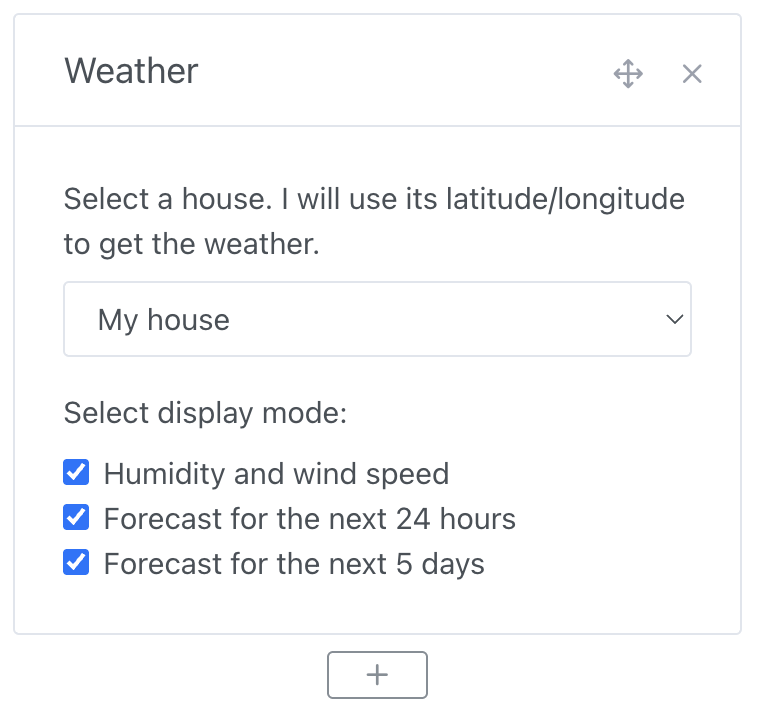
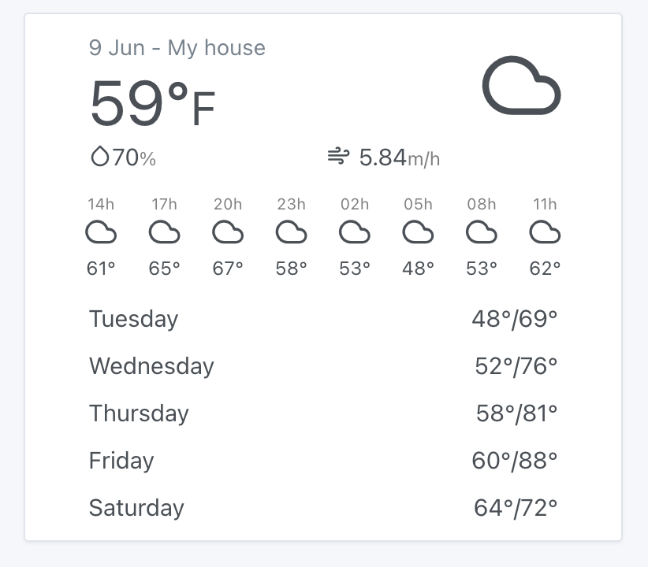

You can display the weather related to your location on the dashboard.

## Prerequisites

- You must have previously configured the [OpenWeather](/docs/integrations/openweather/) service to display the weather in Gladys Assistant.
- You must have configured your home in the settings, and have placed your home on the map, so that OpenWeatherMap knows the latitude and longitude of your home.

## Configuration

Go to the dashboard, then click "Edit".

Add a "Weather" widget:

Next, select your home and display options:

Click "Save".

You should see the weather!

