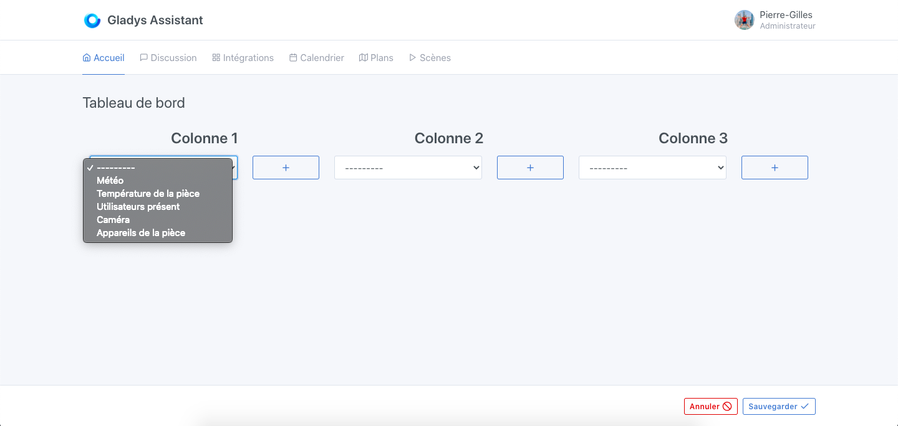
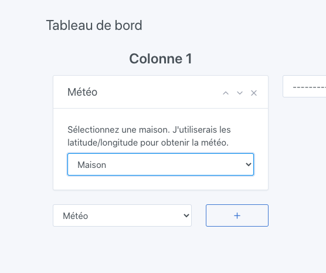

In Gladys Assistant, you can display the weather at your location on the dashboard.

## Prerequisites

- You must first have configured the [OpenWeather service](/docs/integrations/openweather/) to display the weather forecast in Gladys Assistant.
- You must have configured your home in the settings, and have placed your home on the map, so that OpenWeatherMap has the latitude/longitude of your home.

## Configuration

Go to the dashboard, then click on "Edit".

Select the "Weather" widget and click on the + button.

Select your home. This will allow the service to know your latitude/longitude.

Click on "Save".

You should see the weather forecast!
