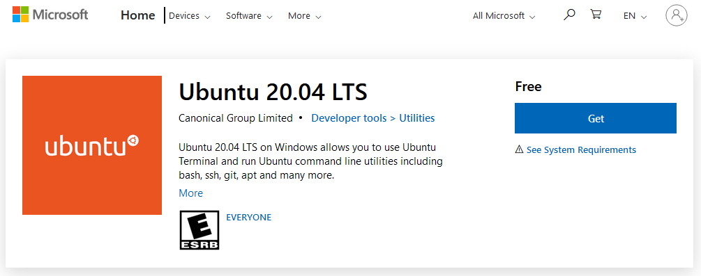

You'll find below the instructions on how to setup a development environment for Gladys 4.

## System prerequisites

Please follow these links to prepare your OS.

- [Windows Subsystem for Linux](https://docs.microsoft.com/en-us/windows/wsl/install-win10)
- [Docker Desktop for Windows](https://hub.docker.com/editions/community/docker-ce-desktop-windows)
- [Visual Studio Code](https://code.visualstudio.com/download)

### WSL Configuration

Please ensure your system uses WSL2 by running following command:

```
wsl.exe --set-default-version 2
```

From the Microsoft Store, search and install Ubuntu 20.04. This can take some time, dependong on your connection speed.



Now you can run Ubuntu; from your start menu please launch Ubuntu 20.04 LTS.
The first time you run Ubuntu, you will be asked to create a user.

### Install system dependencies

First thing to do is to update distribution by running theses commands:

```bash
sudo apt update && sudo apt upgrade -y && sudo apt autoremove -y
```

- Libraries installation:

```bash
sudo apt install sqlite3 make g++ git coreutils tzdata nmap openssl gzip udev -y
```

- Node.js 14 Installation:

```bash
curl -sL https://deb.nodesource.com/setup_14.x -o nodesource_setup.sh
sudo bash nodesource_setup.sh
sudo apt install nodejs -y
```

- Openzwave compilation:

```bash
git clone https://github.com/OpenZWave/open-zwave.git
cd open-zwave
git checkout 5d18bbfb21d8cdc61ee6baae6f478c963297dfc5
make
sudo make install
sudo sh -c "echo '/usr/local/lib64' > /etc/ld.so.conf.d/openzwave.conf"
sudo ldconfig
cd && rm -rf open-zwave
```

## Server

The server is a Node.js app.

### Clone Gladys Git repo

```
git clone https://github.com/GladysAssistant/Gladys gladys && cd gladys
```

### Install NPM dependencies

```
cd server
```

As you probaly don't need to run every single integration when developing, we recommend you create a `.env` file in the `server` folder with the following content:

```
INSTALL_SERVICES_SILENT_FAIL=true
```

Then you can install server dependencies:

```
npm install
```

### Start DB migration

```
npm run db-migrate:dev
```

### Start the server

```
npm start
```

The server should be accessible at http://localhost:1443.

## Frontend

At the root of the git repo, do:

```
cd front
```

### Install NPM dependencies

```
npm install
```

### Start the frontend

```
npm start
```

The frontend should be accessible at http://localhost:1444.

## Start server tests

Go to the `server` folder.

And run:

```
npm test
```

## Start server tests only for a single service

To run the tests just for a single service, go to the `server` folder and run the command:

```
npm run test-service --service=tasmota
```

## Start VSCode

You can launch Visual Studio Code from ubuntu by running command:

```
code .
```
