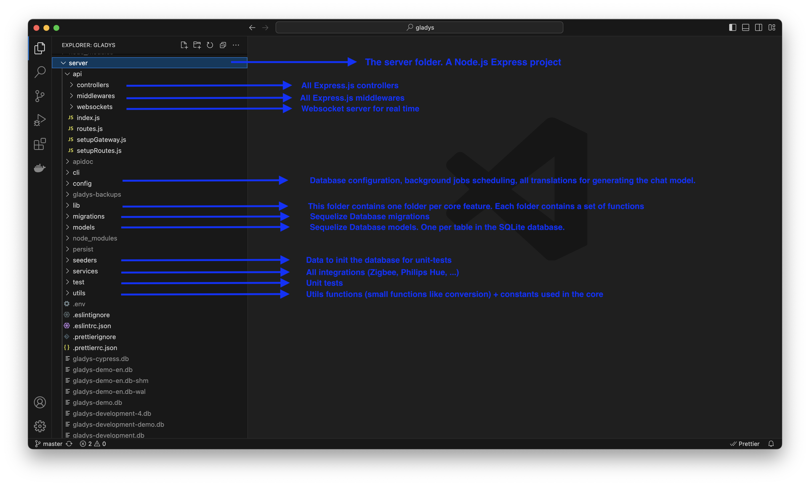
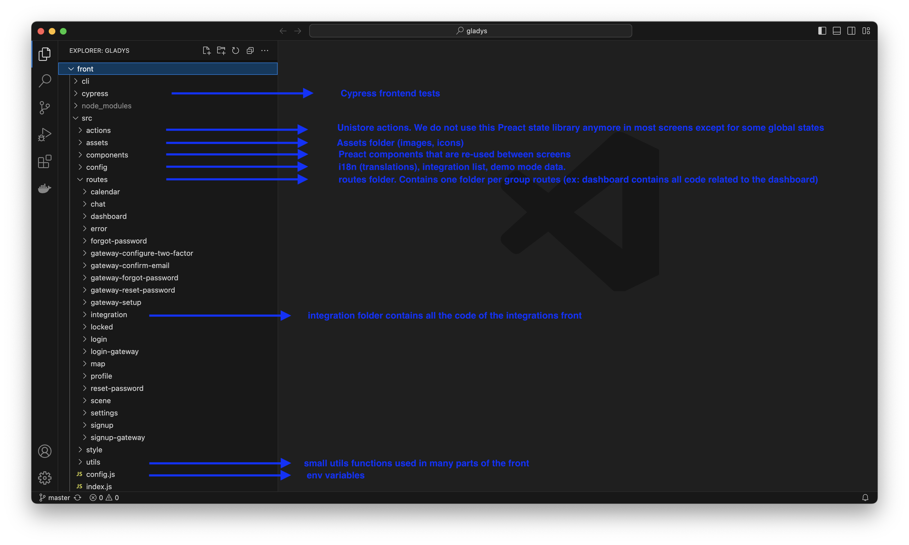

Gladys Assistant is an open-source project, and all its code is available on [Github](https://github.com/GladysAssistant/Gladys).

Anyone can read and modify this code to add features, new integrations, or fix a bug.

## Technologies Used

Gladys is a fairly standard Node.js project that uses:

- [Preact.js](https://preactjs.com/) for the frontend (just like React, but lighter)
- Node.js [Express](https://expressjs.com/) as a backend framework
- [SQLite](https://www.sqlite.org/index.html) for the database
- [DuckDB](https://duckdb.org/) for storing time-series data (sensors data).
- [Sequelize](https://sequelize.org/) as an ORM for the database and migrations
- [Mocha](https://mochajs.org/) for backend tests
- [Cypress](https://www.cypress.io/) for frontend integration tests

## Setting Up a Development Environment

We have two tutorials depending on your platform:

- [Set up a development environment on MacOS/Linux](/docs/dev/setup-development-environment-mac-linux/)
- [Set up a development environment on Windows](/docs/dev/setup-development-environment-windows/)

## Directory Architecture

### The Node.js Express Server

Here's a small explanation of all the backend project folders located in the **server** directory.



### The Preact.js Frontend

The Preact application was generated by [preact-cli](https://github.com/preactjs/preact-cli):



## How to Code a Gladys Assistant Integration?

Integrations are located in the [server/services](https://github.com/GladysAssistant/Gladys/tree/master/server/services) directory.

Create a new folder with the name of your service. The name should be alphanumeric, in lowercase, with dashes as separators if necessary.

Examples of good folder names:

- `wemo`
- `philips-hue`
- `zwave`
- `usb`

### Create a package.json

The package.json describes your service's compatibility and the necessary dependencies.

You can check out all the package.json files on Github, but here's an example of a good package.json:

```json
{
  "name": "gladys-darksky",
  "main": "index.js",
  "os": ["darwin", "linux", "win32"],
  "cpu": ["x64", "arm", "arm64"],
  "scripts": {},
  "dependencies": {
    "axios": "^0.18.0"
  }
}
```

**Note:** The `os` and `cpu` fields are mandatory.

### Create an index.js File

```jsx
const logger = require("../../utils/logger");
const ExampleLightHandler = require("./lib/light");

module.exports = function ExampleService(gladys) {
  // here is an example module
  const axios = require("axios");

  // @ts-ignore: TS doesn't know about the axios.create function
  const client = axios.create({
    timeout: 1000,
  });
  /**
   * @public
   * @description This function starts the ExampleService service
   * @example
   * gladys.services.example.start();
   */
  async function start() {
    logger.log("starting example service");
  }

  /**
   * @public
   * @description This function stops the ExampleService service
   * @example
   * gladys.services.example.stop();
   */
  async function stop() {
    logger.log("stopping example service");
  }

  return Object.freeze({
    start,
    stop,
    device: new ExampleLightHandler(gladys, client),
  });
};
```

- The `index.js` file must expose 2 functions: start and stop. These functions are mandatory and should respectively start or stop the service.
- All dependency requests listed in the package.json should be made **inside** the function, not outside. This is because we want each service to be completely isolated and not crash if the NPM module crashes.
- The `gladys` variable is the Gladys instance and gives you access to all the Gladys APIs. A service should not try to contact the database itself; it should only use the Gladys API. If a request is missing, feel free to code a new function in the Gladys API.
- Comments on functions are mandatory and serve not only for documentation but also for type checking.

### Link Your Integration to Gladys

When your integration is ready to be tested, you can edit the [server/services/index.js](https://github.com/GladysAssistant/Gladys/blob/master/server/services/index.js) file and add the require to your service.

### Unit Tests

A main goal of Gladys Assistant is to be ultra-stable and reliable software.

Therefore, all Gladys code must be fully tested.

Service tests are located in the [server/test/services](https://github.com/GladysAssistant/Gladys/tree/master/server/test/services) directory.

I suggest taking a look at the [example service tests](https://github.com/GladysAssistant/Gladys/tree/master/server/test/services/example) to get an idea of what the tests look like.

To run the tests, in the `server` directory, execute:

```
npm test
```

If you want to run only the tests related to your service, you can add `.only` to your tests, for example:

```jsx
describe.only("ExampleService", () => {
  const exampleService = ExampleService();
  it("should have start function", () => {
    expect(exampleService)
      .to.have.property("start")
      .and.be.instanceOf(Function);
  });
});
```

(Be sure to remove the `.only` before committing)

**Note on Mocking:** Your tests probably call a third-party NPM module. We recommend mocking all calls to the module using proxyquire like [here](https://github.com/GladysAssistant/Gladys/blob/master/server/test/services/example/index.test.js#L5). Your tests should not call real-world APIs!

### Code Quality

We use a fairly strict `eslint` configuration.

Use `VSCode` for development to see linting issues in real-time, or run `npm run eslint` in the `server` directory to see all linting errors.

### Interface

The Gladys 4 interface is a [preact](https://preactjs.com/) application.

If you want to add features to the frontend, you can edit the code in the `front` directory.

All code related to the user interface of services is located in the [front/src/routes/integration/all](https://github.com/GladysAssistant/Gladys/tree/master/front/src/routes/integration/all) directory.

### Submitting Your Integration

If you think your service is good enough to be published, congratulations!

You can create a PR on GitHub.

Read: [Creating a PR on Github](https://docs.github.com/en/pull-requests/collaborating-with-pull-requests/proposing-changes-to-your-work-with-pull-requests/creating-a-pull-request)

## Questions?

Have questions? Come discuss them [on the forum](https://community.gladysassistant.com/)!
