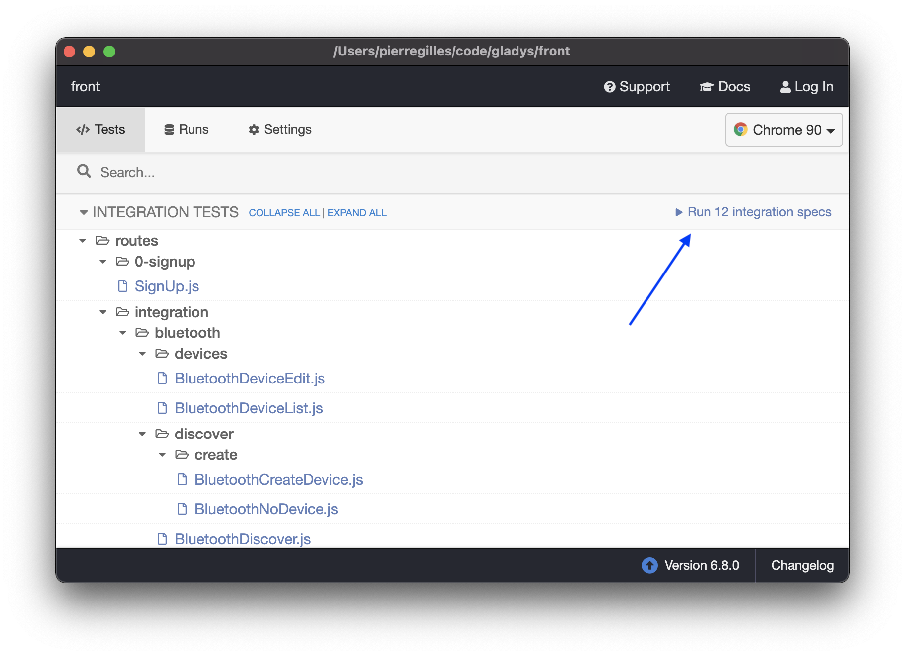

We use [Cypress](https://www.cypress.io/) for end-to-end frontend testing.

## Start the backend

In the `server` folder, run:

```
npm run cypress
```

This will create a new SQlite database just for tests, and start the backend.

## Open Cypress

In the `front` folder, start Gladys frontend:

```
npm run start:cypress
```

Then you can open the Cypress app:

```
npm run cypress:open
```

This will open the Cypress Electron app.

From there, you can start tests manually to see tests running in a browser:



## Running tests in the CLI

You can run Cypress tests in the CLI by doing

```
npm run cypress:run
```
