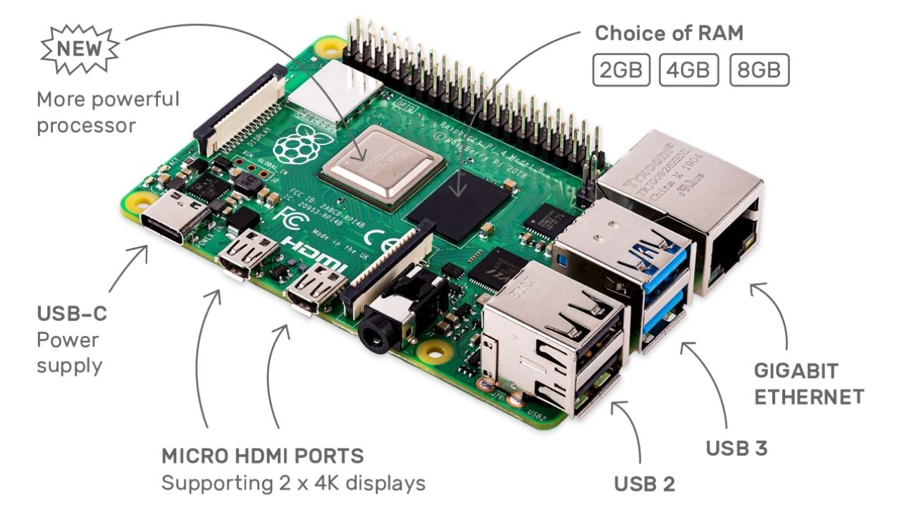

Gladys Assistant is a project that runs on any Linux machine: a Raspberry Pi, a NAS, a VPS, a server at home.

Most people in the community use a Raspberry Pi because it's an affordable little computer with great performances, that uses little energy and has no fans.

## Our recommended stack

- A [Raspberry Pi 4](https://www.amazon.com/Raspberry-Model-2019-Quad-Bluetooth/dp/B07TD42S27?crid=3UT3K90QVBE66&keywords=raspberry%2Bpi%2B4%2B2GB&qid=1644833683&sprefix=raspberry%2Bpi%2B4%2B2gb%2Caps%2C152&sr=8-3&th=1&linkCode=ll1&tag=gladproj-20&linkId=76c25f0db9eb8b1afc55c6c7d9b92187&language=en_US&ref_=as_li_ss_tl). It's a great improvement over the 3rd generation, because it now has USB 3.0 port (very useful to plug an external SSD), Gigabit Ethernet, a more powerful CPU and finally some more choices of RAM.

For a normal setup, if you plan to only run Gladys, I recommend the model with 2GB of RAM. If you plan to run more containers on the same Pi (Pi-Hole/AdGuard, Node-RED), I recommend taking one with more RAM (4GB, or 8GB if you want to be safe)

- An USB-C charger like [the official one](https://www.amazon.com/Raspberry-Model-Official-SC0218-Accessory/dp/B07W8XHMJZ?crid=2M36R4F1XSYUN&keywords=raspberry+pi+charger&qid=1644834355&sprefix=raspberry+pi+charge%2Caps%2C163&sr=8-3&linkCode=ll1&tag=gladproj-20&linkId=7477042f3093652671863b15b1f2d1a7&language=en_US&ref_=as_li_ss_tl). You need to check how much Ampere are delivered by your charger, otherwise your Pi won't be able to work properly, even more if you plug an external SSD disk to your Pi. Here the official charger delivers 3 Ampere.

- A [Raspberry Pi 4 case](https://www.amazon.com/iUniker-Raspberry-Aluminium-Heatsink-Supply/dp/B07D3S4KBK?crid=WXOQTAT2ST5H&keywords=raspberry+pi+4+case&qid=1644835141&sprefix=raspberry+pi+4+cas%2Caps%2C157&sr=8-3&linkCode=ll1&tag=gladproj-20&linkId=ba3cd1773e754f33f84d9a6bbdb4c3a9&language=en_US&ref_=as_li_ss_tl)

- A micro-SD card, like this [Sandisk 32GB Ultra class 10](https://www.amazon.com/Sandisk-Ultra-Micro-Class-Memory/dp/B010NE3QHQ?crid=3S6DCF6ISXC2N&keywords=micro-SD+card&qid=1644834059&sprefix=micro-sd+car%2Caps%2C175&sr=8-14&linkCode=ll1&tag=gladproj-20&linkId=ac43f2b3ff7adb30389ca3756c2b88f3&language=en_US&ref_=as_li_ss_tl).

We don't recommend running Gladys on a micro-SD card on the long run, but you'll need a micro-SD card to at least flash a new bootloader on your Raspberry Pi.

It's not recommended to use Gladys on a micro-SD card because a micro-SD is not designed to handle such sustained read/write for a long period of time, and on the long run your micro-SD will get corrupted.

- A SSD disk like this [120Gb, SATA III PNY for 22$](https://www.amazon.com/PNY-CS900-240GB-Internal-Solid/dp/B0722XPTL6?crid=CYH7OLUP9PH1&keywords=SSD&qid=1644834587&sprefix=ssd%2Caps%2C148&sr=8-4&th=1&linkCode=ll1&tag=gladproj-20&linkId=f04eebc92d0be7165e40d365b8a30184&language=en_US&ref_=as_li_ss_tl) with an external [USB 3.0 enclosure for 11$](https://www.amazon.com/Sabrent-Tool-free-Enclosure-Optimized-EC-UASP/dp/B00OJ3UJ2S?crid=22EU3UTEWY1PS&keywords=2.5%22+SATA+III+case&qid=1644834772&sprefix=2.5+sata+iii+case%2Caps%2C150&sr=8-3&linkCode=ll1&tag=gladproj-20&linkId=8e6a0ce95d69580c8f3964886bbf3812&language=en_US&ref_=as_li_ss_tl).

We highly recommend using a SSD disk instead of an SD card, and there are some great options for cheap prices. If you want ever higher performance/reliability, the [Samsung 870 EVO for 57$](https://www.amazon.com/SAMSUNG-500GB-Internal-MZ-77E500B-AM/dp/B08QBN5J9B?ac_md=3-0-VW5kZXIgJDEwMA%3D%3D-ac_d_bv_bv_bv&crid=1TYDTBQU3P3OS&cv_ct_cx=samsung%2Bevo%2Bssd&keywords=samsung%2Bevo%2Bssd&pd_rd_i=B08QBMD6P4&pd_rd_r=79cb8660-e26d-41f9-a659-0e85e3732cc3&pd_rd_w=mbPCS&pd_rd_wg=fPPgW&pf_rd_p=f77357a4-3bc9-48f9-a560-10a39068cae9&pf_rd_r=ESM4V1RF2VKCF46BSZ45&qid=1644834996&sprefix=samsung%2Bevo%2Bssd%2Caps%2C154&sr=1-1-f4ff053e-b1e8-4d31-8f95-56d755c862ba&th=1&linkCode=ll1&tag=gladproj-20&linkId=d3e58fb66485be6c90c3d9652ed31c62&language=en_US&ref_=as_li_ss_tl) with a 5 years warranty is a great choice.

## The ultimate starter-kit for less than 100$

I did a little recap table of all needed pieces for this setup, and it's just under 100$:

| Piece                  | Price |
| ---------------------- | ----- |
| Raspberry Pi 4         | 45$   |
| Raspberry Pi charger   | 7,95$ |
| Raspberry Pi case      | 11$   |
| 32GB Micro-SD card     | 6,75$ |
| 120GB SSD disk         | 22$   |
| USB 3.0 disk enclosure | 11$   |
| **Total price**        | 93,6$ |

It proves that building your own home automation setup is pretty cheap today!
