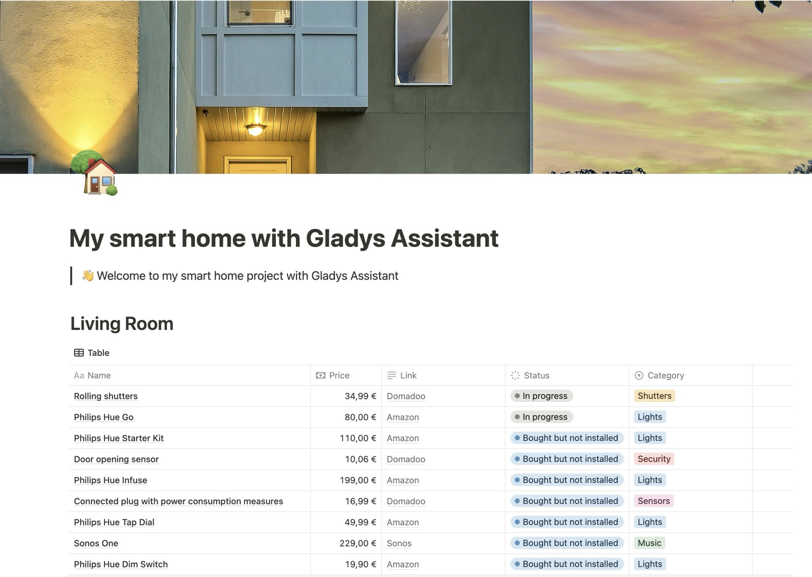
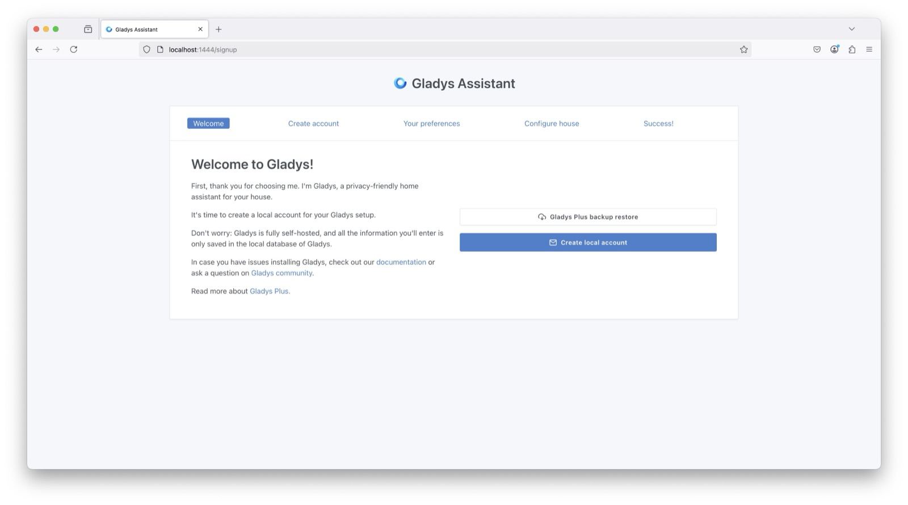
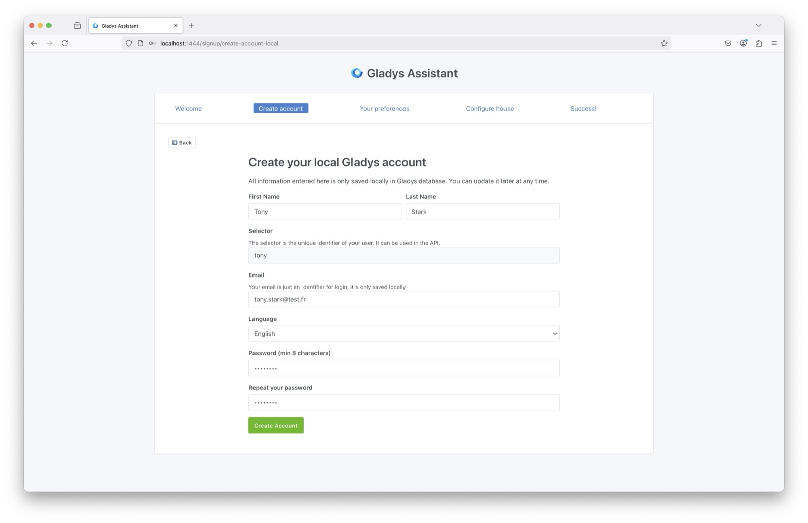
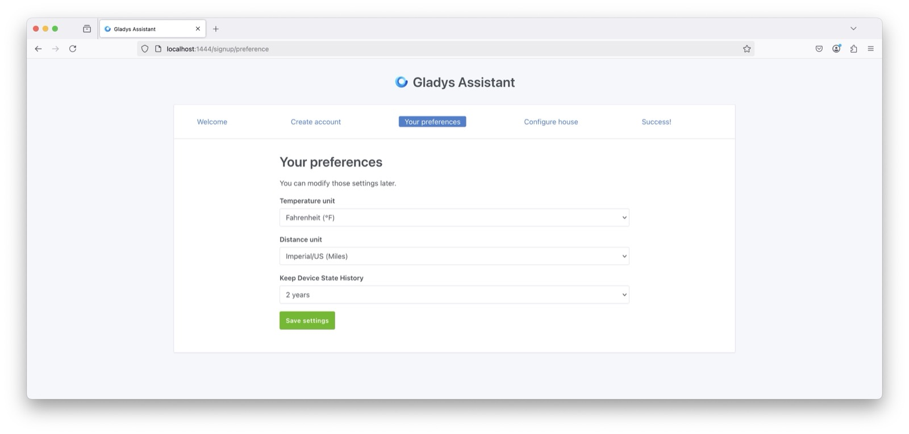
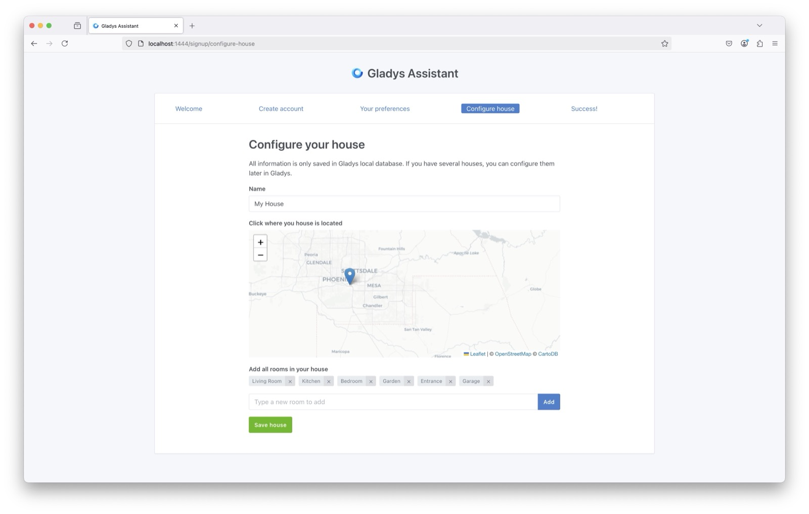

It can be difficult to know where to start when you're new to home automation. What equipment to choose? What budget to plan? Which home automation protocol to adopt?

This guide will help you answer these questions and provide you with a starting point to create your connected home from scratch.

## Define Your Smart Home Project

The most important thing is to define the automations you want to implement in your home: connected lights, an alarm to secure your home, energy savings by turning off unused devices or heating?

A good way to organize is to create a table (in Excel, Google Sheets, or Notion) where you list all the devices you want to integrate, room by room.

### Example: Living Room

| Name                                                      | Price  | Link                                                                                                                           |
| --------------------------------------------------------- | ------ | ------------------------------------------------------------------------------------------------------------------------------ |
| Zigbee Temperature/Humidity Sensor with Display           | $19,99 | [Amazon US](https://amzn.to/4i3oRP1)                                                                                           |
| ZigBee Smart Plug 4 Pack with Real-time Energy Monitoring | €16.99 | [Amazon US](https://amzn.to/3CRoBne)                                                                                           |
| IKEA TRÅDFRI E27 Bulb (Ceiling Light)                     | $13,99 | [IKEA US](https://www.ikea.com/us/en/p/tradfri-led-bulb-e26-1100-lumen-smart-wireless-dimmable-white-spectrum-globe-50545678/) |
| IKEA STYRBAR Remote (Brightness)                          | $13,99 | [IKEA US](https://www.ikea.com/us/en/p/styrbar-remote-control-smart-white-80488370/)                                           |
| Zigbee Motion Sensor 4 Pack                               | $75,99 | [Amazon US](https://amzn.to/4k2hb0X)                                                                                           |

The idea is not necessarily to buy everything at once, but rather to plan and gradually equip your home, unless you have just moved in and want to install everything immediately.

## Choose Your Home Automation Hub

Gladys Assistant is a self-hosted software, which means everything works locally on a home automation hub. This is one of its main strengths!

Gladys can run on any Linux machine:

- **Beelink Mini S12 Pro** (Between $169 and $199 depending on deals)

  - Powerful mini-PC (Intel 12th generation, 16GB RAM, 500GB NVMe SSD).
  - Stable and performant in the long term.
  - Installation of Ubuntu Server via bootable USB key + installation of Gladys via Docker.
  - Available on [Amazon US](https://amzn.to/4gKDV2E)

- **Any server, NAS, mini-PC**

  - If you have a Synology NAS, an Intel NUC, or any other Docker-compatible Linux server, you can install Gladys on it.

- **Raspberry Pi**
  - If you already own a Raspberry Pi, it can be a solution to test Gladys.
  - However, **I do not recommend this option in the long term** for several reasons:
    - The total cost is relatively high, considering the Pi, power supply, case, and SSD.
    - Using a micro-SD card for storage is **strongly discouraged**, as it leads to a high risk of data corruption.
    - Instability issues with power supply via USB ports make using Zigbee/Z-Wave dongles difficult and unreliable.

## Installing Gladys Assistant

Depending on the hardware chosen, you can follow one of the following tutorials:

- [Install Gladys Assistant on a Mini-PC](/docs/installation/mini-pc/)
- [Install Gladys Assistant on a Synology NAS](/docs/installation/synology/)
- [Install Gladys Assistant on an Unraid NAS](/docs/installation/unraid/)
- [Install Gladys Assistant on a Raspberry Pi](/docs/installation/raspberry-pi/)

## Configuring Your Smart Home

Once Gladys is running at your home, you can access it via your web browser and start configuring your home.

Simply follow the steps here.

We will first create the main administrator account for your smart home:

Next, Gladys will ask you for some preferences:

Finally, you can name your house:

There you go! You now have a Gladys smart home system at your place.

You can now set up the various integrations available in Gladys.

If you have any questions, join us now [on the forum](https://en-community.gladysassistant.com/)!
