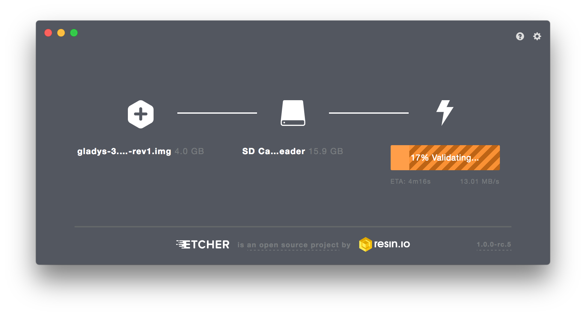

If you are looking to install Gladys Assistant on a Raspberry Pi that is already configured, use the [Docker](/docs/installation/docker) tutorial.

## Download Gladys Raspberry Pi OS image

We provide a pre-built Raspberry Pi OS image with Gladys already configured.

For Raspberry Pi 3, 4 & 400:

<a class="button button--primary margin-bottom--md" href="/download/latest-64" rel="nofollow" >Download Gladys Assistant OS Bullseye 64-bit</a>

For older Raspberry Pi (Raspberry Pi 1, 2 & Zero):

<a class="button button--primary margin-bottom--md" href="/download/latest" rel="nofollow" >Download Gladys Assistant OS Bullseye 32-bit</a>

This link will download a `.zip` file containing the Raspberry Pi OS image of Gladys Assistant. After unzipping the downloaded file, you'll get a `.img` file.

## Clone the image on a SD card

Once you have retrieved the image (`.img` file described above), you need to clone this image on the Raspberry Pi SD card.

We recommend the software [Etcher](https://www.balena.io/etcher/) (Linux/MacOS/Windows compatible).

Install Etcher, plug your SD card into your computer, and clone the `.img` file on your SD card.

## Plug your Raspberry Pi

Plug your Raspberry Pi to your local network. Make sure the power adaptor is connected.

Give it some time to boot.

## Access Gladys

To access Gladys, open your web browser on any computer on the local network. **/!\ Make sure your computer and your Raspberry Pi are connected to the same network.**

Then enter the URL `http://gladys.local` or `http://raspberrypi.local` or `http://IP_OF_YOUR_RASPBERRY_PI`.

You should see the Gladys Web UI (portal).

:::note
If you don't see the Gladys login page when typing `http://gladys.local` in your browser, try typing the IP address of your Raspberry Pi.

💡 To find the right IP address, you can use a network scanner app such as ([Network Scanner](https://play.google.com/store/apps/details?id=com.easymobile.lan.scanner&hl=fr) on Android or [iNet](https://itunes.apple.com/fr/app/inet-network-scanner/id340793353?mt=8) on iOS)
:::
