If you already own a Raspberry Pi, you can install Gladys Assistant in just a few minutes using our new official **64-bit image**, compatible with **Raspberry Pi 3, 4, and 5**.

This is the easiest way to discover Gladys, without having to install Raspberry Pi OS and Docker yourself.

:::info
**For a long-term setup**, I recommend a mini-PC instead (better price/performance ratio, integrated NVMe SSD, more reliable with Zigbee/Z-Wave dongles). If you're in Europe, you can also opt for our [starter kit](https://gladysassistant.com/fr/starter-kit/) with Gladys pre-installed.

But if you already have a Raspberry Pi on hand, use it to try Gladys. That's exactly why we made this installation so simple!
:::

## What You'll Need

- A **Raspberry Pi 3, 4, or 5** (64-bit model)
- A **USB SSD** is preferred (USB 3.0 adapter + SATA or NVMe SSD). A 16 GB micro-SD card also works fine for testing.
- An **official power supply** suited to your model (5V / 3A for Pi 4, 5V / 5A for Pi 5)
- An **Ethernet cable** or Wi-Fi connection
- A computer (Windows, macOS, or Linux) to flash the image

## Step 1: Download Raspberry Pi Imager

Download and install [Raspberry Pi Imager](https://www.raspberrypi.com/software/) on your computer. This is the official tool for flashing images onto SD cards or SSDs.

## Step 2: Select Your Raspberry Pi

Open Raspberry Pi Imager and click **Choose Device** (or **NEXT** if you're in the new step-by-step wizard).

Select your Raspberry Pi model from the list:

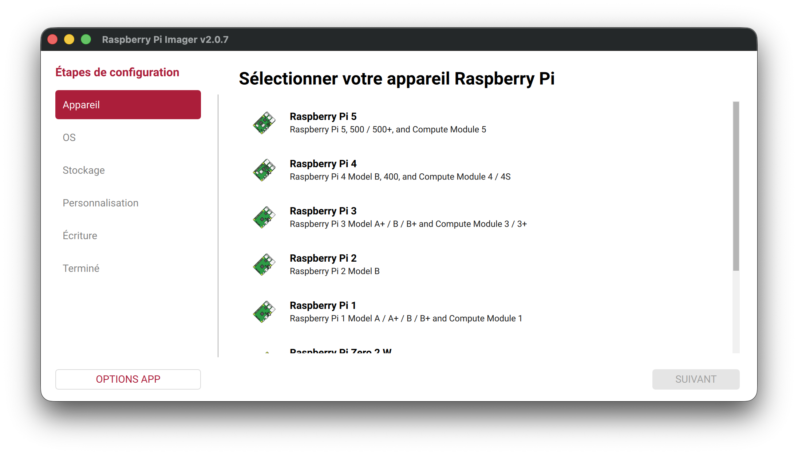

## Step 3: Choose the Gladys Assistant Image

Click **Choose OS**, then navigate through the following categories:

1. **Other specific-purpose OS**
2. **Home automation**
3. **Gladys Assistant**

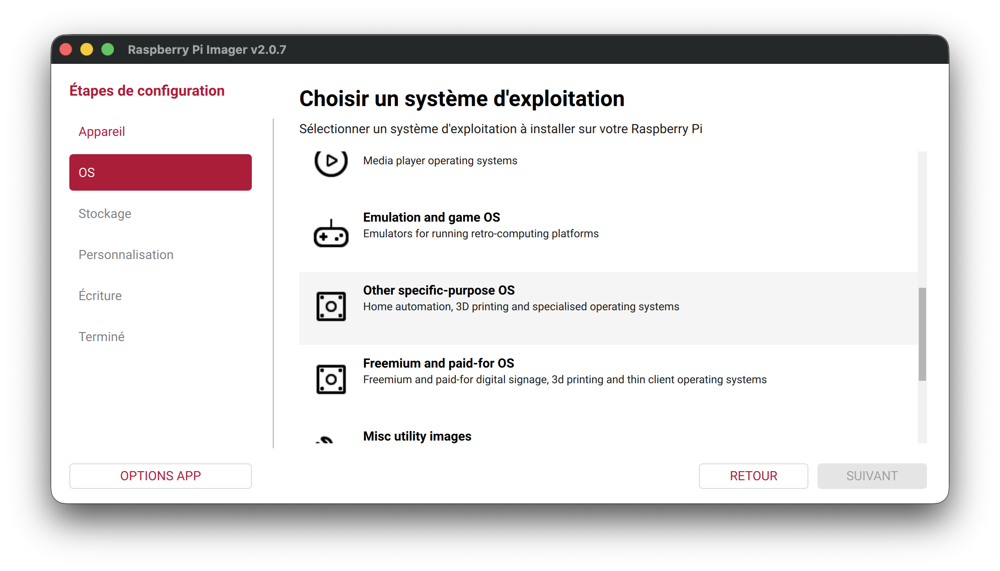

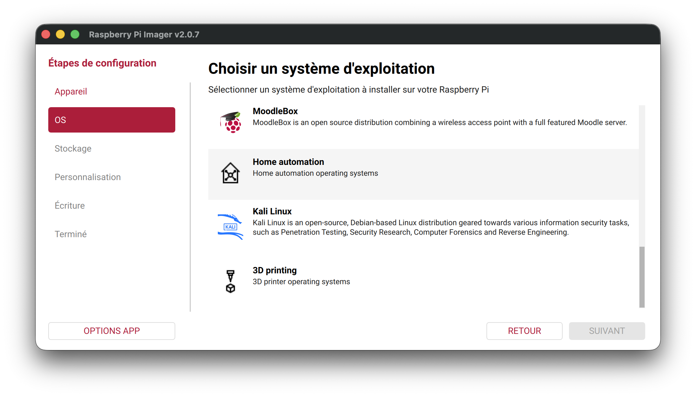

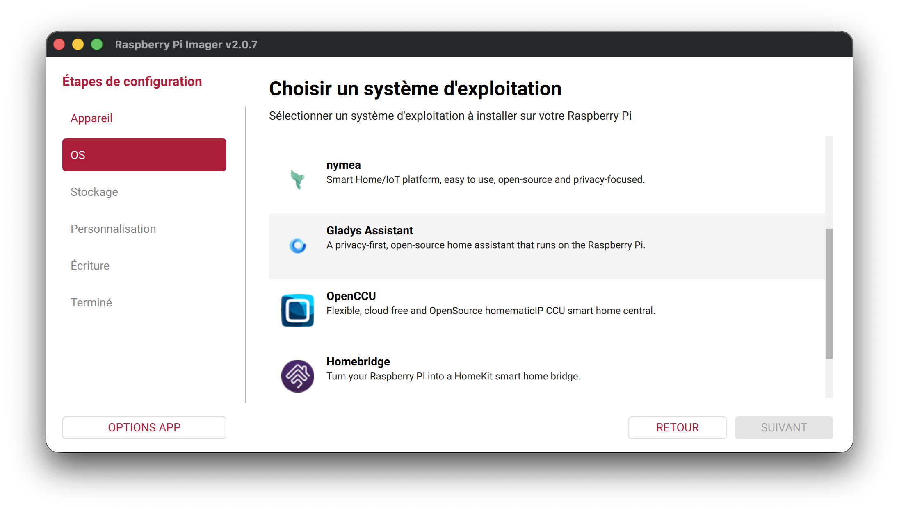

Then select the **Gladys Assistant (64-bit, for Rpi 3, 4 & 5)** image:

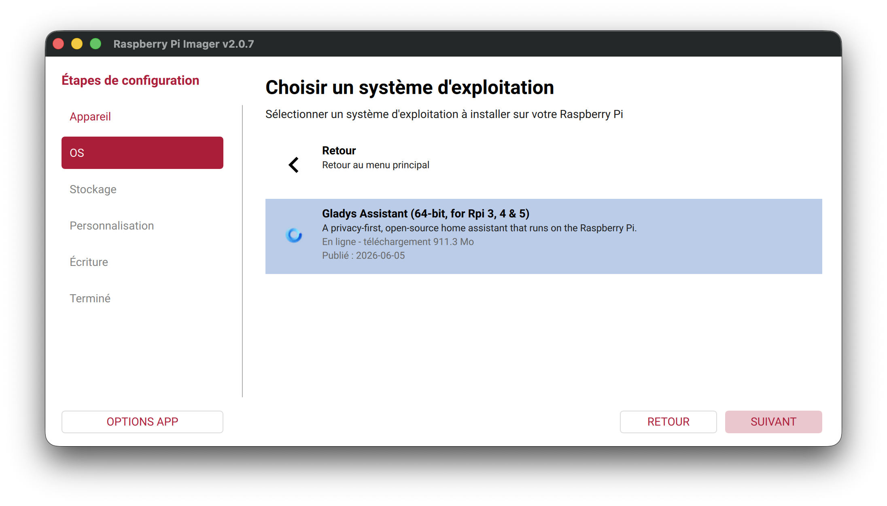

:::tip
The image is about 900 MB to download. Raspberry Pi Imager handles everything: download, verification, and writing to your storage device.
:::

## Step 4: Choose Storage

Insert your micro-SD card or plug in your USB SSD, then click **Choose Storage** and select the corresponding device:

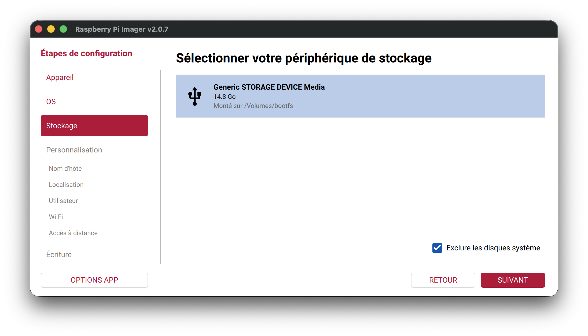

:::warning
Make sure you select the correct device: **all data on this drive will be erased**.
:::

## Step 5: Customize the Installation (Recommended)

Before writing the image, configure your Raspberry Pi settings. This saves you from needing to connect a screen and keyboard on first boot.

### Hostname

Choose a network name for your Raspberry Pi. For example `gladys`, you'll then be able to access it at `http://gladys.local`:

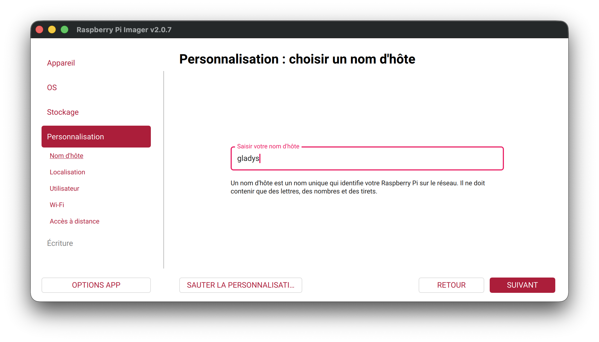

### Localization

Select your city, time zone, and keyboard layout:

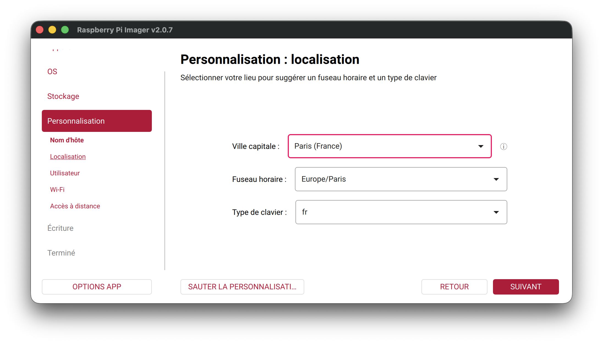

### User Account

Create a username and password. This account will be used for SSH access and system login:

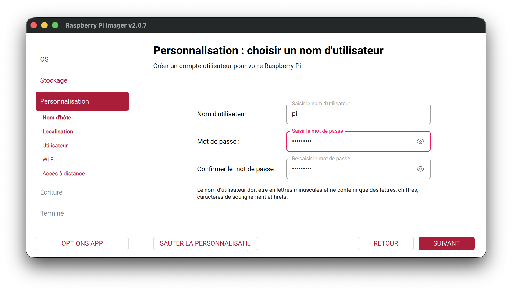

### Wi-Fi (Optional)

If you're not using an Ethernet cable, enter your Wi-Fi network name and password:

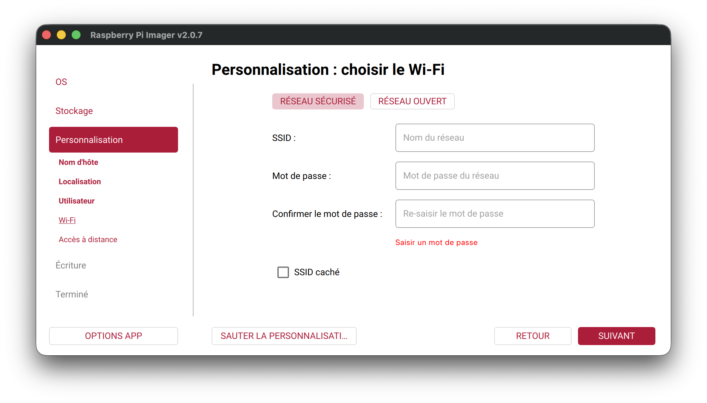

### SSH Access (Recommended)

Enable SSH so you can connect to your Raspberry Pi remotely. Password authentication is the simplest way to get started:

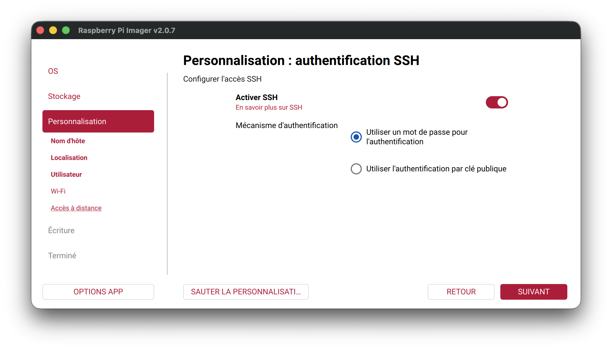

## Step 6: Write the Image

Review the summary of your configuration, then click **WRITE**:

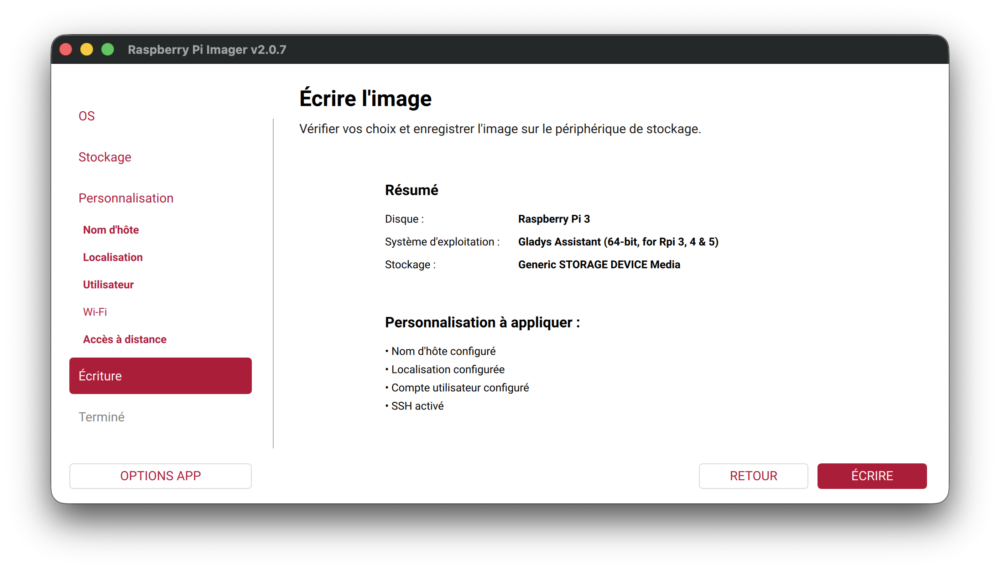

Writing can take several minutes depending on your storage speed. Once complete, Raspberry Pi Imager automatically ejects the device:

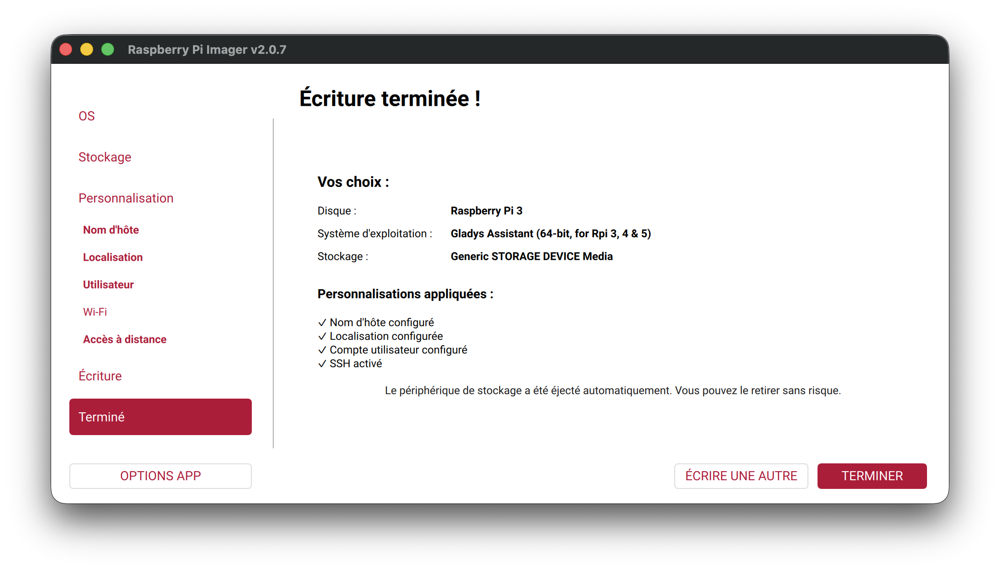

## Step 7: First Boot

1. Insert the micro-SD card (or plug in the USB SSD) into your Raspberry Pi
2. Connect the power supply
3. Wait about 2 minutes for the Raspberry Pi to boot

## Step 8: Access Gladys Assistant

Open your browser and go to one of these addresses:

- `http://gladys.local` (if you configured the hostname as `gladys`)
- `http://YOUR_LOCAL_IP` (for example `http://192.168.1.131`)

On first boot, Gladys runs its initial setup. This can take **between 5 minutes and 1 hour** depending on your hardware and internet connection:

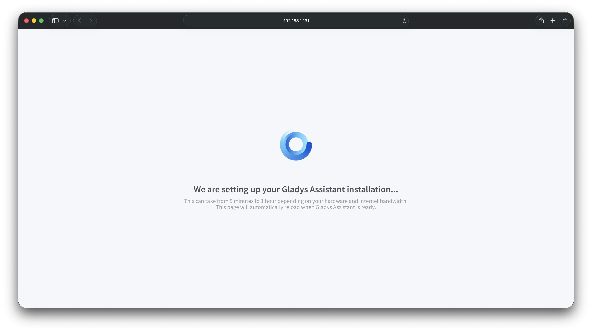

The page will reload automatically when Gladys is ready. You can then create your account and start setting up your smart home!

## What's Next?

- Check out the [Recommended hardware](/docs/installation/recommended-hardware/) guide to choose your connected devices
- Learn how to [install integrations](/docs/integrations/) (Zigbee, Z-Wave, etc.)
- If you want to upgrade to a more powerful setup, see the [Mini-PC installation guide](/docs/installation/mini-pc/)
