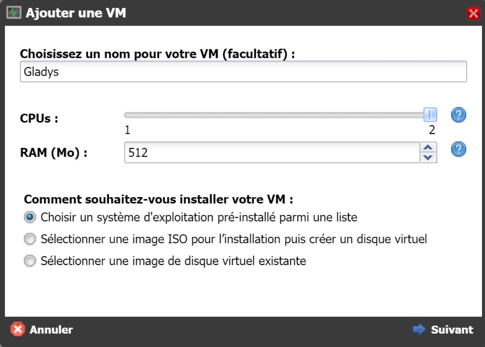
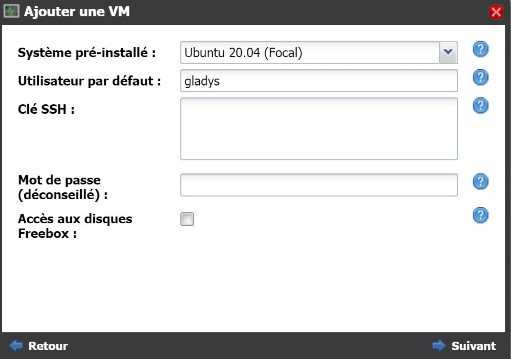
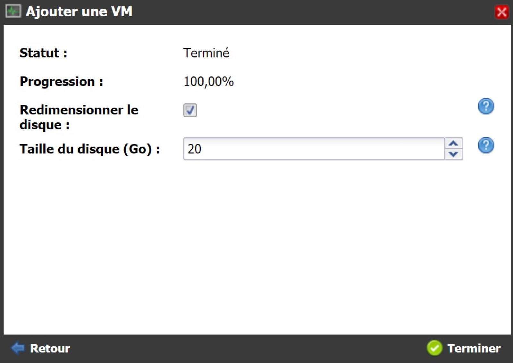
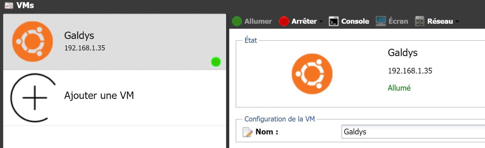
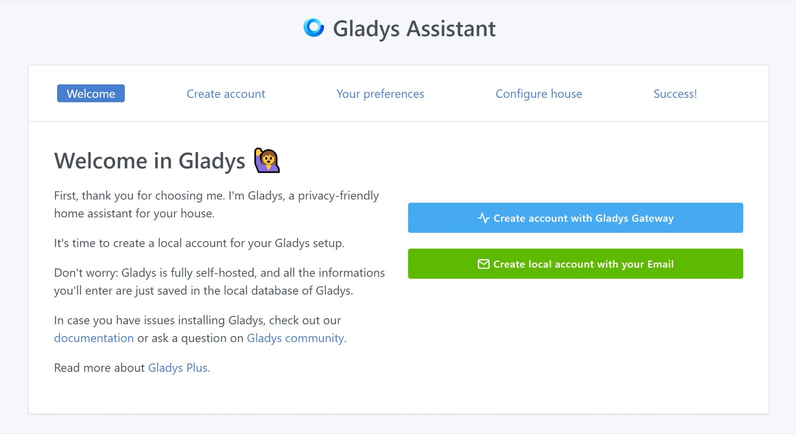

## On a Freebox Delta

This tutorial is for Freebox Delta owner who wants to install Gladys with Docker.

### Create a virtual machine on the Freebox Delta

First, go to the Freebox interface at the following address: mafreebox.free.fr.


Click on "VMs". This window appears:



Choose a name for the VM, for example Gladys.

Select the option "Choose a pre-installed operating system from a list".

Click on "Next".



Select the system to install, for example Ubuntu.

Enter a public SSH key or password.

Choose a username, for example galdys.

Click on "Next".



Click on "Finish".

The VM is ready, click on "Switch on" to start the VM.



Access your VM in SSH and update the system.

```bash
sudo apt update
sudo apt upgrade
```

### Install Docker on the Raspberry Pi

```bash
sudo apt install docker.io
sudo systemctl enable --now docker
sudo usermod -aG docker gladys
```

Then exit your SSH session, and login again.

### Start Gladys

To launch Gladys, run the following command on your VM:

```bash
docker run -d \
--log-opt max-size=10m \
--restart=always \
--privileged \
--network=host \
--name gladys \
-e NODE_ENV=production \
-e SERVER_PORT=80 \
-e TZ=Europe/Paris \
-e SQLITE_FILE_PATH=/var/lib/gladysassistant/gladys-production.db \
-v /var/run/docker.sock:/var/run/docker.sock \
-v /var/lib/gladysassistant:/var/lib/gladysassistant \
-v /dev:/dev \
gladysassistant/gladys:v4
```

## Auto-Upgrade Gladys with Watchtower

You can use Watchtower to upgrade automatically Gladys when a new version is available. To do so, start a Watchtower container:

```
docker run -d \
  --name watchtower \
  --restart=always \
  -v /var/run/docker.sock:/var/run/docker.sock \
  containrrr/watchtower \
  --cleanup --include-restarting
```

### Accessing Gladys

You can access Gladys directly by typing the IP of your VM in your browser.


