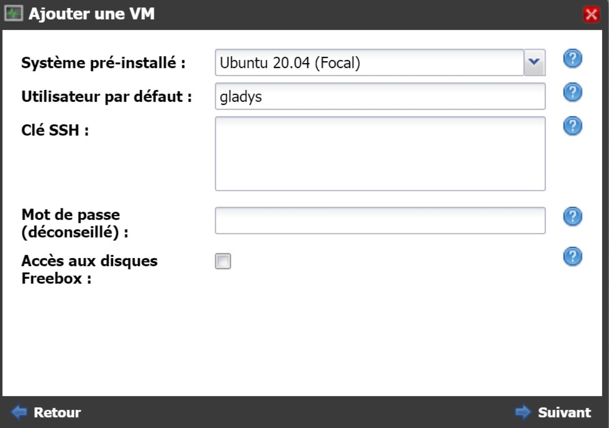
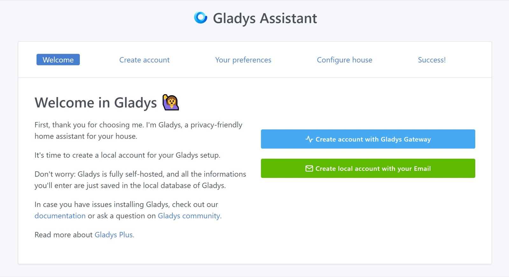

## On a Freebox Delta

This tutorial explains how to install Gladys on a Freebox Delta (this is done with Docker).

### Create a virtual machine on the Freebox Delta

First, go to the Freebox interface at the following address: mafreebox.free.fr.


Click on "VMs". This window appears:


Choose a name for the VM, for example `Gladys`.

Select the option "Choose a pre-installed operating system from a list".

Click on "Next".



Select the system to install, for example `Ubuntu`.

Enter a public SSH key or password.

Choose a username, for example `gladys`.

Click on "Next".


Click on "Finish".

The virtual machine (VM) is ready, click on "Switch on" to start the VM.


SSH into your VM and update the system:

```bash
sudo apt update
sudo apt upgrade
```

### Install Docker on the Raspberry Pi

Type in the following commands, one by one, to install Docker on the Raspberry Pi.

```bash
sudo apt install docker.io
sudo systemctl enable --now docker
sudo usermod -aG docker gladys
```

Then exit your SSH session, and login again to ensure the changes are applied.

### Start Gladys

To launch Gladys, run the following command on your VM:

```bash
docker run -d \
--log-driver json-file \
--log-opt max-size=10m \
--cgroupns=host \
--restart=always \
--privileged \
--network=host \
--name gladys \
-e NODE_ENV=production \
-e SERVER_PORT=80 \
-e TZ=Europe/Paris \
-e SQLITE_FILE_PATH=/var/lib/gladysassistant/gladys-production.db \
-v /var/run/docker.sock:/var/run/docker.sock \
-v /var/lib/gladysassistant:/var/lib/gladysassistant \
-v /dev:/dev \
-v /run/udev:/run/udev:ro \
gladysassistant/gladys:v4
```

## Auto-Upgrade Gladys with Watchtower

You can use Watchtower to upgrade automatically Gladys when a new version is available. To do so, start a Watchtower container:

```
docker run -d \
  --name watchtower \
  --restart=always \
  -v /var/run/docker.sock:/var/run/docker.sock \
  containrrr/watchtower \
  --cleanup --include-restarting
```

### Accessing Gladys

You can access Gladys directly by typing the IP of your VM in your browser.


