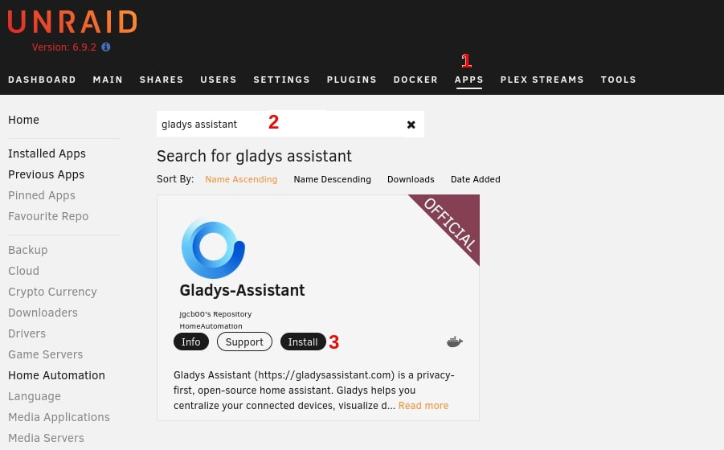

In this tutorial, we go through the instructions for installing Gladys Assistant on an Unraid NAS with Docker

## Search for Gladys-Assistant

You must install the docker app from the 'Apps Manager'.
1) From your Unraid admin dashboard click on Apps
2) Search for Gladys-Assistant
3) Click on install

## Gladys configuration

You will then be redirected to the configuration pages of Gladys 

Here are the different parameters : 

1) The name of your App, if you don't have any other instance you can leave Gladys-Assistant
2) The docker hub repository, don't touch that unless you know what you are doing.
3) The Network type MUST stay on **HOST**. This is needed for Gladys to be able to scan your network to find a new smart device.
4) Your time zone, make sure to follow this [type](https://en.wikipedia.org/wiki/List_of_tz_database_time_zones)
5) The port on which Gladys's Dashboard will be displayed.

Caution: If you have/plan to have MQTT Device the ports 1883 and 1884 must be free. Same for Zigbee device that needs both 1883, 1884, and 8080 free.

Caution: If you change the default port 8006, the WebUI button might redirect you to the wrong port address to change that, click on advanced view, find web UI and change the number.

Click on apply and wait until the installation finishes.

## Gladys access

Gladys will be accessible on your browser on `http://YOUR_NAS_IP:PORT`

For example `http://192.168.1.2:8006`

You can also access the Web UI by clicking on docker, then on the logo of Gladys, and finally web UI.

Welcome in Gladys Assistant!

## Update Gladys

Currently, Watchtower isn't available in Unraid (might change soon).

To update Gladys : 
0) Go to the docker
1) Click Advanced view
2) Click on force update

You can see your current version in Gladys Dashboard, click on your profile on the top right, then parameters, and finally systems.

## Advanced Parameters

When configuring Gladys, you can see others parameters.

- Gladys lib folder: folder on your NAS to store permanent files
- Gladys Dev Folder: folder where devices are represented as files
- Gladys uDev Folder: Udev is the device manager for the Linux kernel. 
- DB File path: Docker path to the SQLite database
- Environement : production or development (Display Debug)
- Gladys Docker Folder: Docker command file to create and manage docker from within Gladys