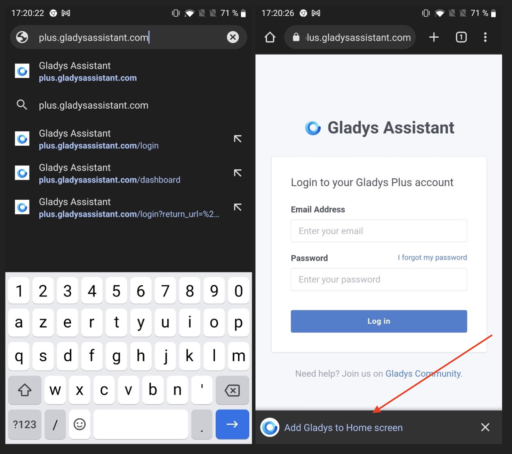
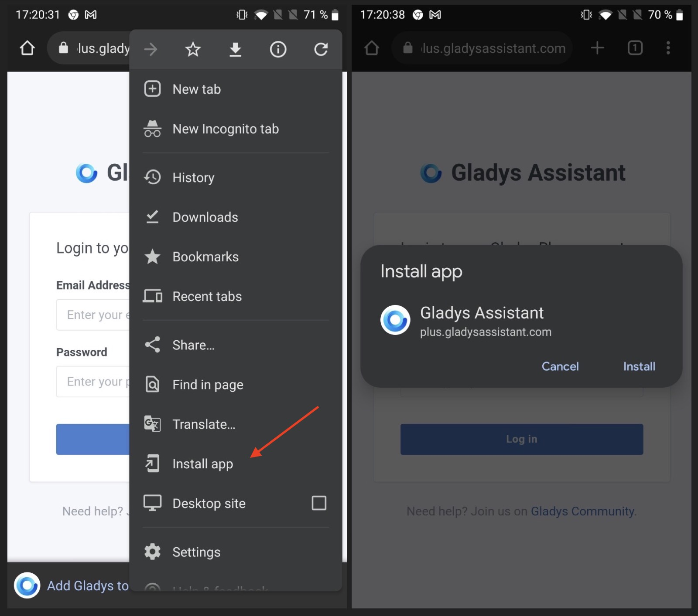
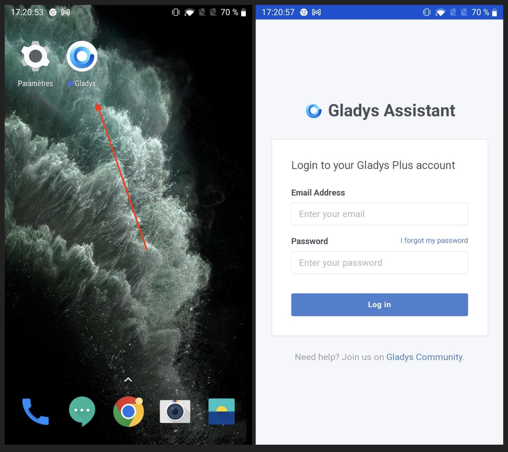
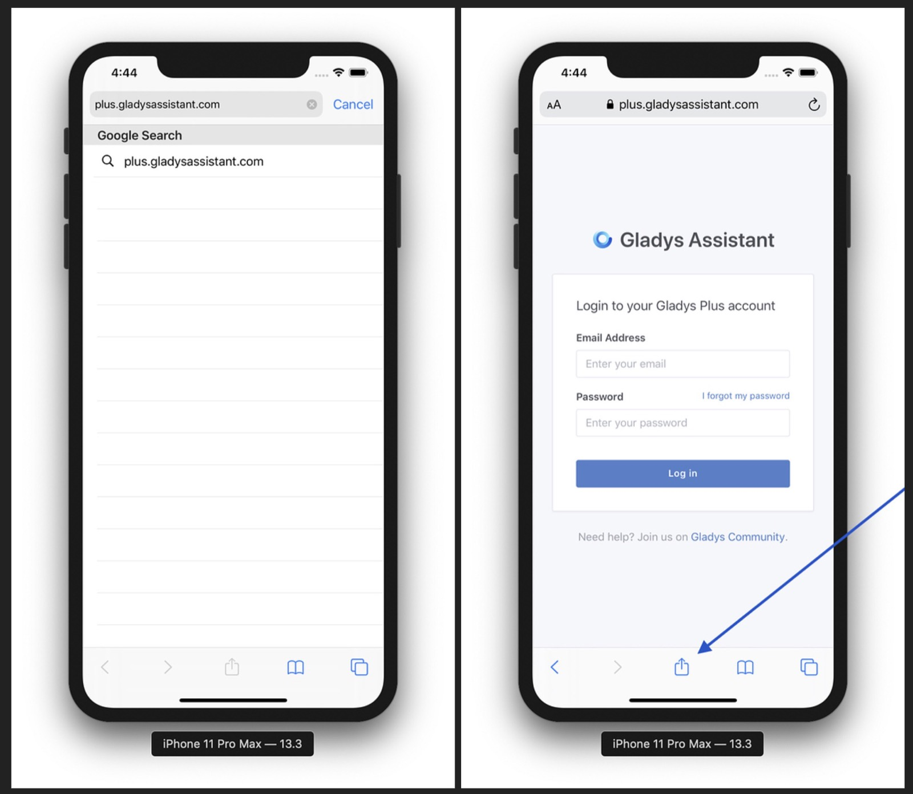
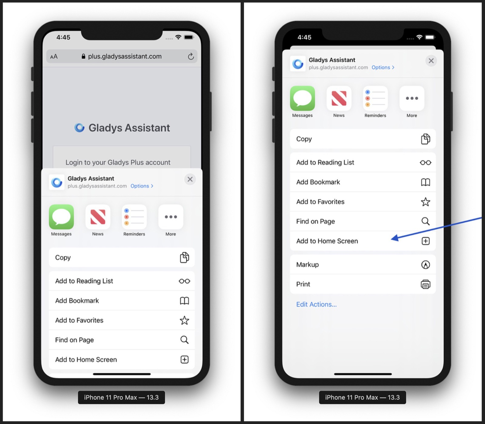
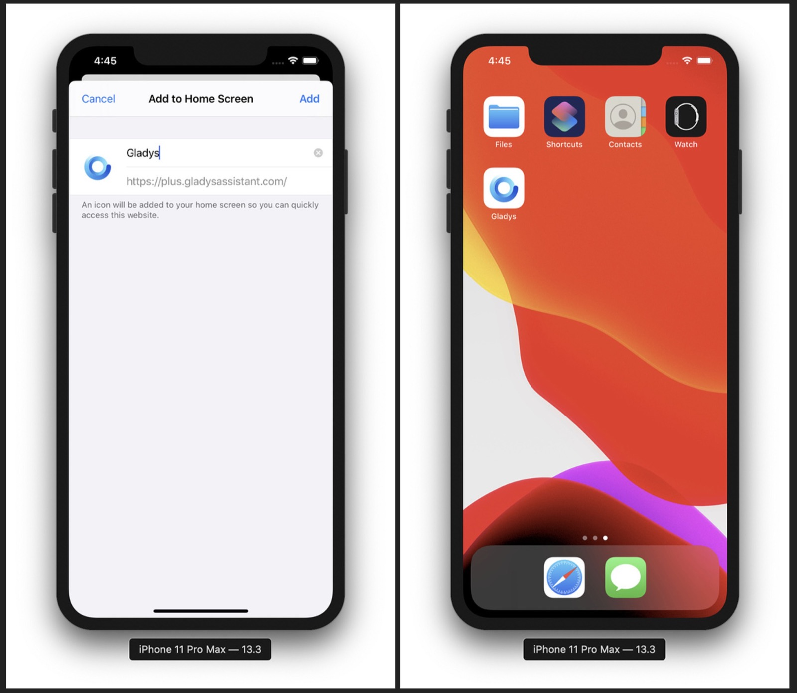
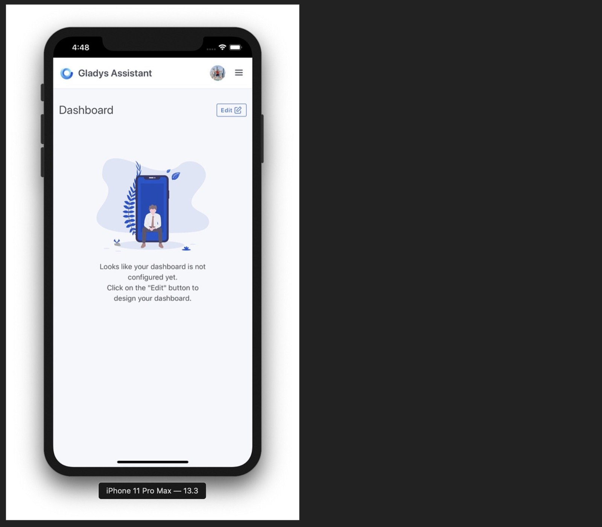

import JsonLd from '@site/src/components/seo/JsonLd';

Gladys Assistant is a PWA ([Progressive Web App](https://en.wikipedia.org/wiki/Progressive_web_application)), it's a web application that can be installed on any device: on iOS, on Android, on MacOS, on Windows, on Linux.

As Gladys is running on your home network, by default Gladys is only available when you are on your local network.

We offer [Gladys Plus](/plus), a service that proxy the traffic from [plus.gladysassistant.com](https://plus.gladysassistant.com/) to your local network, all end-to-end encrypted for maximum privacy, and without any configuration.

If you want to use Gladys locally only, or with your own domain, you can follow this tutorial with the address of your Gladys instance.

## On Android

It's super simple to install Gladys on an Android phone or tablet.

Open [plus.gladysassistant.com](https://plus.gladysassistant.com/) in Chrome.

You should see a button "Add Gladys to home screen" at the bottom.

If not, you can still go to the three dots in the right-hand corner, and click on "Install app":

Success! You can now enjoy Gladys/Gladys Plus as an app.

## On iOS

It's super simple to install Gladys on an iOS device (iPhone/iPad)

Open [plus.gladysassistant.com](https://plus.gladysassistant.com/) in Safari, and click on the share button on the bottom of the page.

Click on "Add to home screen":

Give a name to the app, and click "add":

Success! You have Gladys Plus on your home screen.

## Frequently asked questions

### Is there a Gladys mobile app for iPhone and Android?

Gladys is a Progressive Web App, so you install it straight from your browser instead of an app store. Once added to your home screen on iPhone or Android, it looks and behaves like a native app, with its own icon and full-screen view.

### Can I access Gladys from my phone outside my home?

Yes, with Gladys Plus. By default Gladys only answers on your local network, but Gladys Plus securely proxies the connection so you can control your home from anywhere, end-to-end encrypted, with no port forwarding or configuration.

### Does Gladys work on both iOS and Android?

Yes. The same web app installs on iPhone, iPad and Android phones and tablets, and also on macOS, Windows and Linux.

<JsonLd
  data={{
    "@context": "https://schema.org",
    "@type": "FAQPage",
    mainEntity: [
      {
        "@type": "Question",
        name: "Is there a Gladys mobile app for iPhone and Android?",
        acceptedAnswer: {
          "@type": "Answer",
          text: "Gladys is a Progressive Web App, so you install it straight from your browser instead of an app store. Once added to your home screen on iPhone or Android, it looks and behaves like a native app, with its own icon and full-screen view.",
        },
      },
      {
        "@type": "Question",
        name: "Can I access Gladys from my phone outside my home?",
        acceptedAnswer: {
          "@type": "Answer",
          text: "Yes, with Gladys Plus. By default Gladys only answers on your local network, but Gladys Plus securely proxies the connection so you can control your home from anywhere, end-to-end encrypted, with no port forwarding or configuration.",
        },
      },
      {
        "@type": "Question",
        name: "Does Gladys work on both iOS and Android?",
        acceptedAnswer: {
          "@type": "Answer",
          text: "Yes. The same web app installs on iPhone, iPad and Android phones and tablets, and also on macOS, Windows and Linux.",
        },
      },
    ],
  }}
/>
