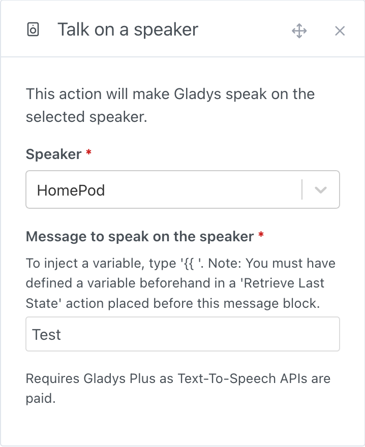

## Prerequisites

Check that your speaker is accessible from all devices on the same network.

For a HomePod diffusion, go to the Home application, `Home Settings` then choose `Speakers and TVs` -> then select `Any user on the same network` and disable the password.

If you wish to stream audio to a Mac on the network, go to your Mac's Settings, `General`, click on `AirDrop and Handoff`, enable the `AirPlay receiver`, authorize `All people on the same network` and also disable the password. PLEASE NOTE: for security reasons, you must manually validate the AirPlay connection each time you broadcast to a Mac, by accepting the on-screen notification.

## Add a speaker in Gladys

After adding your speakers in the Airplay application, go back to Gladys:

1. go to the `Integration -> Airplay` page in Gladys
2. select the `Airplay Discovery` menu

   

3. click on the `Scan` button at top right (if the device is not already in the list)
4. finally, click on `Save` for the speakers you want to integrate into Gladys
5. and you're done!

## Rename / place a speaker in a room

If necessary, you can go to the `Devices` menu to modify / complete the configuration of your speakers by adding them to a room or renaming them.

## Let Gladys talks

In the scenes, you can now make Gladys speak throught your Airplay device.

