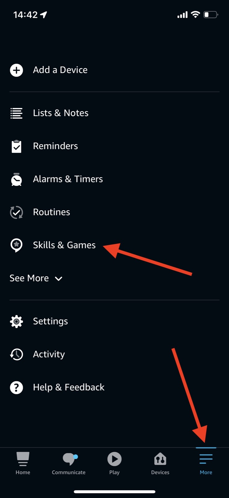
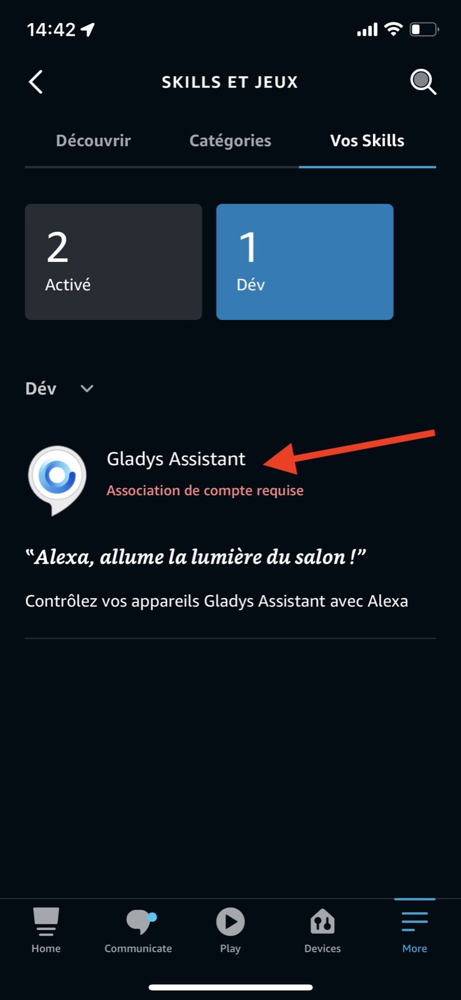
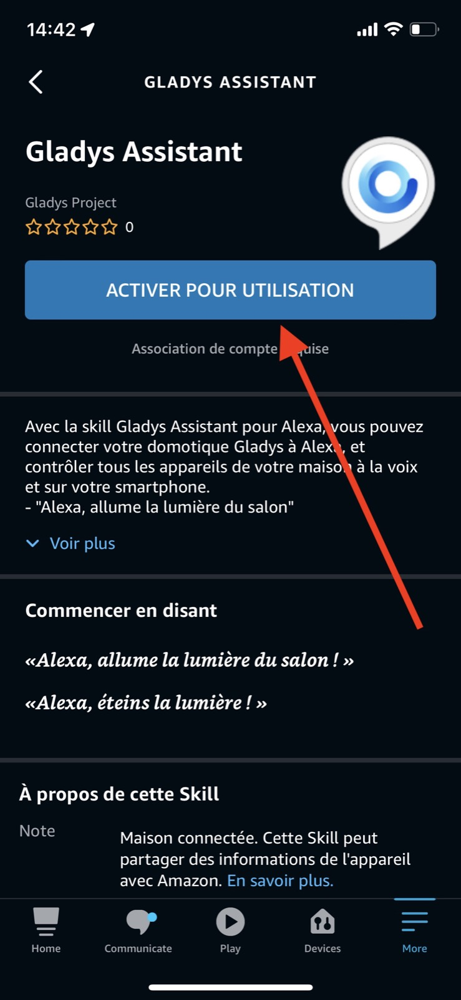
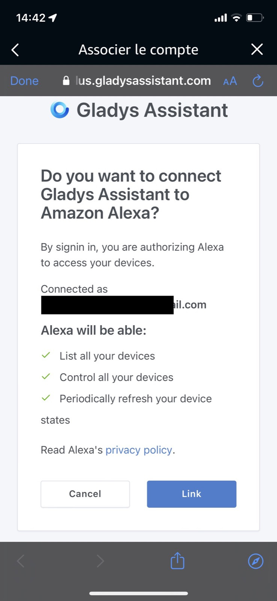
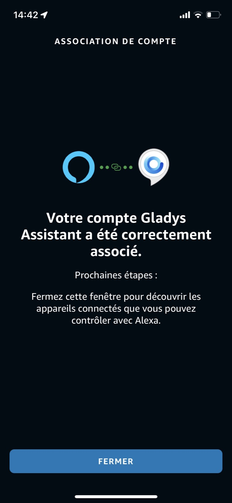
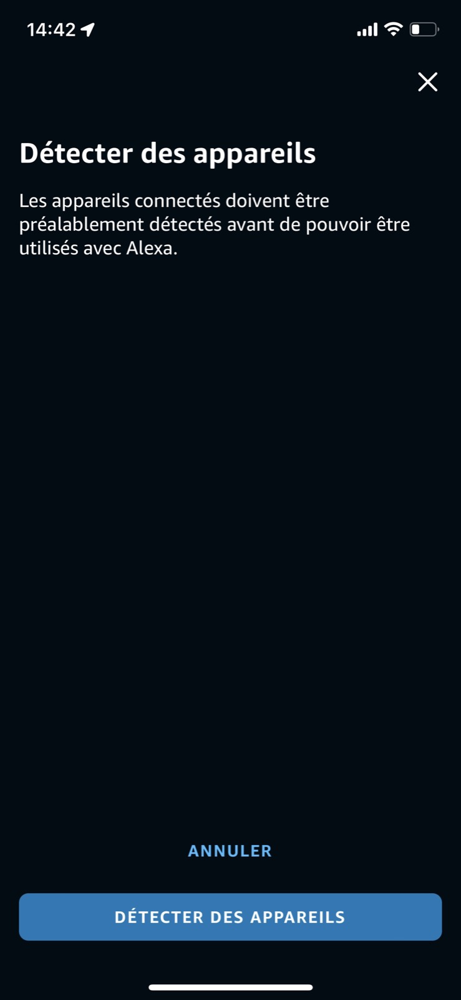

This tutorial will show you how to set up **Alexa** **integration** in just a few minutes on your **Gladys** instance.

## A word before we begin

**Alexa** integration is a special kind of integration.

As Alexa is a 100% Cloud product, Amazon requires that its partners are also hosted in the Cloud.

So, unlike other integrations that can work entirely locally, Alexa by nature can only work through an Amazon-approved, cloud-hosted integration.

To enable the Gladys community to use Alexa with Gladys, we developed our own **Alexa** integration, via [Gladys Plus](https://gladysassistant.com/fr/plus/), our web gateway.

Being an Alexa partner was not an easy task, we had to :

- pass certification to become an Alexa partner
- Validate automated tests
- pass a manual review with an Amazon employee

All this process, maintenance and infrastructure costs justify the fee we charge to make this integration work, and I hope you'll understand.

## Create a Gladys Plus account

To join Gladys plus, head over to the [dedicated page](/plus), and enter your email.

## Configure Gladys Plus

Gladys Plus needs to be fully configured before you can use the Google Home integration.

We recommended you follow the step you received by email to configure Gladys Plus.

At the end, you should be able to connect to [plus.gladysassistant.com](https://plus.gladysassistant.com) without any issue.

Once you have successfully logged in to Gladys plus, you can configure Google Home!

## Configure Alexa

First, open the Alexa app on your phone.

Go to "Skills & Games":

Click on the "Gladys Assistant" integration:

Activate the integration

You'll need to connect with your Gladys Plus account.

Success!

Alexa will now scan for all your devices on Gladys side.

## Compatible devices

For now, only:

- Lights (On/Off / Color / Brightness)
- Switch (On/Off)

Additionnal compatibilities will be added on request. Don't hesitate to send us your feature requests on [the forum](https://community.gladysassistant.com/).

Please post a message on the forum, if you need any help.