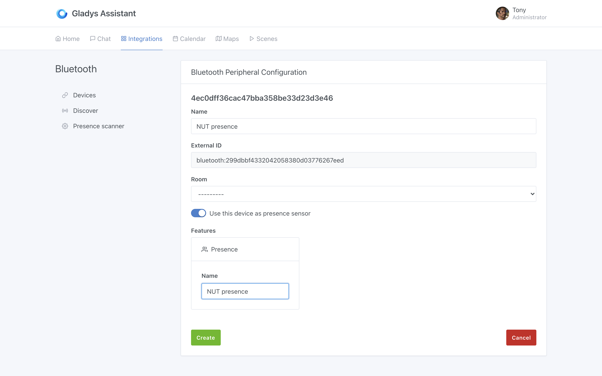
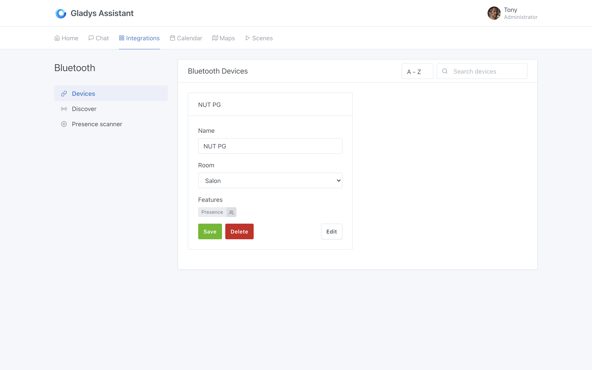
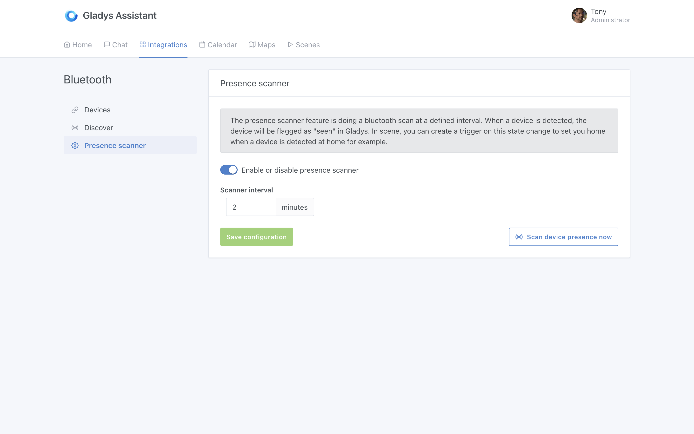
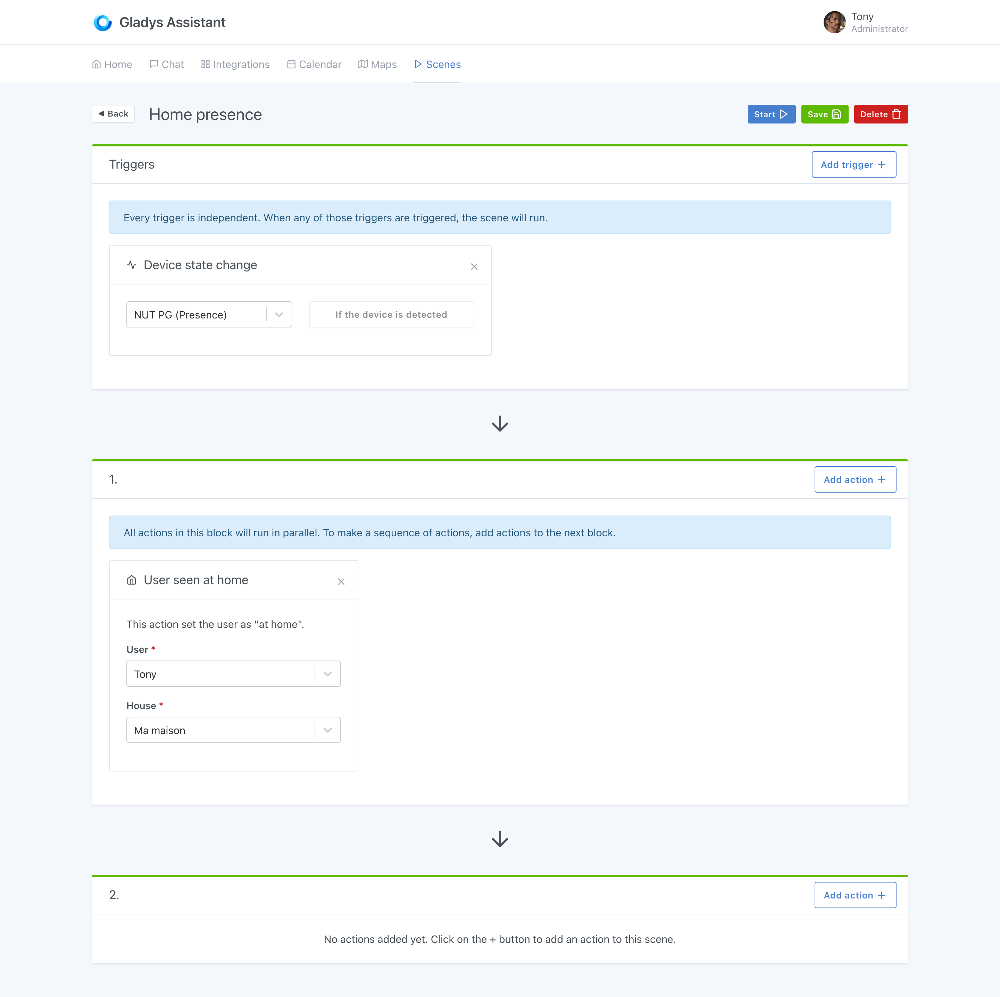
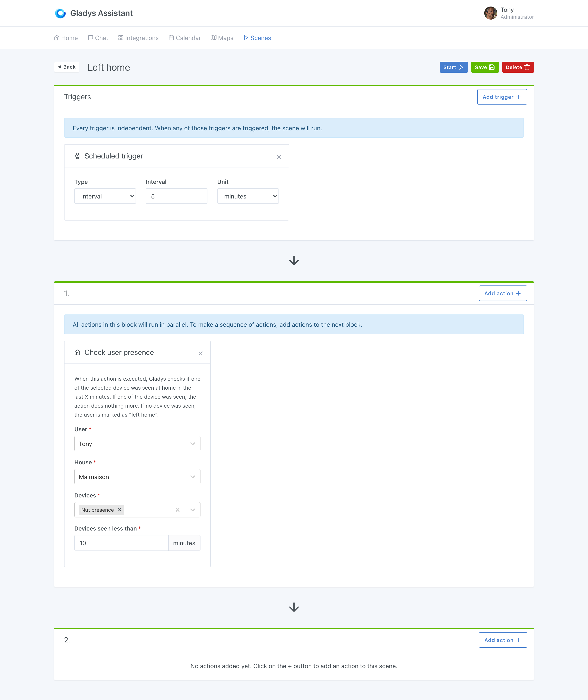
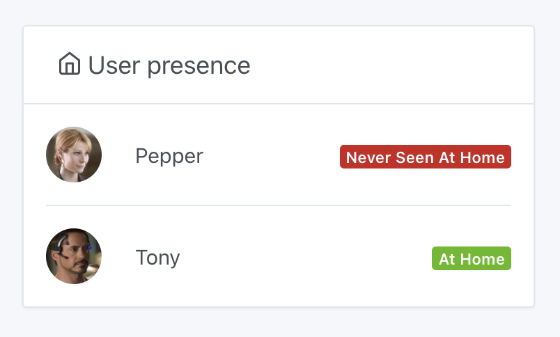

Bluetooth integration is useful for presence detection.

There are bluetooth key chains like the [NUT keychain](https://www.amazon.com/gp/product/B08K3124JR/ref=as_li_qf_asin_il_tl?ie=UTF8&tag=gladproj-20&creative=9325&linkCode=as2&creativeASIN=B08K3124JR&linkId=5688d18164e92becabd17c6d49fdd778) which permanently broadcast their presence via Bluetooth.

With this kind of key fob, Gladys can detect when you are (or are not) at home, simply by scanning for nearby bluetooth devices.

:::note
This trick does not work with all Bluetooh devices. This only works with bluetooth devices that (1) transmit their signal continuously, and (2) which do not obfuscate their bluetooth address. **Most  phones do not broadcast their bluetooth signal continuously**. 

In general, the "dumber" the device, the better it works! For example, I had a Fitbit Force 2 bracelet, and it worked. However, it does not work with an Apple Watch.
:::

## Configure your bluetooth device

Go to the "Bluetooth" integration, "Discovery" tab. Scan the surrounding bluetooth devices, and find the device you want to add.

Click on "Connect to Gladys":

Then activate the option "Use this device as a presence sensor".

Give this device a unique name, and add it to Gladys.

You should land on this screen:

Now, go to the "Presence scanner" screen, and check that your configuration looks like this:

It's good, everything is configured on the Bluetooth side!

## Manage presence in scenes

### A "homecoming" scene

We are now going to create a `scene` that will mark a user as "present at home" when this Nut keychain (or any other compatible bluetooth device) is detected.

Go to the "Scenes" tab, and create a scene like this:

The scene is very simple.

WHEN "the key fob is detected" THEN "put user 'Tony' as present at home".

### A "leaving home" scene

To manage the departure of the user from the house, we recommend you make a scene executed periodically, which will check if your NUT keychain has been detected recently at home.

If Gladys detects the device's presence, it won't do anything. If not, Gladys will mark the user as absent.

The scene should look like this:

You can play around with the settings to suit your home. If you feel that 10 minutes is too short to be put as absent, you can extend it to 20 minutes to avoid "false positives" 😀

## Display presence on the dashboard

You can display the presence of selected users on the dashboard. To do so, you can use the "Users present" widget:

