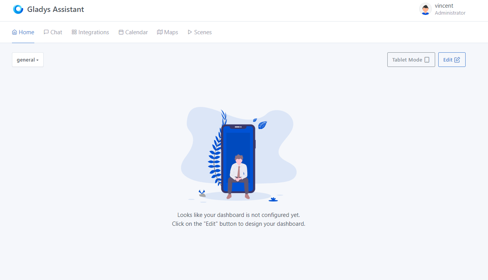

# Control your TVs and air conditioners with a BroadlLink infrared transmitter

With **ladys**, you can manage **Broadlink** devices and create remote controls to operate them via infrared.

## Connect the device to your network

To be visible to Gladys, the **Broadlink** device must be connected to the same WiFi network as Gladys. To do this, simply follow the official Broadlink hardware installation procedure.

## Add a device to Gladys

From Gladys, go to `Integrations -> Broadlink`, then click on `Available devices` to find the devices detected on your network.

Just click on `Register` to add a device.

## Create a remote control in Gladys

It's now possible to replace your remote controls with Gladys. Go to the `Devices -> Create +` menu, enter a name, choose a room, your Broadlink controller and the type of device, then let the learning mode guide you.

Example for a TV remote control:

After pairing, click on `Save`.

You will no longer need your remote controls.

Your remote control is now registered in `apparatus`.

## Troubleshooting

### Device locked

From the Broadlink mobile application, you need to uncheck the option in the settings.

### RF management

Currently, only infrared signals are supported.

## Control your remote on the dashboard

You can now add a **devices widget** to your dashboard and control your remote control.

Go to the Gladys dashboard and click on the "edit" button to modify the dashboard.

Click on `add +`, then select the `devices` widget and move it to a column.

Select the feature(s) you wish to add, and click `Save`.

That's it! Your widget is now visible on the dashboard.

Please post a message on [the forum](https://en-community.gladysassistant.com), if you need any help.