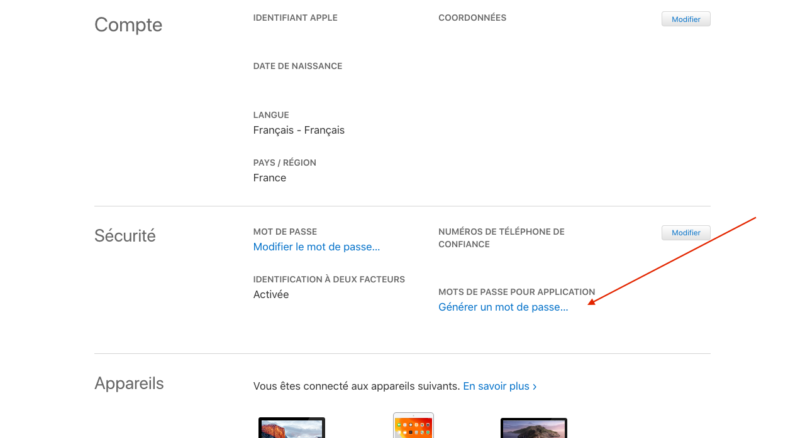
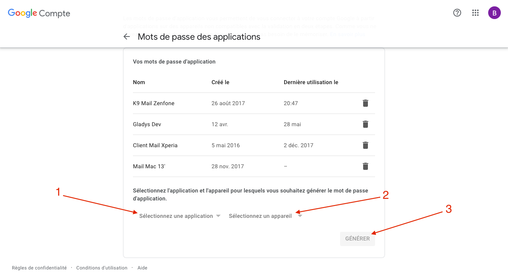
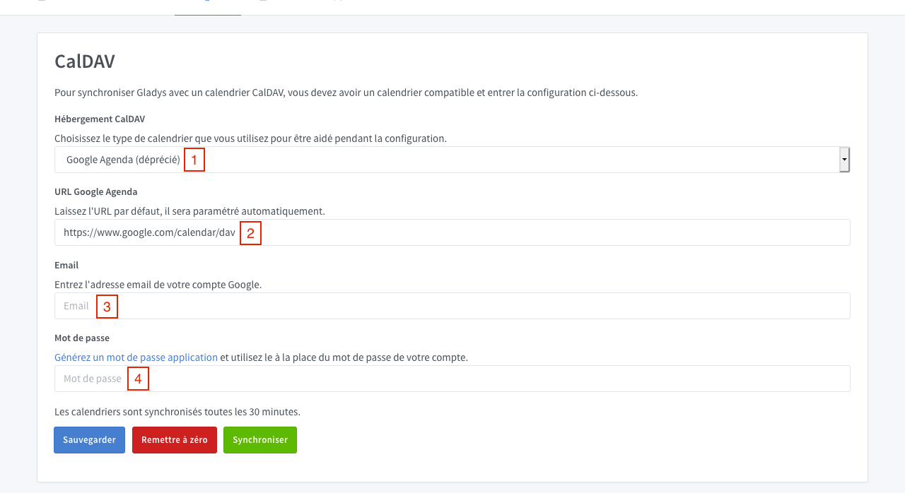
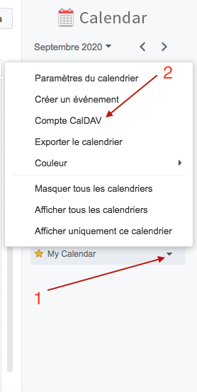
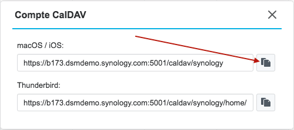
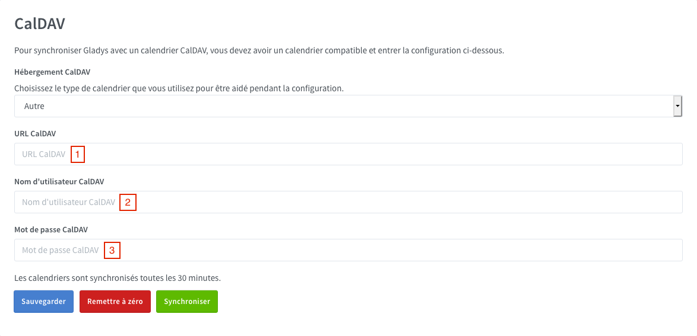

import JsonLd from '@site/src/components/seo/JsonLd';

CalDAV is an open standard that lets applications read and sync calendar events from a calendar server. Most calendar services support it, including iCloud, Google Calendar, Synology Calendar and Nextcloud, which is why it is a convenient, vendor neutral way to bring your existing calendar into another app.

In Gladys, you use CalDAV to synchronise your calendar with these external services. Once your events are in Gladys, you can use them to trigger [scenes](/docs/scenes/intro/): turn the heating on before a meeting, send a reminder when an event starts, or change your house mode when you are on holiday.

Most services require an app specific password rather than your main account password. The steps below show how to generate it and where to paste it for each service.

## Available services (tested & others)

1. [iCloud](#icloud)
2. [Google Calendar](#google-calendar)
3. [Synology Calendar](#synology-calendar)
4. [Nextcloud](#nextcloud)
5. [Others](#others)

### iCloud

Log in to your Apple account: [https://appleid.apple.com](https://appleid.apple.com)

Click on "Generate Password".

Type a name for your password, "Gladys" for exemple.

Note the generated password.

In Gladys dashboard, go to CalDAV config page.

1. Choose "iCloud Calendar"
2. Leave the default URL
3. Type your Apple ID (it should be the email adress associated with your Apple account)
4. Paste here the previously generated password

Click on "Save".

If there is a validation message, Gladys will sync your calendar. If an error appears, check previous steps and try again.

### Google Calendar

Log in to your Google account : [https://myaccount.google.com/](https://myaccount.google.com/)

Go to security tabs and click on "App Passwords".

1. Select "Calendar" for application
2. Select "Other" for device
3. Once you entered the chosen application name ("Gladys" for example), click on "Generate" and write down the generated password.

In the Gladys dashboard, go to CalDAV config page (Integration tab > Calendar).

1. Choose "Google Calendar"
2. Leave the default URL
3. Type your Google email address
4. Paste here the previously generated password

Click on "Save". If there is a validation message, Gladys will sync your calendar. If an error appears, check previous steps and try again.

### Synology Calendar

On your Synology, open "Calendar" application.

1. Next to your calendar, click on the small triangle
2. Then click on "CalDAV Account"

Copy "macOS / iOS" url.

In the Gladys dashboard, go to CalDAV config page (Integration tab > Calendar).

1. Choose "Synlogy Calendar"
2. Paste here the URL you copied previously
3. Type your Synology username
4. Type here you Synology password

Click on "Save".

If there is a validation message, Gladys will sync your calendar. If an error appears, check previous steps and try again.

### Nextcloud

1. On your Nextcloud instance go to config page, then click on the Security tab
2. At the bottom enter "Gladys" and click on "Create new app password"

Write down the generated password.

In the Calendar application, click on "Settings & import"

Then "Copy the primary CalDAV address"

In Gladys dashboard, go to CalDAV config page (Integration tab > Calendar).

1. Choose "Other"
2. Paste here the URL you copied previously
3. Type in your Nexcloud password
4. Paste the previously generated password here

Click on "Save".

If there is a validation message, Gladys will sync your calendar. If an error appears, check previous steps and try again.

### Others

For all others services

1. Enter the CalDAV URL here
2. Enter your username or your email address here
3. Then enter your password (if applicable)

## Frequently asked questions

### What is CalDAV?

CalDAV is an open standard, built on top of WebDAV, that lets applications access and synchronise calendar data from a calendar server. It is supported by most calendar providers, so an app like Gladys can read your events from iCloud, Google Calendar, Synology or Nextcloud without a service specific integration.

### Do I need my account password or an app password?

For most services you need an app specific password, not your main account password. iCloud, Google and Nextcloud all let you generate a dedicated password for Gladys from their security settings, which you can revoke at any time without changing your main password. The setup steps above show where to generate it for each service.

### How do I connect Google Calendar with CalDAV?

Sign in to your Google account, open the security settings and create an app password for "Calendar". Then in Gladys go to the CalDAV config page, choose "Google Calendar", keep the default URL, enter your Google email and paste the generated app password. Gladys will sync your events.

### How do I connect my iCloud calendar?

Sign in at appleid.apple.com and generate an app specific password. In Gladys, open the CalDAV config page, choose "iCloud Calendar", keep the default URL, enter your Apple ID email and paste the password. If the password does not work, make sure you generated an app specific password and not your normal Apple ID password.

### Can I use CalDAV with any other calendar service?

Yes. If your service supports CalDAV, choose "Other" in Gladys, then enter its CalDAV URL, your username or email and your password. This covers self hosted servers like Baïkal or Radicale, and most providers that expose a CalDAV endpoint.

<JsonLd
  data={{
    "@context": "https://schema.org",
    "@type": "FAQPage",
    mainEntity: [
      {
        "@type": "Question",
        name: "What is CalDAV?",
        acceptedAnswer: {
          "@type": "Answer",
          text: "CalDAV is an open standard, built on top of WebDAV, that lets applications access and synchronise calendar data from a calendar server. It is supported by most calendar providers, so an app like Gladys can read your events from iCloud, Google Calendar, Synology or Nextcloud without a service specific integration.",
        },
      },
      {
        "@type": "Question",
        name: "Do I need my account password or an app password for CalDAV?",
        acceptedAnswer: {
          "@type": "Answer",
          text: "For most services you need an app specific password, not your main account password. iCloud, Google and Nextcloud all let you generate a dedicated password for Gladys from their security settings, which you can revoke at any time without changing your main password.",
        },
      },
      {
        "@type": "Question",
        name: "How do I connect Google Calendar with CalDAV?",
        acceptedAnswer: {
          "@type": "Answer",
          text: "Sign in to your Google account, open the security settings and create an app password for Calendar. Then in Gladys go to the CalDAV config page, choose Google Calendar, keep the default URL, enter your Google email and paste the generated app password. Gladys will sync your events.",
        },
      },
      {
        "@type": "Question",
        name: "How do I connect my iCloud calendar with CalDAV?",
        acceptedAnswer: {
          "@type": "Answer",
          text: "Sign in at appleid.apple.com and generate an app specific password. In Gladys, open the CalDAV config page, choose iCloud Calendar, keep the default URL, enter your Apple ID email and paste the password. If it does not work, make sure you generated an app specific password and not your normal Apple ID password.",
        },
      },
      {
        "@type": "Question",
        name: "Can I use CalDAV with any other calendar service?",
        acceptedAnswer: {
          "@type": "Answer",
          text: "Yes. If your service supports CalDAV, choose Other in Gladys, then enter its CalDAV URL, your username or email and your password. This covers self hosted servers like Baikal or Radicale, and most providers that expose a CalDAV endpoint.",
        },
      },
    ],
  }}
/>
