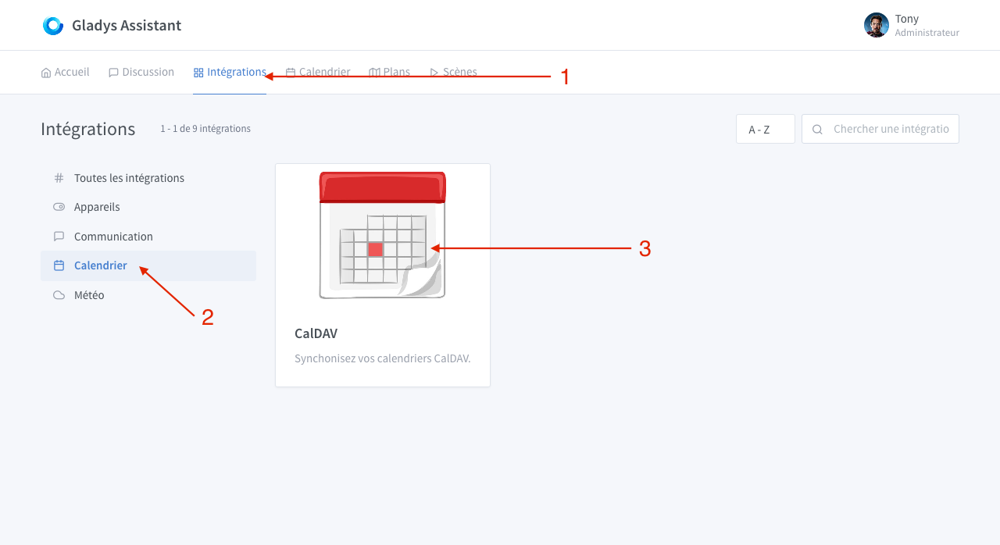
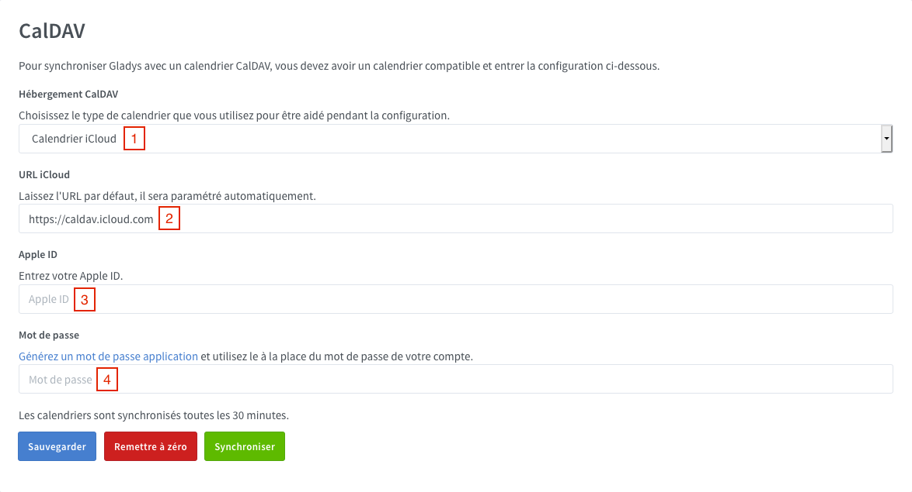
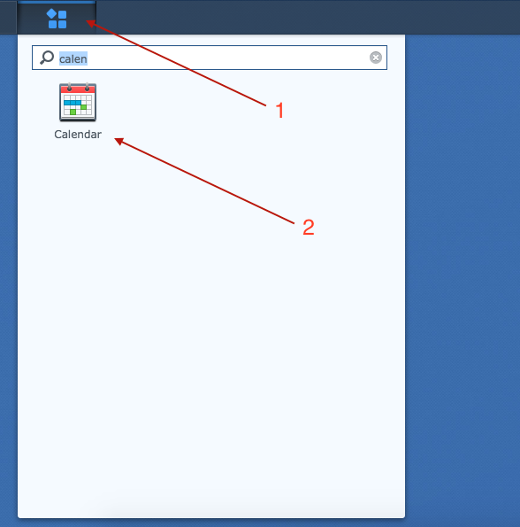
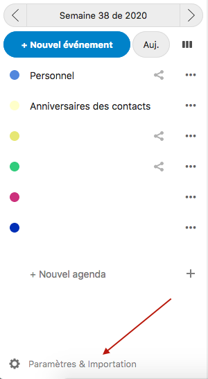

Use CalDav to synchronise your Gladys calendar with external services (Google Calendar, iCloud, Nextcloud...).

## Available services (tested & others)

1. [iCloud](#icloud)
2. [Google Calendar](#google-calendar)
3. [Synology Calendar](#synology-calendar)
4. [Nextcloud](#nextcloud)
5. [Others](#others)

### iCloud

Log in to your Apple account: [https://appleid.apple.com](https://appleid.apple.com)

Click on "Generate Password".

Type a name for your password, "Gladys" for exemple.

Note the generated password.

go to the `Integration -> CalDav` page in Gladys

1. Choose "iCloud Calendar"
2. Leave the default URL
3. Type your Apple ID (it should be the email adress associated with your Apple account)
4. Paste here the previously generated password

Click on `Save`.

If there is a validation message, Gladys will sync your calendar. If an error appears, check previous steps and try again.

### Google Calendar

Log in to your Google account : [https://myaccount.google.com/](https://myaccount.google.com/)

Go to security tabs and click on "App Passwords".

1. Select "Calendar" for application
2. Select "Other" for device
3. Once you entered the chosen application name ("Gladys" for example), click on "Generate" and write down the generated password.

go to the `Integration -> CalDav` page in Gladys

1. Choose `Google Calendar`
2. Leave the default URL
3. Type your Google email address
4. Paste here the previously generated password

Click on `Save`. If there is a validation message, Gladys will sync your calendar. If an error appears, check previous steps and try again.

### Synology Calendar

On your Synology, open "Calendar" application.

1. Next to your calendar, click on the small triangle
2. Then click on "CalDAV Account"

Copy "macOS / iOS" url.

go to the `Integration -> CalDav` page in Gladys

1. Choose `Synlogy Calendar`
2. Paste here the URL you copied previously
3. Type your Synology username
4. Type here you Synology password

Click on "Save".

If there is a validation message, Gladys will sync your calendar. If an error appears, check previous steps and try again.

### Nextcloud

1. On your Nextcloud instance go to config page, then click on the Security tab
2. At the bottom enter "Gladys" and click on "Create new app password"

Write down the generated password.

In the Calendar application, click on "Settings & import"

Then "Copy the primary CalDAV address"

go to the `Integration -> CalDav` page in Gladys

1. Choose "Other"
2. Paste here the URL you copied previously
3. Type in your Nexcloud password
4. Paste the previously generated password here

Click on `Save`.

If there is a validation message, Gladys will sync your calendar. If an error appears, check previous steps and try again.

### Others

For all others services

1. Enter the CalDAV URL here
2. Enter your username or your email address here
3. Then enter your password (if applicable)

Please post a message on [the forum](https://en-community.gladysassistant.com), if you need any help.