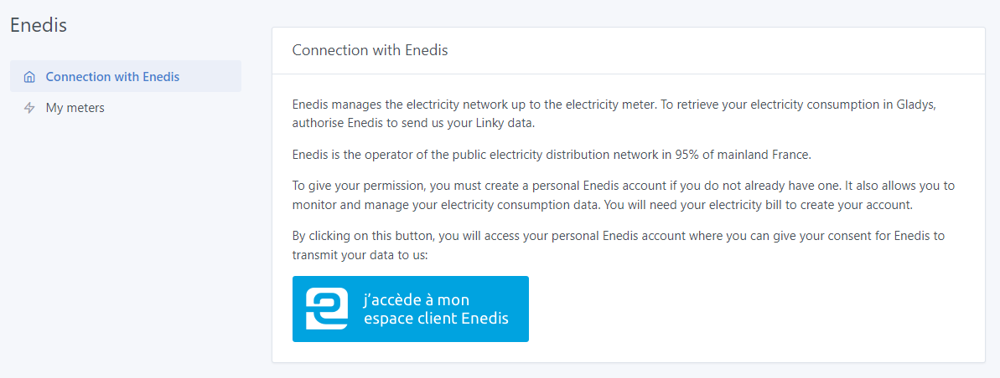
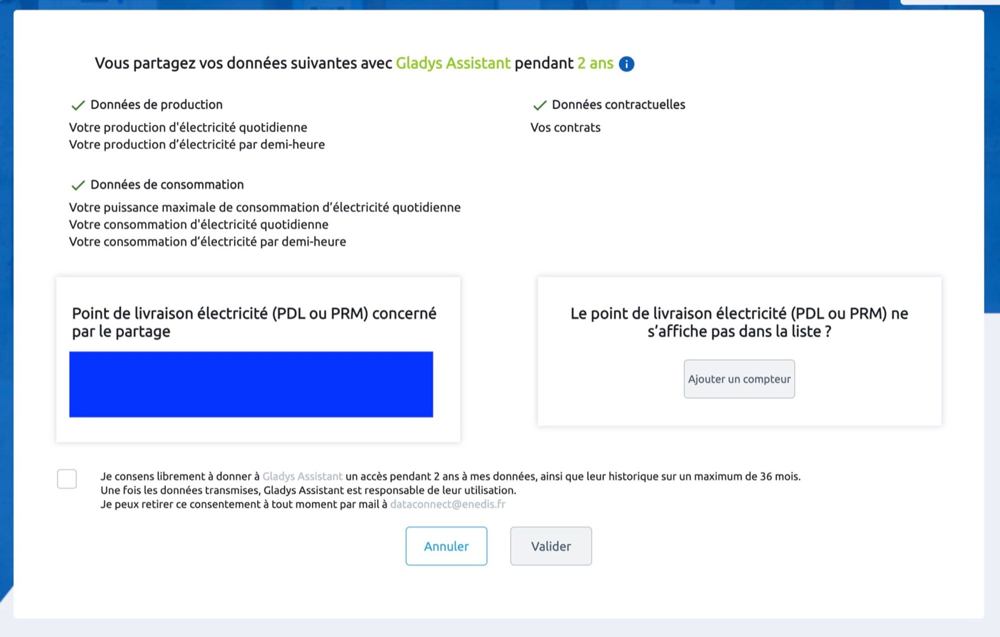
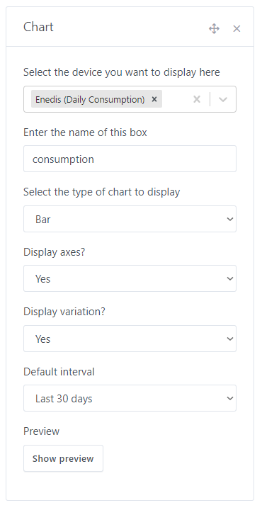
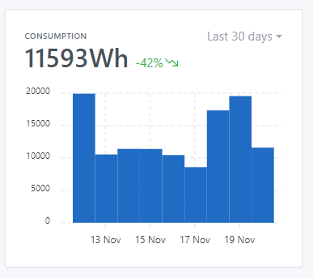

# View your electricity consumption in Gladys with Enedis

Enedis offers an API for retrieving electricity consumption data from a household's Linky meter.

This API is only available to companies after signing a contract and undergoing a certification process.

As for Gladys, we have a legal structure, "Gladys Assistant SAS", which gives us access to this API and authorizes us to make it available to private individuals.

This API is made available via [Gladys Plus](https://gladysassistant.com/fr/plus/).

NOTE

This integration can only be used in France, as Enedis is the operator of the French electricity distribution network.

## Connect to Enedis in Gladys

Go to [plus.gladysassistant.com](https://plus.gladysassistant.com/), and click on `Integration -> Enedis` :

Click on the button `I access my Enedis customer area`:

On the Enedis side, accept the consent and click on `Validater`.

In Gladys, you will find your electricity meter in `My Meters` :

## View your consumption on the dashboard

Go to Gladys' dashboard and click on the `edit` button to modify the dashboard.

Click on `add +` then select the `graphic` widget, you can move it to a column and select D`aily consumption` :

Choose `Histogram`, you should see this graph on your dashboard:

## FAQ

### I can't make the Enedis consent

The Enedis platform is sometimes offline due to updates on the Enedis side. Often, the best thing to do is to try again later.

If this still doesn't work, check that your Enedis account is up and running: can you see your electricity consumption data in Enedis? If not, the problem probably lies with Enedis.

### I don't have any data from previous days

In theory, the Enedis API is updated every morning.

However, in practice the data is not always available at the same time, and on certain days (public holidays, for example), the data is not available.

However, if you notice any gaps in your dashboard that persist over time, please post a message on [the forum](https://community.gladysassistant.com/).

### Synchronization no longer works?

Your consent is valid for 2 years, and must be renewed if you want Gladys to continue retrieving your data.

If your account no longer synchronizes, if in doubt I advise you to renew your consent by clicking on the blue button "J'accède à mon espace client Enedis".

Please post a message on [the forum](https://en-community.gladysassistant.com), if you need any help.