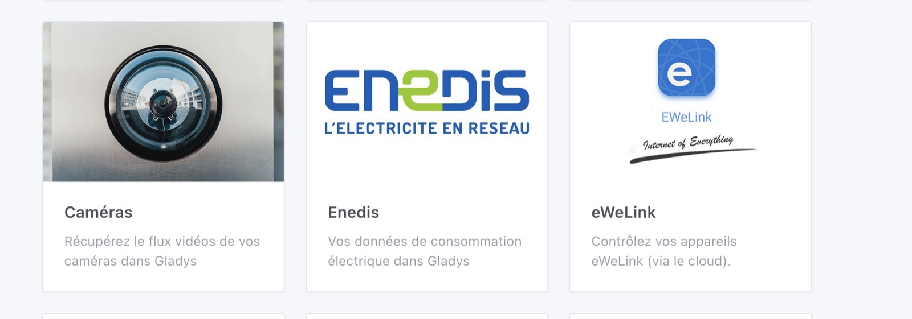
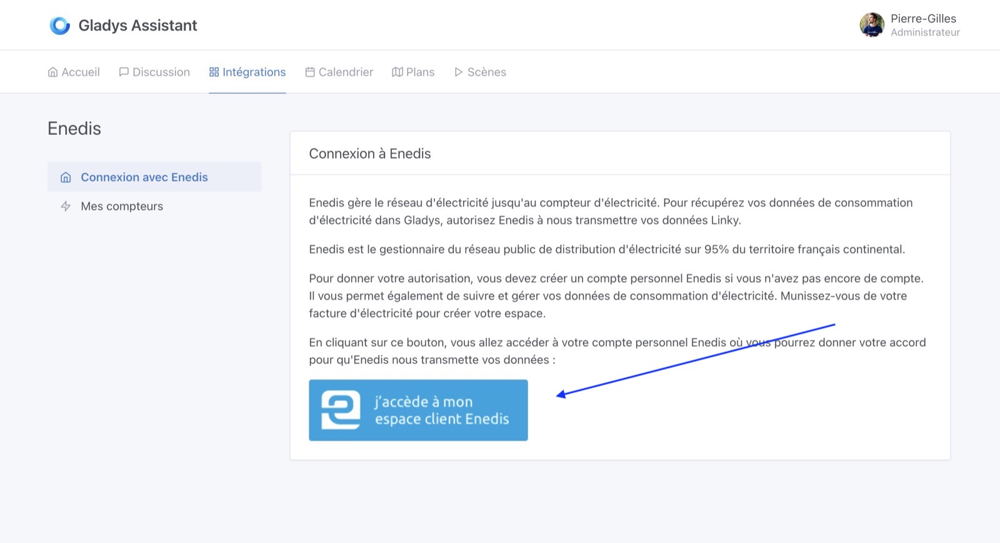
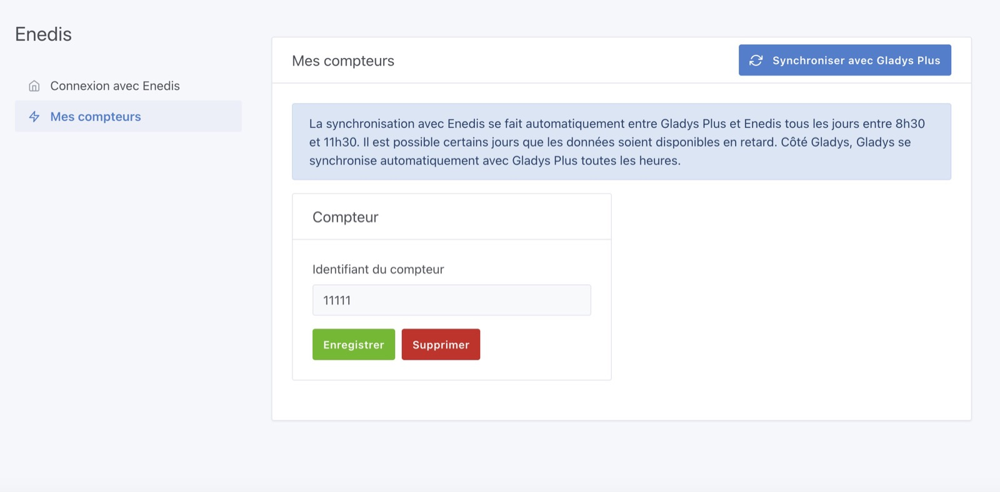
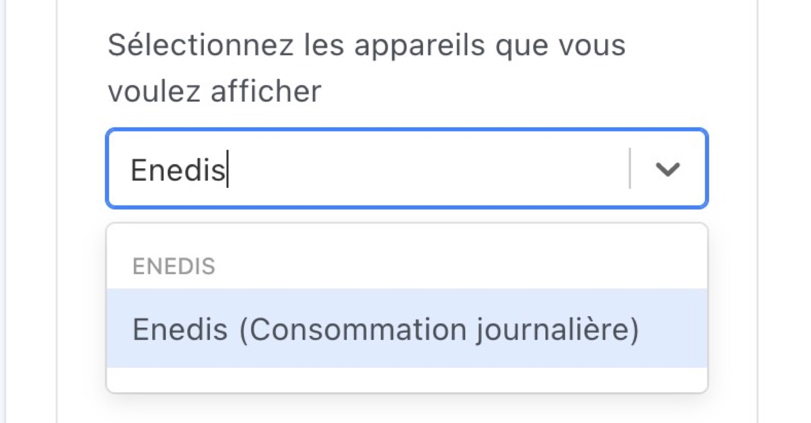
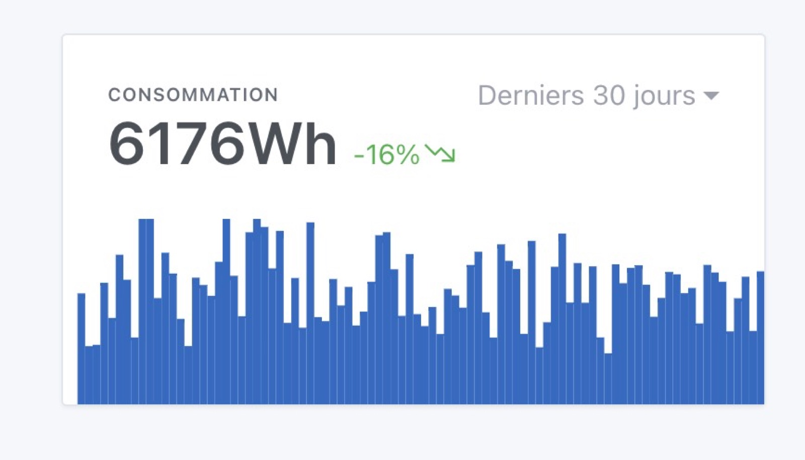

Enedis is a french electricity provider, and offers an API that allows to retrieve the electricity consumption data from a Linky meter of a household.

This API is only proposed to companies, after signing a contract and a certification process.

For Gladys, we have a legal structure, "Gladys Assistant SAS", which allows us to have access to this API and authorizes us to make it available to individuals.

This API is available via [Gladys Plus](/plus).

Note: This documentation has screenshot in French, mainly because this integration is dedicated to the french market.

## Connect to Enedis in Gladys

Go to [plus.gladysassistant.com](https://plus.gladysassistant.com), and click on the "Enedis" integration:

Click on the button "I access my Enedis customer area":

On the Enedis side, accept the consent and click on "Validate".

You should arrive on Gladys, which will synchronize with your Enedis account.

The first synchronization may take some time depending on the load on the Enedis API, I advise you to quit Gladys and come back later 🙂

## View your electricity consumption

In Gladys, you find your electricity meter in "Meters" :

On the dashboard, you can create a new graph, and select "Daily consumption" :

Choose "Histogram", and you should see this graph on your dashboard :

## FAQ

### I can not make the Enedis consent?

The Enedis platform is sometimes offline for updates on the Enedis side. Often the best thing to do is to try again later.

If it still doesn't work, check that your Enedis account is working: are you able to see your electricity consumption data in Enedis? If not, the problem is probably with Enedis.

### I don't have any more data on the previous days ?

The Enedis API is updated every morning in theory.

However, in practice the data is not always available at the same time, and on some days (public holidays for example), the data is not available.

If however, you observe holes on your dashboard, which persist over time, please post a message on [the forum](https://en-community.gladysassistant.com/).

## Synchronization is not done anymore?

Your consent is valid for 2 years, and must be renewed if you want Gladys to continue retrieving your data.

If your account does not synchronize anymore, in case of doubt I advise you to renew your consent by clicking on the blue button "I access my Enedis customer space".
