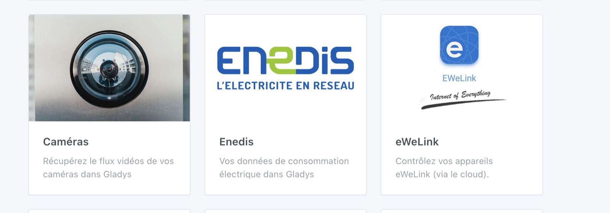
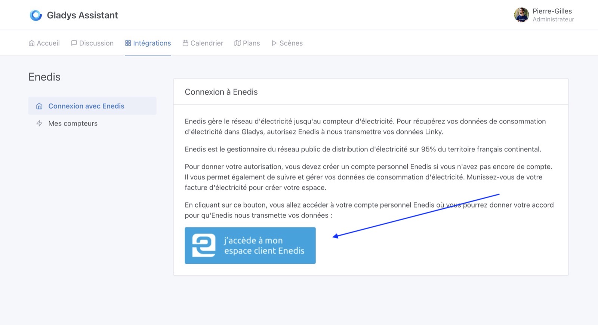
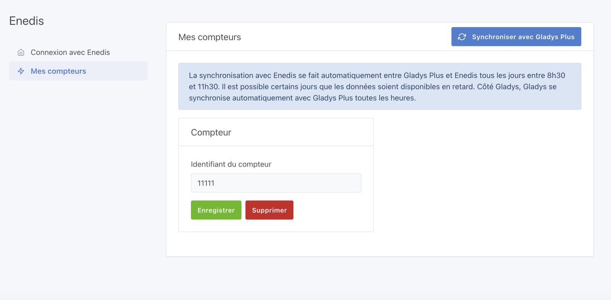
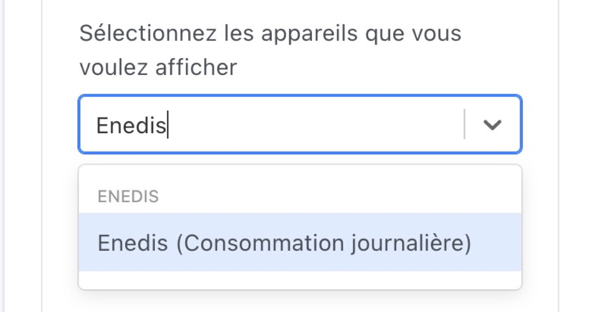
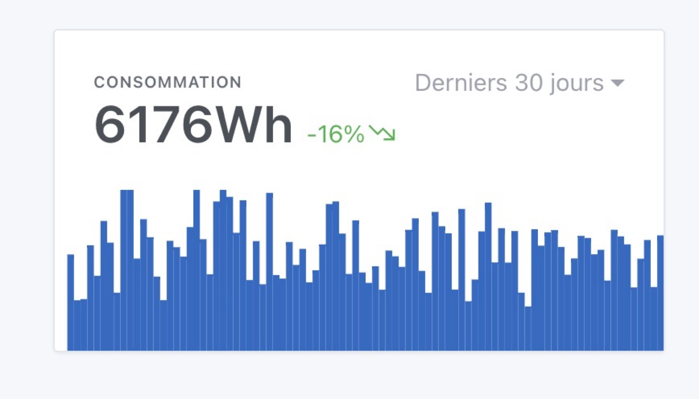

import JsonLd from '@site/src/components/seo/JsonLd';

Enedis is the company that manages the French electricity distribution network, and the one that installs Linky smart meters in homes. Enedis exposes an API, called Data Connect, that lets you retrieve the electricity consumption data measured by your Linky meter.

The catch: this API is only open to companies, after signing a contract and going through a certification process. As an individual, you cannot request access to the Enedis API directly.

This is where Gladys helps. We have a legal entity, "Gladys Assistant SAS", that is certified to access the Enedis Data Connect API and authorized to make it available to individuals. So with Gladys you can track your Linky consumption through the official Enedis API, without running a company yourself.

This integration is available via [Gladys Plus](/plus). Once connected, your daily consumption is retrieved automatically and stored in your own Gladys instance, so you keep your history and can build your own graphs and [scenes](/docs/scenes/intro/) on top of it.

:::note
This integration only works in France, as it connects to the Enedis API, which is the French electricity distribution network operator.
:::

## Connect to Enedis in Gladys

Go to [plus.gladysassistant.com](https://plus.gladysassistant.com), and click on the "Enedis" integration:

Click on the button "I access my Enedis customer area":

On the Enedis side, accept the consent and click on "Validate".

You should arrive on Gladys, which will synchronize with your Enedis account.

The first synchronization may take some time depending on the load on the Enedis API, I advise you to quit Gladys and come back later 🙂

## View your electricity consumption

In Gladys, you find your electricity meter in "Meters" :

On the dashboard, you can create a new graph, and select "Daily consumption" :

Choose "Histogram", and you should see this graph on your dashboard :

From there, the data behaves like any other Gladys device: you can build automations with it, get alerts when your consumption is unusually high, or cross it with other sensors. It pairs well with the [energy monitoring](/docs/integrations/energy-monitoring/) features.

## Frequently asked questions

### How do I access the Enedis API as an individual?

The Enedis Data Connect API is not open to individuals directly: Enedis only signs API contracts with certified companies. The practical way to access your own Linky data through the official API, without creating a company, is to go through a certified provider. Gladys Assistant SAS is certified, so with [Gladys Plus](/plus) you connect your Enedis account once and Gladys retrieves your consumption for you.

### Is the Enedis API free?

For individuals, the data itself is free: you are simply authorizing access to your own consumption data measured by your Linky meter. The cost is the service that retrieves and stores it. With Gladys, the Enedis integration is included in [Gladys Plus](/plus).

### What data does the Linky meter expose?

Through Data Connect, you can access your daily consumption, and depending on your contract your half-hourly load curve, your maximum power, and your contract details. In Gladys, the daily consumption is retrieved and stored so you can chart it over days, weeks and months.

### Can I store my Linky data locally?

Yes. Once Gladys retrieves your consumption from the Enedis API, the data is stored in your own Gladys instance. You keep your full history even if you later disconnect the integration, and you can build local graphs, scenes and alerts on top of it.

### I can not give the Enedis consent?

The Enedis platform is sometimes offline for updates on the Enedis side. Often the best thing to do is to try again later.

If it still doesn't work, check that your Enedis account is working: are you able to see your electricity consumption data in Enedis? If not, the problem is probably with Enedis.

### I don't have any more data on the previous days?

The Enedis API is updated every morning in theory.

However, in practice the data is not always available at the same time, and on some days (public holidays for example), the data is not available.

If however you observe holes on your dashboard, which persist over time, please post a message on [the forum](https://community.gladysassistant.com/).

### Synchronization is not done anymore?

Your consent is valid for 2 years, and must be renewed if you want Gladys to continue retrieving your data.

If your account does not synchronize anymore, in case of doubt I advise you to renew your consent by clicking on the blue button "I access my Enedis customer space".

<JsonLd
  data={{
    "@context": "https://schema.org",
    "@type": "FAQPage",
    mainEntity: [
      {
        "@type": "Question",
        name: "How do I access the Enedis API as an individual?",
        acceptedAnswer: {
          "@type": "Answer",
          text: "The Enedis Data Connect API is not open to individuals directly: Enedis only signs API contracts with certified companies. To access your own Linky data through the official API without creating a company, you go through a certified provider. Gladys Assistant SAS is certified, so with Gladys Plus you connect your Enedis account once and Gladys retrieves your consumption for you.",
        },
      },
      {
        "@type": "Question",
        name: "Is the Enedis API free?",
        acceptedAnswer: {
          "@type": "Answer",
          text: "For individuals the data itself is free: you authorize access to your own consumption measured by your Linky meter. The cost is the service that retrieves and stores it. With Gladys, the Enedis integration is included in Gladys Plus.",
        },
      },
      {
        "@type": "Question",
        name: "What data does the Linky meter expose?",
        acceptedAnswer: {
          "@type": "Answer",
          text: "Through Data Connect you can access your daily consumption, and depending on your contract your half-hourly load curve, your maximum power and your contract details. In Gladys, the daily consumption is retrieved and stored so you can chart it over days, weeks and months.",
        },
      },
      {
        "@type": "Question",
        name: "Can I store my Linky data locally?",
        acceptedAnswer: {
          "@type": "Answer",
          text: "Yes. Once Gladys retrieves your consumption from the Enedis API, the data is stored in your own Gladys instance. You keep your full history even if you later disconnect the integration, and you can build local graphs, scenes and alerts on top of it.",
        },
      },
    ],
  }}
/>
