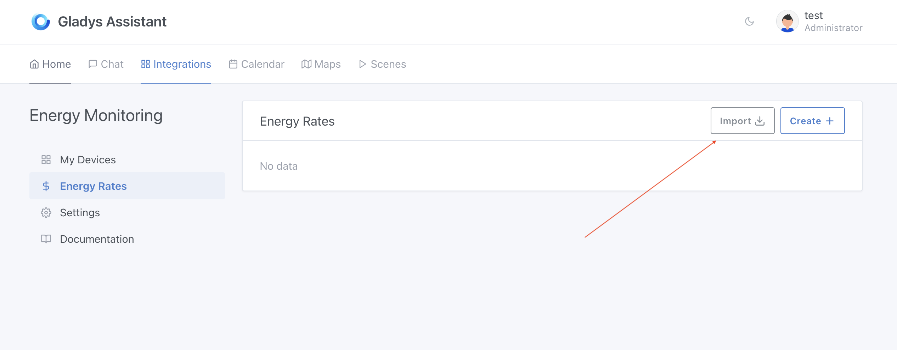
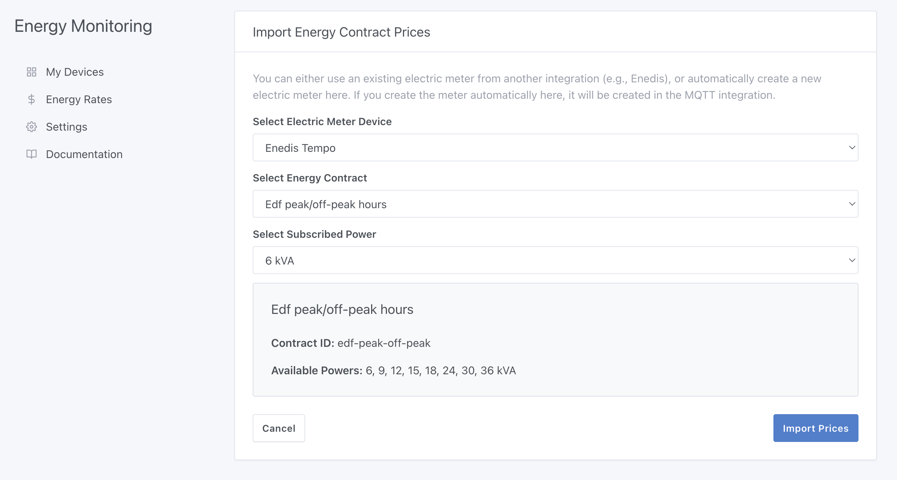
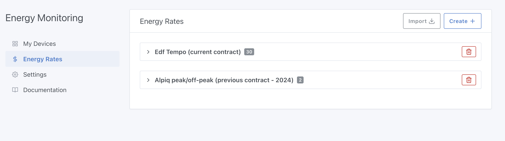
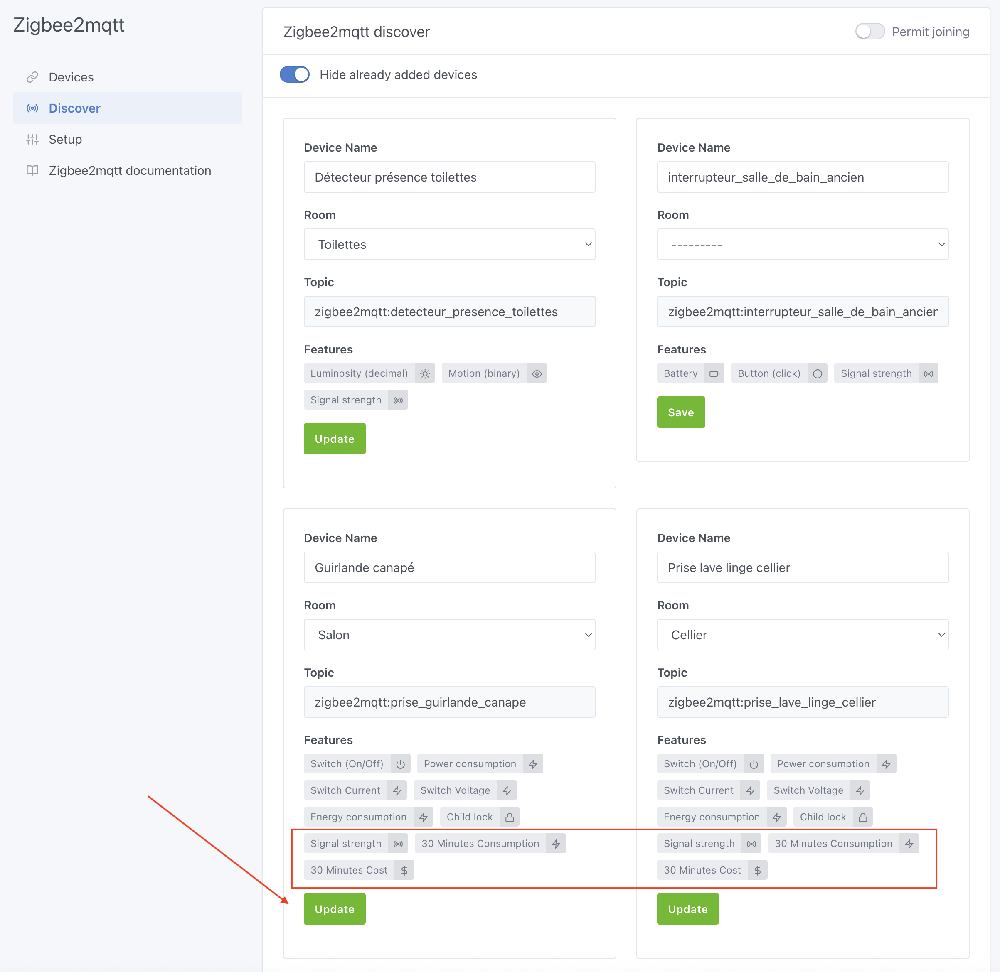
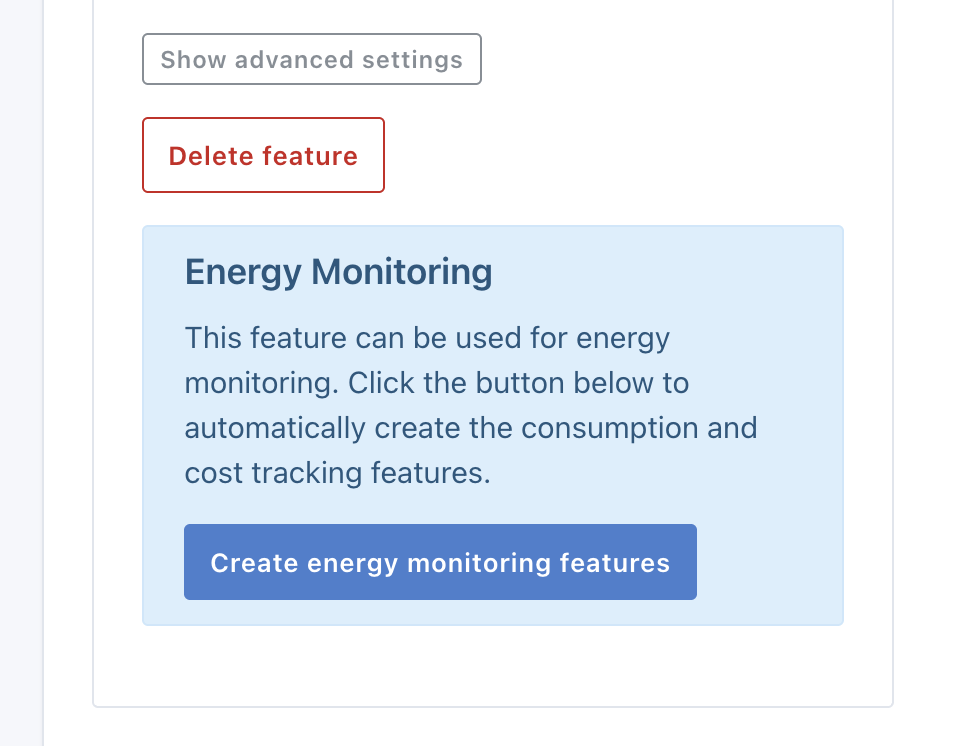
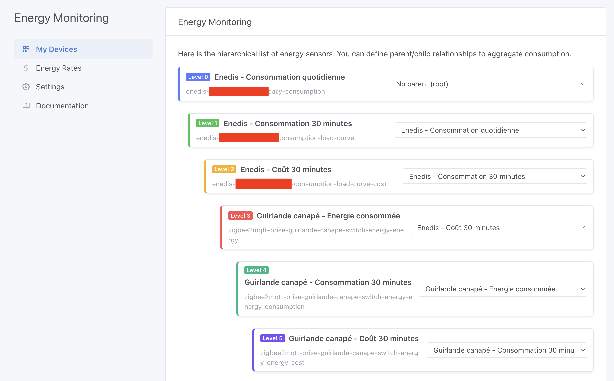
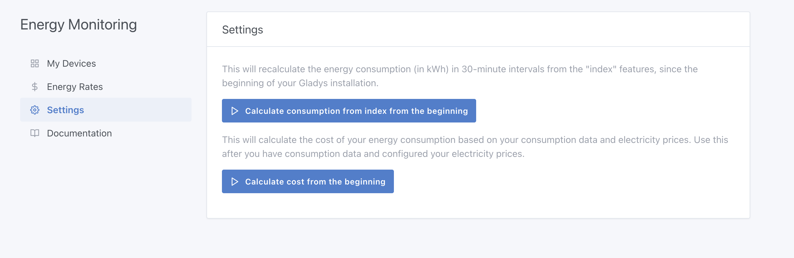
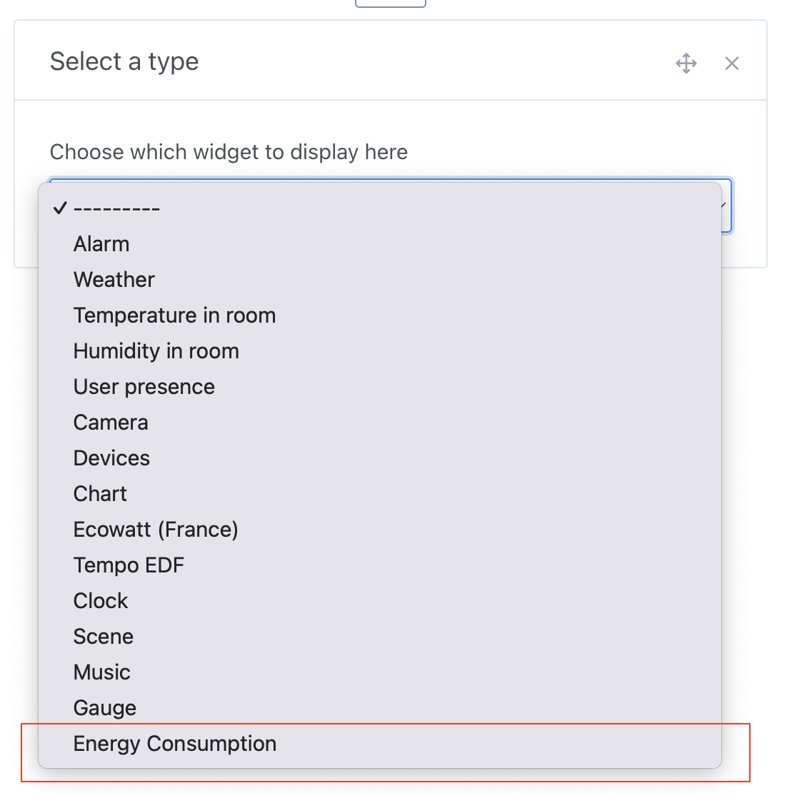
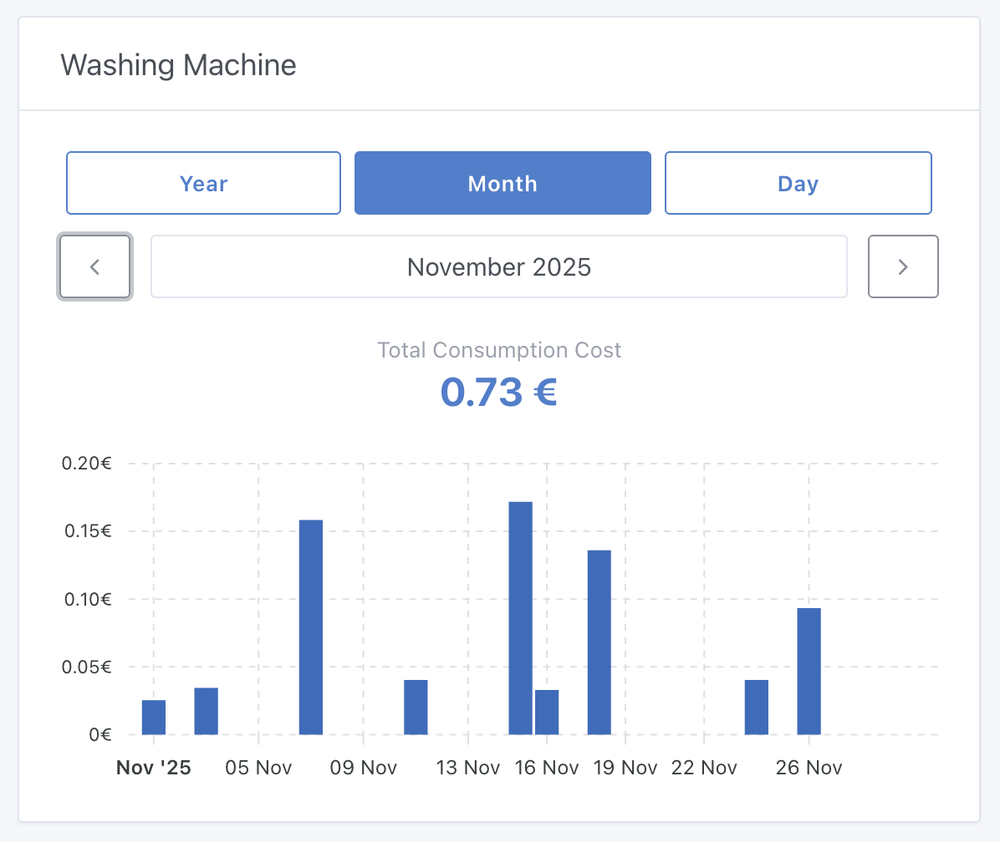

The "Energy Monitoring" integration allows you to track your energy consumption with Gladys Assistant.

It is available since Gladys Assistant 4.66.

## Compatible Hardware

To use this integration, you need devices that report energy consumption data in kWh.

There are several ways to achieve this:

### 1. **With a Lixee ZLinky TIC via Zigbee (France only)**

:::note For French users
This option is specific to France and the Linky smart meter.
:::

This is the best solution for accurately tracking your consumption in France: readings every minute in kWh, perfect for monitoring your entire home.

Zigbee compatible, available for €49:

- [on Domadoo](https://www.domadoo.fr/fr/eco-energie/7492-lixee-module-tic-vers-zigbee-30-pour-compteur-linky-v2-v4000-0014-3770014375179.html?domid=17)
- [on the Lixee website](https://lixee.fr/fr/produits/42-zlinky-tic-v2-3770014375179.html)

At my place, this gives me a chart like this:


Each color represents an energy price (I'm on Tempo pricing), you can clearly see the white days that appeared in late November with the return of cold weather 🥶

### 2. **Through the Enedis integration on Gladys Plus (France only)**

:::note For French users
This option is specific to France and requires a Linky meter with an Enedis account.
:::

The Enedis integration allows you to retrieve the recorded values from your Linky meter, automatically sent to Enedis once a day.

This integration works without hardware, but it has the drawback of only returning consumption once a day, unlike the ZLinky which sends data live every 60 seconds.

To configure Enedis, go to [this tutorial](/docs/integrations/enedis/).

### 3. **With a Zigbee plug that measures consumption (international)**

This is the recommended option for international users. Ideal for tracking a specific appliance. At my place, I use this NOUS plug to track my washing machine's consumption for example:

[NOUS A1Z plug with consumption measurement on Domadoo](https://www.domadoo.fr/fr/prises-connectees/6165-nous-prise-intelligente-zigbee-30-mesure-de-consommation-5907772033517.html?domid=17)

### 4. **With a custom MQTT device (international)**

This option works worldwide. If you have a smart meter or devices that return consumption values in kWh, you can integrate them with Gladys Assistant using the MQTT integration.

## Configuration

:::info
You must be on Gladys Assistant 4.66 or higher to use this integration.
You can update with one click in Gladys system settings.
:::

The order of steps in this tutorial is important!

### Step 1: Configure the Enedis integration (optional, France only)

:::note For French users
Skip this step if you're not in France.
:::

If you plan to use the Enedis integration, go to [this tutorial](/docs/integrations/enedis/) and follow the instructions.

If you're already using the Enedis integration, you need to go to the integration, "My meters" tab, and check if the device needs a feature update.

If an "Update" button is displayed, click on it, then click "Sync with Gladys Plus".

At the end of synchronization, you can verify that your Enedis device has properly uploaded data to Gladys by creating a chart on the "Enedis (30-minute consumption)" feature.

If you see all your consumption in kWh, great, you can move on to the next step!

### Step 2: Configure your energy rates

You now need to tell Gladys which energy provider you use and what your rate is.

Two options are available: either you're on a contract that Gladys knows and you can import it easily, or you have an unknown contract and you need to configure it manually.

Note: The list of energy contracts is open-source and can be modified by anyone on [this GitHub repository](https://github.com/GladysAssistant/energy-contracts).

#### Import a contract

To configure your contract, go to the "Energy Monitoring" integration, in the "Energy rates" tab, then click "Import":



Gladys asks you to select an electricity meter.

If you're using the Enedis integration, you should see your meter here, you can select it.

Otherwise, you can click "Create an electricity meter" so that Gladys automatically creates a device that will be the "parent" of all your energy sensors in your home.

Then, select your contract from the list, then your subscribed power:



If you're on peak/off-peak hours, you'll need to select your contract's schedules.

In the case of Tempo, this will create dozens of prices because it will import the entire history of this contract with 6 prices per period!



### Manually create a contract

If your contract is not in the list, click "Create".

You'll need to create one price per period and per price type. If you're on a peak/off-peak hours contract, you'll need to create 2 prices for each period.

Example:

If in 2024 your energy rate was €0.15/kWh during peak hours and €0.10/kWh during off-peak hours, and in 2025 prices drop by €0.05/kWh, you'll need to create 4 prices:

- 2024 peak hours
- 2024 off-peak hours
- 2025 peak hours
- 2025 off-peak hours

This can quickly become tedious if your contract changes prices often, which is why I strongly encourage you to add your contract to the shared contract database on [the GitHub repository](https://github.com/GladysAssistant/energy-contracts).

It's collaborative and anyone can propose a rate!

### Step 3: Update your Zigbee devices

In the Zigbee integration, if you had added Zigbee devices measuring consumption **before this update**, you need to update them.



This will add the features necessary for energy monitoring.

### Step 4: Update your MQTT devices

In the MQTT integration, if you have devices with "Index" features, you will see a new button on "Index" features to enable the energy monitoring feature:



This will add the features necessary for energy monitoring.

### Step 5: Verify your electrical network hierarchy

Go to the "Energy Monitoring" integration, and on the first tab, you should see your electrical network hierarchy.



Verify that each device is properly associated with its parent.

In Gladys logic, a device's "parent" corresponds to what the device is plugged into.

An example hierarchy:

```
- Electricity meter
  - NOUS A1Z plug (Energy consumed)
     - NOUS A1Z plug (30-minute consumption)
        - NOUS A1Z plug (30-minute cost)
```

The hierarchy is very important for Gladys to correctly calculate your consumption cost.

### Step 6: Recalculate all historical consumption

If your devices have consumption history, you can launch a recalculation of historical 30-minute consumption and 30-minute costs from the "Settings" tab:



First click on the first button to calculate consumption from indexes, then click on the second button to calculate 30-minute costs.

### Step 7: Display your consumption on the dashboard

On your dashboard, you can now add a new "Energy Consumption" widget:



You can display your consumption:


You can also display each device individually, for example my washing machine:



## Feedback?

This feature is brand new. If you have questions or feedback, feel free to post a message [on the forum](https://community.gladysassistant.com/).

I'd like to thank Thomas Lemaistre, who funded this development and allowed me to bring it to life!

If in the future you'd like to see major developments like this one in Gladys, know that I'm available for feature sponsoring.
