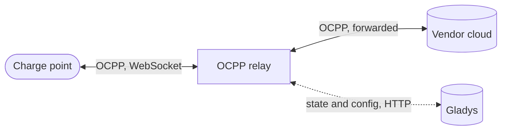

{/* GENERATED FILE: built by `yarn load-external-integrations` from the
integration store. Do not edit by hand, edit docs/en.md in
https://github.com/sescandell/gladys-ocpp-integration instead. */}

import ExternalIntegrationHeader from "@site/src/components/ExternalIntegrationHeader";

<ExternalIntegrationHeader slug="charger-station" />

**Read-only supervision.** This integration observes any
number of OCPP 1.6 charge points and shows their state in Gladys
(connector status, charging state, power, current, voltage, total energy) —
there is no way to start, stop, or limit a charge from Gladys yet.

## How it works

The integration runs its own OCPP relay. Every charge point connects to the
**same** URL — the relay tells them apart by the identity each one
announces on connection. The moment a charge point points at that URL (see
Setup below), the relay supervises it **automatically**, with no need to
declare it in Gladys first: it answers it normally, so charging itself
keeps working. But until you attach it to **its own** origin cloud, that
cloud is completely out of the loop — nothing that goes through the
vendor's app (remote start/stop, live status, charge history) works during
that window, since the vendor's backend has no connection to the charge
point at all. Attaching the origin cloud changes that: the relay then also
forwards the charge point's traffic there, and the vendor's app works
exactly as before again. The relay only _observes_ what passes through it
to build the state shown in Gladys; it never invents or withholds anything
on the wire, in either mode.

## Prerequisites

**Gladys 4.85.0 or later.** The charge point state is published using
Gladys's charging-station device features, which older versions don't know
about (they would refuse to create the device).

Each charge point's vendor app or portal must let you view and change the
OCPP server URL it connects to. Not every vendor exposes this — if yours
doesn't, this integration cannot be used for that charge point.

**Before changing anything, write down the OCPP server URL currently shown
by the vendor app.** It is the only way back to the vendor's own cloud if
you ever want to stop using this integration for that charger.

## Setup

Five steps, once per charge point. Nothing is lost along the way: the charge
point keeps its own connection to the vendor's cloud, Gladys simply sits in
the middle and watches.

1. **Write down the OCPP server URL** your charge point currently uses, from
   its vendor app. This is your only way back to the vendor's cloud — keep
   it somewhere safe.
2. **Point the charge point at Gladys**: in that same app, replace the URL
   with the one shown in the walkthrough on the integration's
   **Configuration** screen — it's filled in for you, address and port
   included. The same URL works for **every** charge point.
3. **Add it to Gladys**: it connects immediately and appears in the
   **Discovery** tab, already supervised. Add it from there.
4. **Give it back its cloud**: on the Configuration screen, run the
   **"Add a charge point"** action, pick it from the list, and paste the URL
   from step 1 — exactly as the vendor app showed it, including any trailing
   query string some vendors use (e.g. ending in `?sn=`).
5. **Done.** The charge point reconnects on its own within seconds and
   carries on talking to its vendor's cloud exactly as before, through
   Gladys — which now follows it live.

Repeat for every other charge point: same Gladys URL, its own vendor URL,
even a different vendor.

To fix a mistake or change a charge point's origin cloud URL, run the action
again for the same charge point with the corrected URL (check its current
URL on its device card first). To detach a charge point from its cloud and
put it back into local-only supervision, run the action for it with an
**empty** URL — takes effect the next time that charge point reconnects (it
keeps relaying through its current connection until then).

If you **delete** a charge point's device from Gladys while it still has an
origin cloud configured, it disappears from the picker and the action can no
longer change it — the relay keeps using that cloud. Add the device back
from Discovery to regain control of it.

## Starting over

Uninstalling the integration removes everything it created: its devices, its
stored configuration, and the relay's own container and data. Nothing is left
behind, so reinstalling starts genuinely fresh.

To go back to your vendor's cloud directly, put the URL you noted in step 1
back into the charge point's app — it stops going through Gladys at its next
reconnection.

## What you see on a charge point

Each connector reports two state features, plus its measurements (power,
current, voltage, total energy):

- **Status** — what the connector itself is doing: _Available_, _Occupied_,
  _Reserved_, _Unavailable_, _Faulted_.
- **Charging state** — what the session is doing: _Charging_, _Vehicle
  connected_, _Paused (vehicle)_, _Paused (charger)_, _Idle_.

OCPP 1.6 charge points report a single, more detailed status, which is split
across those two: `Preparing` and `Finishing` both show as "Occupied /
Vehicle connected" (a vehicle is physically connected in both cases),
`Charging` as "Occupied / Charging", and `SuspendedEV`/`SuspendedEVSE` as
"Occupied / Paused (vehicle)"/"Occupied / Paused (charger)". When no session
is in progress, the charging state reads _Idle_. Both features stay empty
until the charge point
has reported its status at least once.

Values update **as they happen**, within a few seconds: the relay tells the
integration about every change it observes rather than being asked at
intervals. A charge point that connects for the first time also appears in
Discovery on its own, without waiting for a refresh.

## Multiple connectors

A charge point is one device in Gladys, whatever its number of physical
connectors. It starts with one connector's worth of features (status,
charging state, power, current, voltage, energy); if it has more than
one physical connector, the extra ones appear as additional features
("Connector 2 - ...", etc.) once the gateway has actually seen them report
their status at least once. If you've already created the device, Gladys
shows an **Update** button once new connectors are picked up — nothing is
added silently to a device you already created. If a connector doesn't
appear yet, try **Rescan** from the Discovery tab after using that
connector.

## Security note

Exposing the relay's OCPP port makes it reachable by anything on your LAN,
without authentication — this is inherent to how OCPP charge points connect
to a server. The relay only ever _observes_ what passes through it and never
makes decisions on its own (it never invents a transaction, never authorizes
a charge): at worst, a rogue device on your LAN could feed misleading data
into this integration's view, but it cannot affect a real charge point,
which keeps its own independent connection to its vendor's cloud through the
relay. Keep this in mind on a shared or untrusted network.

## Known limitations (this version)

- **The relay's state resets on restart** (host reboot, a crash): it only
  remembers what it has seen since it last started, including which charge
  points are configured — the integration re-sends the full configured set
  as soon as it reconnects to Gladys, so this self-heals within seconds and
  does not require re-running the action. Freshly restarted, already-known
  charge points briefly disappear until they reconnect (normally within
  seconds); this does not delete any device you already created in Gladys.
- **Starting a charge session while a charge point is still locally
  supervised (no origin cloud attached yet), then attaching a cloud mid-session:**
  the charge point may keep referencing the session it started locally once
  it reconnects into relay mode, which the real origin cloud never saw. A
  rare overlap in practice (attaching a cloud is usually done once, right
  after first connecting) — if it happens, the affected session's data may
  not reach the origin cloud correctly; the next session is unaffected.
- **No control from Gladys.** Starting, stopping, or limiting a charge is not
  possible in this version.

## Troubleshooting

Check the integration's logs from the Gladys UI (supervision block →
container selector) for the main container and, separately, for the
`gateway` sub-container — that is where the OCPP relay itself logs every
connection, disconnection, and relayed message (full payload, both
directions) for every charge point.

## Configuration settings

These are the settings Charger Station asks for in its configuration screen in Gladys.

| Setting | Type | Required | Description |
| --- | --- | --- | --- |
| Connecting a charge point | `section` | No | In your charge point's app, note down its current OCPP URL and keep every setting you find there: that's what lets you get back to normal operation if anything goes wrong. Replace that URL with ws://\{\{gladys_host\}\}:\{\{port:ocpp\}\}/ - the same one for every charge point. Your charge point reconnects right away and appears in the Discovery tab: add it to Gladys. Then come back here, in the Action section below, select your charge point and paste the OCPP URL you noted in the first step - that's what lets it keep talking to its vendor's cloud, now relayed through Gladys. |

## How to install Charger Station in Gladys

1. In Gladys, open **Integrations**: Charger Station appears in the catalog, next to the native integrations, with a community badge.
2. Click **Install**. Gladys pulls the Docker image (`ghcr.io/sescandell/gladys-ocpp-integration:1.0.0`), starts it in a sandbox isolated from the core, and generates the integration's interface (devices, discovery and configuration).
3. Open the **Configuration** screen of the integration, fill in the settings, and save.
4. You can also install it directly from its repository URL: [https://github.com/sescandell/gladys-ocpp-integration](https://github.com/sescandell/gladys-ocpp-integration).

Charger Station requires Gladys `>=4.85.0`. The catalog inside Gladys refreshes every hour, so a new version becomes available at most one hour after its release.

Not running Gladys yet? It is free and open source: [follow the installation guide](/docs/) to get started.

## About external integrations

Charger Station is an **external integration**: a community integration packaged as a Docker container and published on GitHub, that Gladys installs in one click and runs in a sandbox isolated from its core. It is published and maintained by [sescandell](https://github.com/sescandell), not by the Gladys core team.

- [Browse all external integrations](/docs/integrations/external/)
- [Discover the native integrations](/docs/integrations/) built into Gladys
- [Build and publish your own external integration](/docs/dev/external-integrations/)
- [Source code on GitHub](https://github.com/sescandell/gladys-ocpp-integration) — [source of this documentation](https://github.com/sescandell/gladys-ocpp-integration/blob/HEAD/docs/en.md)
