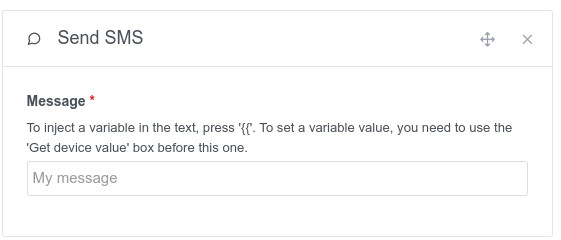

This integration allows you to send SMS to your cell phone with the french mobile operator [Free Mobile](https://mobile.free.fr).

## **Prerequisites**

You must go to the [Free Mobile](https://mobile.free.fr) page and click on [Subscriber Area](https://mobile.free.fr/account/v2/login) 

You must then to click to the option page.

Enable the option `Notifications par SMS`

:::note
If you disable and re-enable the SMS notification option, please be sure to update your API key in your configuration.
:::

## Enter this key in Gladys Assistant

Go to "Integrations" -> "Free-Mobile".

Enter your Customer ID and API key then click "Save".

## Send your first SMS

You can now use these integration from the [Scenes](../scenes/intro.md).

