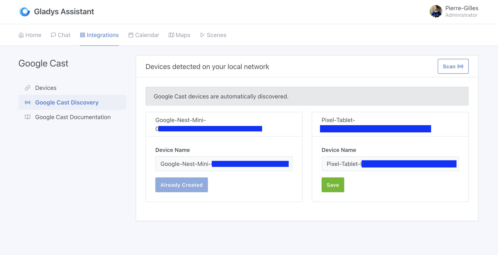
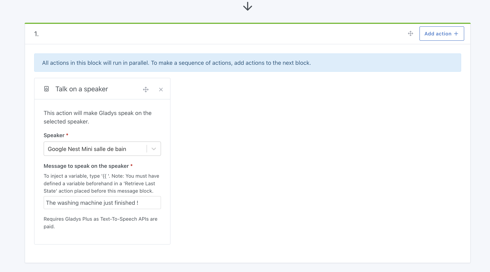

Gladys Assistant can broadcast voice messages on a Google speaker or any other Google Cast-compatible device.

## Adding a Google Speaker to Gladys Assistant

1. Go to the **Google Cast** integration in the Gladys interface.
2. Open the **Google Cast Discovery** tab: compatible devices on your network should appear automatically.

3. Select your device and click **Save**.
4. Then, go to the **Devices** tab and assign the speaker to its corresponding room.

## Making Gladys Assistant Speak on a Speaker

Once the speaker is added, you can use it in a scene with the **Speak on a Speaker** action:

### Important Note

:::note
This feature requires a **Gladys Plus** subscription, as it relies on an AI-based Text-to-Speech (TTS) API, which is a paid service.

In the future, we would like to offer a fully local solution, but currently, there are no high-quality alternatives for French TTS that work offline.
:::
