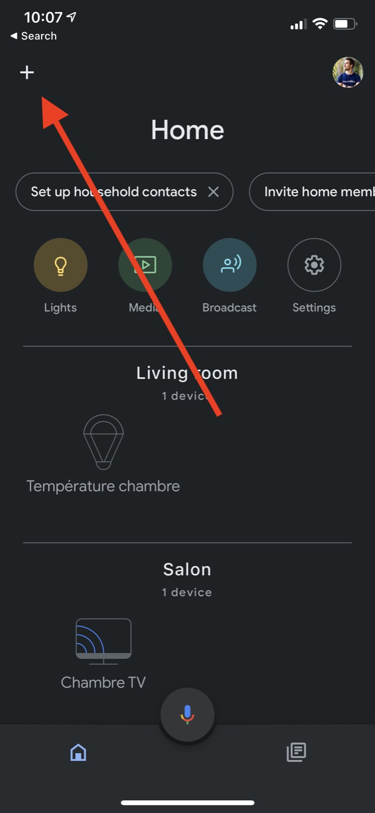
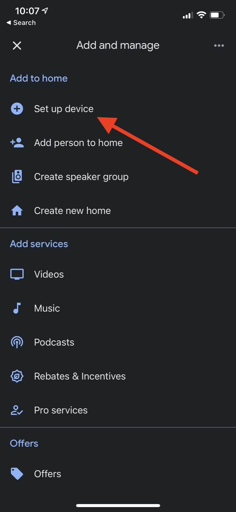
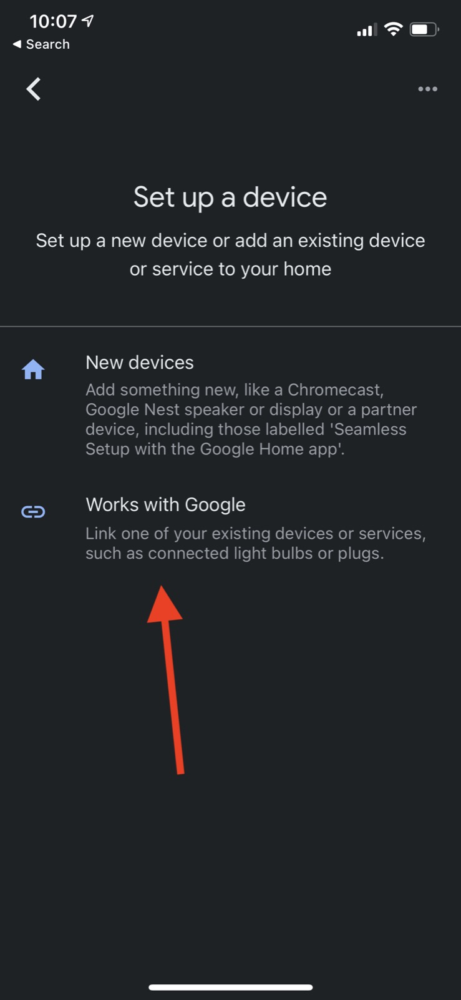
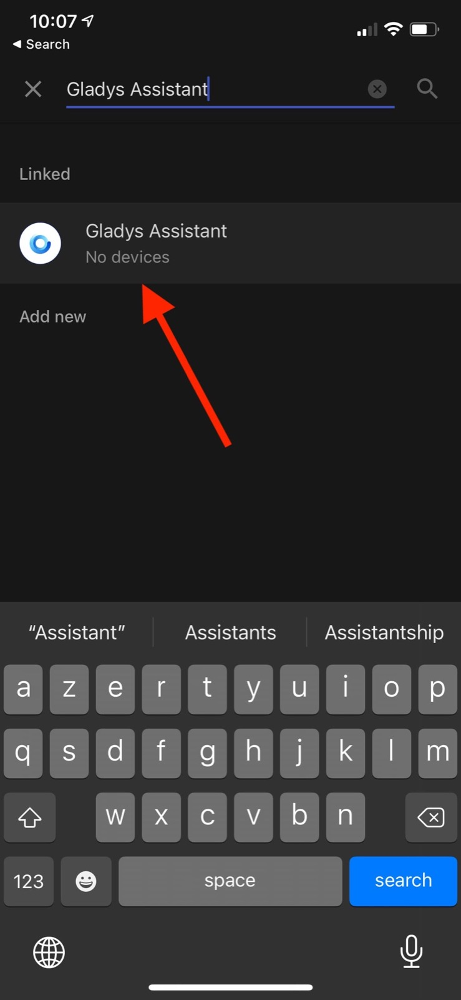
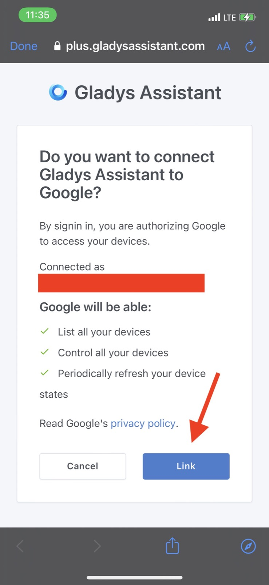

It is possible to control Gladys devices with Google Home using [Gladys Plus](/plus), our online gateway service.

Google Home is a unique integration, because Google Home works exclusively in the cloud. This means we have very limited control over what we can and can't do (unfortunately).

To become a Google Home partner, we had to:

- Pass some automated unit tests on Google side
- Pass a manual review from Google team
- Complete a Google Home Certification process

This is not a simple process, and therefore it's not realistic for all our users go through it on their side. It is a process that is intended for professionals & companies, hence why we offer this integration in Gladys Plus, exclusively.

## Create a Gladys Plus account

To join Gladys plus, head over to the [dedicated page](/plus), and enter your email.

There is a 14 free trial so you can try our Google Home integration for free.

## Configure Gladys Plus

Gladys Plus needs to be fully configured before you can use the Google Home integration.

We recommended you follow the step you received by email to configure Gladys Plus.

At the end, you should be able to connect to [plus.gladysassistant.com](https://plus.gladysassistant.com) without any issue. 

Once you have successfully logged in to Gladys plus, you can configure Google Home!

## Configuring Google Home

First, go to your Google Home app on your phone (available on iOS/Android).

On the homescreen, click on the "+" in the top-left corner:

Click then on the "set up device" button:

Then click on "Works with Google":

Finally search for "Gladys Assistant":

By clicking on it, you should have to connect with your Gladys Plus account.

Enter your Gladys Plus credentials, your 2FA code, and finally you should see this screen:

Click on "Link". You should be good to go.

You should now see your devices in Google Home.

## Compatible devices

For now, only:

- Lights (On/Off / Color / Brightness)
- Switch (On/Off)

Additionnal compatibilities will be added on request. Don't hesitate to send us your feature requests on [the forum](https://community.gladysassistant.com/).
